# KeInFS: Erasure-Coded Parallel Object Storage on Raw Block Devices

### A Design Specification for High-Performance AI Storage Infrastructure

---

**Andreas Krause**
*Storage Engineering & High-Performance Computing Infrastructure*

**Document Version:** 0.1-draft | **Date:** February 2026 | **Classification:** Architecture & Design Specification

---

> Note
> This document is the target-state architecture and design direction.
> For current prototype behavior and validated implementation notes, start with
> [README.md](../README.md), [poc/METADATA_NAMESPACE_ARCHITECTURE.md](../poc/METADATA_NAMESPACE_ARCHITECTURE.md),
> [poc/IO_LIFECYCLE.md](../poc/IO_LIFECYCLE.md), [poc/ksc/README.md](../poc/ksc/README.md),
> and [poc/kfc/README.md](../poc/kfc/README.md).

## Abstract

This document presents the architecture and design of KeInFS, a distributed object storage system purpose-built for artificial intelligence training and inference workloads. KeInFS eliminates the traditional filesystem layer entirely, writing erasure-coded data chunks directly to raw block devices via `io_uring` with `O_DIRECT`, while a separate control plane handles namespace, authorization, placement, and policy. The system's name encodes its dual identity: "Kein FS" (German: "No Filesystem") declares the architectural thesis, while the embedded "KI" (German: *Künstliche Intelligenz*) identifies the target domain.

The design addresses four fundamental deficiencies in existing high-performance storage systems. First, the persistence of filesystem abstractions (journals, inode tables, POSIX lock managers) originally designed for 1970s-era interactive workstations imposes measurable overhead on modern parallel I/O patterns. Second, the reliance on kernel modules and version-locked drivers creates operational fragility across heterogeneous compute fleets. Third, the absence of native workload attribution in storage protocols forces operators to correlate disjoint monitoring systems (eBPF probes, kernel-space statistics, application-level metrics) to diagnose performance anomalies. Fourth, the complexity of distributed lock managers — necessitated by mutable-file semantics that AI workloads do not require — introduces failure modes and latency that are entirely avoidable.

KeInFS addresses these deficiencies through a userspace-only architecture comprising stateless coordinators for the control plane, storage nodes that serve chunk I/O directly, a metadata service defined by contract rather than by commitment to one specific backend, Intel ISA-L hardware-accelerated erasure coding (leveraging AVX-512, GFNI, AES-NI, and CRC32C instructions), and a lock-free concurrency model based on immutable object versions with optimistic concurrency control. The system provides two client paths: a universal S3-compatible path proxied by storage-node S3 ingress endpoints, and a high-performance native path via `libkeinfs` that performs parallel erasure-coded I/O directly to storage nodes. The FUSE client is a first-class read/write client built on the same direct native path. End-to-end observability is embedded in the protocol via signed attribution contexts that identify tenant, team, project, job, and distributed training rank on every request. Preliminary analysis suggests 10–20% throughput improvement over Lustre on identical hardware for large sequential I/O, attributable to the elimination of journal overhead, distributed lock acquisition, kernel filesystem traversal, and coordinator-free native data movement.

**Keywords:** object storage, erasure coding, distributed systems, high-performance computing, AI infrastructure, raw block devices, `io_uring`, metadata services, Intel ISA-L, hardware acceleration, observability, multi-tenancy

---

### Table of Contents

1. Introduction and Motivation
2. Design Principles
3. System Architecture
4. Component Design
5. Data Path
6. Storage Classes and Erasure Coding Profiles
7. Consistency and Concurrency Model
8. Security Architecture
9. High Availability and Self-Healing
10. Observability Framework
11. Quota Management
12. Audit Logging
13. Administration Interface
14. Client Libraries and FUSE Integration
15. Performance Analysis
16. Implementation Technology
17. Deployment Model
18. S3 Compatibility Layer
19. Future Directions
20. Conclusion
21. References

---

## 1. Introduction and Motivation

### 1.1 The Case Against Filesystems in AI Storage

The storage industry has spent two decades polishing the wrong architecture. S3, GPFS, Lustre, Ceph, MinIO — every major storage system in production today is, at its core, a filesystem with a distributed veneer. They inherit the same foundational assumptions from the 1970s: inodes, journals, POSIX lock semantics, directory trees, page cache coherency. These abstractions were designed for interactive multi-user Unix workstations. They are not designed for a world where a single training run reads petabytes sequentially across 16,000 GPU nodes, or where an inference fleet serves 1 million requests per second from a shared model repository.

The industry's response has been to bolt more layers on top: distributed lock managers that add milliseconds to every metadata operation; kernel modules that must be recompiled for every OS update; eBPF probes and sidecar agents glued to the I/O path to provide the observability that should have been built in from the start; POSIX compatibility shims that nobody asked for but everybody pays the performance tax on.

**KeInFS rejects this approach entirely.**

The name says it all — in two languages at once. "Kein FS" is German for "No Filesystem." And embedded in the capitalization — **Ke***In***FS** — is **KI**: *Künstliche Intelligenz*, the German term for Artificial Intelligence. KeInFS is a storage system with no filesystem, purpose-built for AI. The name encodes the entire design philosophy in six characters.

KeInFS is erasure-coded parallel object storage written directly to raw block devices — no filesystem, no kernel modules, no POSIX, no journal, no inode table. The wire protocol, KeInFS/2, is HTTP/2 native over TLS 1.3. Smart clients using `libkeinfs` and `keinfs-fuse` talk to coordinators for control and to storage nodes for data, performing parallel erasure-coded I/O directly against the nodes that actually hold the chunks. That is not an implementation detail. It is the performance thesis.

**What makes KeInFS fundamentally different:**

**Built for AI, not retrofitted.** KeInFS is not a general-purpose filesystem that someone added an S3 gateway to. It is an object storage system designed from the ground up for the access patterns of modern machine learning: massive sequential reads for training data, large checkpoint writes, high-throughput parallel ingest from data pipelines, and low-latency model serving. S3 API backward compatibility is provided natively for ecosystem integration, but the performance path is KeInFS/2.

**Observability is the product, not an afterthought.** Every KeInFS/2 request carries a signed attribution context identifying the tenant, team, project, job, and distributed training rank. Metrics are emitted per-job, per-operation, in real time. End-to-end distributed tracing follows a request from the client library through the coordinator, into the metadata service, and down to the individual `io_uring` submission on the storage node's raw block device. There is no separate monitoring stack to deploy, no eBPF programs to attach, no kernel probes to maintain across upgrades, no agents to install on every node. The question "why is my training run slow?" is answered by a single CLI command that pinpoints the exact storage node, drive, and concurrent operation causing the bottleneck. No other storage system — commercial or open source — can do this.

**Unmatched multi-tenant flexibility.** KeInFS enforces hierarchical quotas across five dimensions (capacity, object count, bandwidth, request rate, concurrent connections) at every level of a tenant-team-project-job hierarchy. Quotas are enforced in real time at the coordinators. Usage accounting is per-job and per-operation. Chargeback reporting is built in. In a shared AI infrastructure serving multiple research teams, platform engineers, and production inference workloads, KeInFS provides the isolation, accountability, and resource governance that administrators currently cobble together from a patchwork of external tools — or, more commonly, simply do without.

**Zero-friction adoption.** There are no kernel modules to compile. There are no FUSE mounts to configure. There are no client packages that must match the server version. `curl` works. The Python SDK is a `pip install`. The S3-compatible endpoint works with every existing tool, SDK, and framework in the ecosystem. For maximum performance, `libkeinfs` provides native C, Rust, and Python clients that handle parallel erasure-coded I/O transparently — the application calls `put()` and `get()`, and the library does the rest. Deployment is static Rust binaries with zero runtime dependencies. And because the entire client stack is userspace HTTP/2, the KeInFS client runs identically on bare metal, in Docker containers, in Kubernetes pods, and inside KVM virtual machines — across Linux, macOS, and Windows. (The backend — storage nodes, coordinators, and the metadata and allocator services — is Linux-only; this portability is a property of the client, not the cluster.) The client's deployment target is a choice, not a constraint imposed by the storage system. This platform invariance enables a seamless development-to-production continuum: a researcher prototypes a training pipeline on a macOS laptop against the same KeInFS cluster, with the same credentials and the same API, that will later serve the production run across a 16,000-node GPU cluster. The code that runs on the laptop runs on the cluster — unchanged, untranslated, unported. Even provisioning new storage capacity is near-instantaneous: because there is no filesystem to create, formatting a drive takes under one second regardless of capacity. Click provision in the portal, and GPUs are training in minutes — not idling for hours while `mkfs` grinds through terabytes of inode tables and journals.

**Self-healing, self-managing.** Drives fail. Nodes fail. KeInFS detects failures in seconds, automatically reconstructs lost data from erasure coding parity distributed across the surviving cluster, and restores full protection — all without operator intervention, all without impacting running workloads beyond configurable rebuild throttling. The administrator replaces hardware when convenient. The system has already healed.

**Hardware-accelerated data path.** KeInFS offloads the computationally intensive parts of the I/O path onto the CPU's vector processing units. Erasure coding — the core operation that provides data protection — is performed by Intel ISA-L using hand-tuned AVX2 and AVX-512 SIMD instructions, achieving encode and decode throughput of 10–30 GB/s per CPU. CRC32C integrity checksums are computed via the hardware CRC32 instruction (SSE 4.2) at effectively zero cost. AES-256-GCM encryption for TLS 1.3 is accelerated by AES-NI, making encryption overhead negligible. These are not optional optimizations — they are fundamental to the architecture. KeInFS treats the CPU's vector units and cryptographic accelerators as hardware offload engines, the same way a network card offloads TCP segmentation or a GPU offloads matrix multiplication. The result is that the protection, integrity, and security layers that other systems treat as performance taxes are effectively free in KeInFS.

**Clean namespace separation.** The metadata plane owns a tenant-scoped namespace hierarchy: namespaces, projects or groups, buckets, collections, objects, versions, chunk manifests, placement rules, quotas, and cluster coordination. That service is defined by the transactional contract KeInFS requires, not by dependence on a single vendor-specific implementation. Storage nodes have no knowledge of namespaces, buckets, or objects. Each storage node maintains only a local KIX directory that maps chunk IDs to physical locations on its own raw block devices — a purely local index that can be rebuilt from device metadata if lost. This separation means the namespace is fully decoupled from the physical storage layer. Storage nodes can be added, removed, or replaced without any namespace migration. The namespace can be queried, listed, and managed transactionally even while storage nodes are offline.

**Minutes to first job, not days.** When a 16,000-GPU cluster comes online, the storage system should not delay workload start. With traditional parallel filesystems, it commonly does. First, the server side: every raw drive must be formatted with a full filesystem (`mkfs` creating gigabytes of inode tables, journals, and allocation groups), targets must be registered with the metadata server, and consistency checks must pass. At scale, this alone takes hours. Then the client side: kernel modules must be installed and version-matched on every compute node, mount points configured and verified across thousands of nodes, scheduler prolog scripts written to health-check mounts before job launch, and client tuning parameters set for the specific filesystem. In practice, a full day — sometimes two — passes before the first user job can submit and successfully read training data. At enterprise-discounted GPU rates of $1.50–2.50/GPU-hour, every hour of this delay costs $24,000–40,000 in idle compute for a 16,000-GPU cluster (see Section 17.5 for sourced cost analysis and pricing methodology). KeInFS eliminates both halves of this delay. Server-side: formatting a drive writes a small fixed amount of allocator metadata — under one second, regardless of capacity. A thousand drives across 120 nodes format in under two minutes. Client-side: there are no kernel modules or host-wide POSIX client installations that must be staged before the first job can start. A job needs a coordinator list and a credential (`KEINFS_COORDINATORS`, `KEINFS_TOKEN`), and the application's own `libkeinfs`, Python SDK, or FUSE client handles the rest. Storage goes from "hardware allocated" to "users running jobs" in minutes.

**Storage expertise that scales with you.** Every parallel filesystem deployment traditionally requires its own dedicated storage SRE team — engineers who specialize in striping policies, distributed lock manager tuning, metadata server performance, and post-failure filesystem checks. These are scarce, expensive hires, and the staffing need scales with every new cluster and every new filesystem instance. An organization running three Lustre filesystems needs three filesystems' worth of operational knowledge, monitoring, patching, and on-call rotation. KeInFS fundamentally changes this staffing equation. The existing storage SMEs an organization already employs become dramatically more effective because the per-cluster operational burden drops by an order of magnitude. There is no striping to optimize (the EC profile is set once per bucket). There is no lock manager to tune (there are no locks). There is no `fsck` to run after failures (there is no filesystem — the self-healing rebuilder handles it automatically). The team that today manages one or two parallel filesystems at capacity can manage ten KeInFS clusters with room to breathe, because the operational surface is smaller and the failure modes are simpler. Storage does not become the headcount bottleneck that slows down the next GPU cluster buildout — the team you have can cover the ground that's growing under them.

---

### 1.2 Design Thesis

Storage infrastructure for AI training and inference is broken. Not because the hardware is slow, but because the software between the hardware and the workload was designed for a world that no longer exists.

S3 is twenty years old. It put a REST API on a filesystem. GPFS and Lustre are even older, born in an era when POSIX compliance was considered a feature rather than the liability it has become. Every system that has followed has made the same fundamental mistake: it starts with a filesystem and then tries to make it faster, more distributed, more resilient. The filesystem is the problem. The inode table, the journal, the directory tree, the POSIX lock manager, the page cache coherency protocol — all of it exists to maintain an abstraction from 1973 that AI workloads never asked for and do not need.

KeInFS takes a different approach. There is no filesystem. Not on the storage nodes, not in the data path, not anywhere. Objects go in. Erasure-coded chunks land on raw block devices. A metadata service knows where everything is. The wire protocol is KeInFS/2 — HTTP/2 native, TLS 1.3, no legacy. That is the entire system.

Instead of bolting monitoring onto the side of a storage system and then struggling to correlate eBPF traces with kernel-space I/O schedulers with userspace metrics with SNMP traps — KeInFS builds observability into the protocol itself. Every request carries attribution context. Every operation is traceable end-to-end. The system does not merely allow monitoring; it was designed from the ground up to answer the only question that matters in AI infrastructure: **"Why is my training run slow?"**

**Kein Filesystem. Kein Problem.** And if you look closely at the name: **Ke**_**In**_**FS** — **KI**, the German acronym for Künstliche Intelligenz. Artificial Intelligence. It is a storage system with no filesystem, purpose-built for AI. The name says both things at once.

---

## 2. Design Principles

**No Filesystem, Anywhere.** Storage nodes write erasure-coded chunks directly to raw block devices using `io_uring` and O_DIRECT. There is no ext4, no XFS, no ldiskfs, no journal, no inode table. The fastest filesystem is no filesystem.

**No Kernel Modules.** KeInFS runs entirely in userspace. There are no kernel modules to compile, no DKMS to manage, no version-locked drivers to maintain across kernel upgrades. The client is a library (`libkeinfs`) or a plain HTTP/2 request. If `curl` can reach it, it works.

**Run Anywhere, Unchanged.** Because KeInFS has no kernel module, no VFS integration, and no block device dependency on the client side, the entire client stack is a userspace process making HTTP/2 requests over TLS. This makes the KeInFS *client* genuinely platform-agnostic: the same `libkeinfs` binary, FUSE mount, or `curl` command works identically on bare metal, inside a Docker container, in a Kubernetes pod, or within a KVM virtual machine — and across Linux, macOS, and Windows. To be precise about which half of the system this describes: the *backend* — storage nodes, coordinators, and the metadata, allocator, and rebuild services — runs on Linux and only Linux, because it depends on raw block devices, direct I/O, and Linux-specific topology control. "Run anywhere" is a guarantee about the client stack, never the cluster. The client's deployment target is a choice, not a constraint. There is no "supported platform matrix" with asterisks and caveats; there is "anything that speaks HTTP." This is not a feature that was added to KeInFS — it is a consequence of the architecture. When your data path is an HTTP client library and your metadata is an HTTP API, the question of "what OS does this run on" becomes equivalent to "what OS has an HTTP stack." The answer is all of them. More importantly, this platform invariance creates a seamless continuum from development to production: a researcher prototyping on a laptop and a 32,000-node GPU cluster are equivalent citizens of the same storage namespace, running the same code against the same data with the same API.

**HTTP/2 Native.** The wire protocol is KeInFS/2, built on HTTP/2 over TLS 1.3. Not a custom binary protocol that needs a custom client. Not an RPC framework that requires code generation. HTTP/2 gives multiplexing, header compression, flow control, and an ecosystem of tooling and load balancers that already exist. Any HTTP client works — and for ecosystem compatibility, storage-node S3 ingress also serves a native S3-compatible API on the same data. Smart clients go faster via the KeInFS/2 initiate/resolve protocol.

**Parallel by Design.** The client library performs erasure coding locally and writes chunks directly to storage nodes in parallel, bypassing the coordinators for data transfer entirely. This is the same architectural insight that makes Lustre fast — the metadata path and the data path are completely separated — implemented as an object protocol instead of a POSIX filesystem.

**Observability Is Not an Afterthought.** Every request carries a signed attribution context identifying the tenant, team, project, and job. Metrics are emitted per-job, per-operation, in real time. End-to-end tracing follows a request from the client library through the coordinator, into the metadata service, and down to the individual `io_uring` submission on the storage node. There is no separate monitoring stack to deploy, no agents to install, no kernel probes to attach. The storage system knows who is using it, how much, and how fast, because that information is woven into the protocol.

**Self-Healing.** When a drive or node fails, the system detects it within seconds, reconstructs the lost chunks from erasure coding parity across the remaining nodes, and writes them to healthy storage — all automatically, with configurable bandwidth throttling to avoid impacting production workloads. The administrator's only job is to replace the failed hardware when convenient.

**Secure by Default.** All communication is TLS 1.3 with mutual TLS (mTLS) for inter-component authentication. Native chunk access is authorized by short-lived signed capabilities minted by coordinators and verified locally by storage nodes. There are no unauthenticated paths. Rate limiting and connection management provide baseline DDoS protection. The system assumes a hostile network.

**Hardware-Accelerated.** The CPU is not just running business logic — it is a hardware offload engine. ISA-L erasure coding runs on AVX2/AVX-512 vector units. CRC32C checksums run on the hardware CRC instruction (SSE 4.2). AES-256-GCM for TLS runs on AES-NI. HPACK header compression benefits from BMI2 bit manipulation instructions. Every computationally expensive operation in the data path has a dedicated hardware acceleration path. The protection and integrity layers that other systems treat as performance overhead are effectively free.

**Namespace Separation.** The namespace hierarchy (tenant namespace, project or group entries, bucket roots, collections, objects, versions, metadata) lives exclusively in the KeInFS metadata service, backed by any store that satisfies the required transactional contract. Storage nodes know nothing about objects or buckets; they only maintain a local KIX directory of chunk-ID-to-location mappings for their own drives. This is not metadata — it is a device-local lookup cache that can be rebuilt from the on-disk allocator state. The namespace and the physical storage are fully decoupled. You can query, list, and manage objects even while storage nodes are offline. You can replace every storage node in the cluster without touching the namespace.

**POSIX Path Emulation.** For teams migrating from traditional filesystems who think in terms of directory hierarchies, KeInFS provides hierarchical namespace traversal over collections and object leaves. The object path `/datasets/imagenet/2024/train/shard-00042.parquet` is resolved inside a tenant namespace, beneath one bucket root, through explicit collection entries, and finally to an object leaf. This is not a full POSIX inode model and it should not pretend to be. It is a namespace service with directory-like traversal semantics, ordered listing, watch support, and immutable object-version publish. What KeInFS does not provide is byte-range locking, `fcntl`, or mutable-in-place file semantics — because those abstractions are what make distributed filesystems slow, complex, and fragile.

---

## 3. System Architecture

**Figure 1.** KeInFS system architecture showing the direct native data plane, the coordinator-only control plane, storage-node S3 ingress, the metadata service, and raw block device storage nodes.

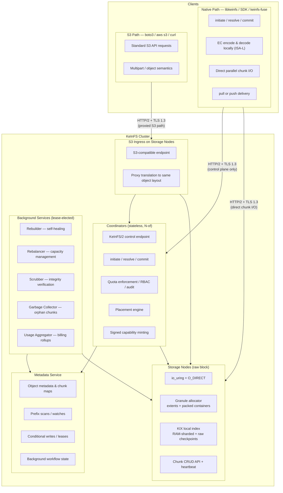

---

## 4. Component Design

### 4.1 Storage Nodes

Storage nodes are intentionally the simplest component in the system. They store and retrieve opaque chunks of data on raw block devices. They have no knowledge of objects, buckets, erasure coding profiles, users, or metadata. They are chunk vending machines.

**Operational first principles.** Storage-node behavior must remain legible to the operator. Errors, warnings, and degraded-mode notices are written in terms of drives, shards, requests, rebuild state, and recovery actions, not opaque internal trivia. A storage-node message is not complete unless it states what failed, what the daemon will do next, and what the operator should verify or change. Silent or ambiguous fallback is unacceptable.

**NUMA locality is part of the storage layout.** On startup, the storage daemon determines the NUMA locality of each configured raw block device from the platform's PCIe and sysfs topology when available. Drives are then grouped by locality domain, and KIX shard workers, appender workers, completion polling threads, and their buffer pools are placed on cores and memory local to those drives by default. On single-node systems this collapses to a trivial placement. On multi-node systems, cross-node placement is treated as an explicit fallback and produces an operator-visible warning.

**Ingress follows the same locality rules.** NUMA-aware storage layout is not limited to the block side. Each locality domain also owns its NIC receive queues, socket pollers, HTTP/2 data-plane runtime threads, any separate management-plane RPC threads, request buffer pools, and completion paths. A request should either arrive on the correct locality domain from the start or pay exactly one early handoff to the owning domain. It is expressly forbidden to parse, authorize, buffer, and route the request on one NUMA node and then submit the actual drive I/O on another as if that were a harmless implementation detail.

**IRQ and queue affinity are part of correctness.** Generic interrupt balancing is not trusted to preserve storage-node locality. NIC RSS queues, NIC interrupt vectors, NVMe MSI-X vectors, and any other queue-driven completion path must be affined to the CPUs reserved for the owning locality domain. If a low-latency deployment uses busy polling for some legs of the path, interrupts become less relevant on those legs but remain relevant everywhere else. The operating rule is simple: worker placement, memory placement, queue ownership, and interrupt affinity must agree.

**Allocator Model.** KeInFS uses a single aligned physical allocation granule size, variable contiguous extents for the large-object fast path, and packed containers for small objects. Allocation policy is selected per bucket or storage class and does not require pre-partitioning the device into fixed size classes.

The practical consequence is that administrators do not guess future workload ratios at format time and partition the device into permanent regions for different object sizes. The drive is formatted once with a fixed physical granule size and allocator metadata. Bucket or storage-class policy then decides whether a given object lands in long contiguous extents or inside packed small-object containers.

**On-Disk Layout:**

Each raw block device (typically an NVMe drive) is formatted with a minimal custom layout that eliminates all filesystem overhead.

**Figure 2.** On-disk layout of a KeInFS-formatted raw block device, showing the single raw-device format: superblock, allocator metadata, KIX arena, packed-container region, extent-backed data region, and backup superblock.

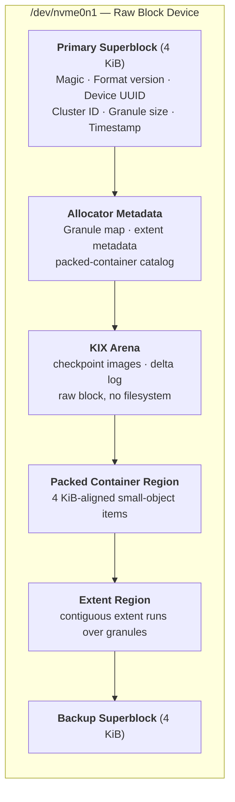

KeInFS formats each drive with a fixed 1 MiB physical allocation granule size. Large objects are placed in variable contiguous extents, while small objects below a policy threshold are packed into containers with 4 KiB internal alignment. Allocation therefore follows workload policy without requiring repartitioning when workload shape changes.

**Device Formatting:**

Raw block devices do not arrive ready to store chunks. Each device must be formatted before the storage node daemon can use it. This operation is analogous to `mkfs`, but simpler because there is no filesystem to create. There are no inodes, no journal, no directory structures, no superblock trees, and no allocation groups. The format operation writes a 4 KiB superblock, initializes the granule map, extent allocator state, packed-container catalog, and raw KIX arena header, and returns. On a modern NVMe drive, formatting completes in under one second regardless of drive capacity.

```bash
# Format a single device
keinctl device format /dev/nvme0n1

# Format with explicit allocator policy
keinctl device format /dev/nvme0n1 \
    --allocator-policy large-object \
    --granule-size 1M \
    --small-object-threshold 256K

# Format all unformatted devices on a node
keinctl device format-all --confirm

# Dry run — show what would be written without touching the device
keinctl device format /dev/nvme0n1 --dry-run

# Inspect an already-formatted device
keinctl device inspect /dev/nvme0n1
```

The format operation performs the following steps in sequence.

**Step 1 — Safety checks.** The tool verifies that the device is not currently mounted, not in use by another KeInFS storage node process, and does not contain a recognized filesystem signature (ext4, XFS, etc.) unless `--force` is specified. This prevents accidental destruction of existing data. If the device already has a KeInFS superblock, the tool refuses to re-format unless `--force` is specified, and it displays the existing superblock's UUID and creation timestamp so the operator can confirm they are formatting the intended device.

**Step 2 — Capacity planning.** The tool reads the device's total capacity via `ioctl(BLKGETSIZE64)` and computes the allocator metadata layout. The default policy (`large-object`) formats the device with a fixed physical granule size, reserves allocator metadata, a raw KIX arena, and packed-container bookkeeping, and leaves the overwhelming majority of the medium available for contiguous extent allocation. Mixed and small-object policies adjust thresholds and reservation budgets, but they do not repartition the device into fixed size classes.

For a 3.84 TB NVMe drive (3,840,000,000,000 bytes), the default layout is:

```
Primary superblock:        4 KiB         (offset 0x0000)
Backup superblock:         4 KiB         (tail of data partition)
Granule map:            ~448 KiB         (1 MiB granules)
Extent allocator state:  ~64 KiB         (free lists, generation metadata)
Container catalog:      ~512 KiB         (packed-container directory)
KIX arena:               512 MiB         (raw checkpoint + delta-log region)
Packed reserve:         ~1.0 GiB         (small-object fast path)
Extent pool:            remaining device space
Format metadata written: < 2 MiB
```

The format metadata actually written — primary and backup superblocks, granule map, extent allocator state, packed-container catalog, and the small KIX arena header — remains below 2 MiB for a 3.84 TB drive. The KIX arena itself is reserved address space, not eagerly initialized with a full image at format time. Because KeInFS stores no filesystem metadata (no inodes, no directory entries, no journal, no extended attributes) on the data device, the written-overhead remains negligible. By comparison, `mkfs.ext4` on the same drive creates approximately 1.5 GB of filesystem metadata (inode tables, group descriptors, journal), consuming 0.04% of the drive. XFS and ldiskfs have similar overhead. KeInFS's format overhead remains orders of magnitude smaller.

**Step 3 — Write superblock.** The superblock is written at offset 0 with a single `O_DIRECT` aligned write.

```c
struct keinfs_superblock {
    uint32_t magic;           // 0x4B45494E ("KEIN" in ASCII)
    uint16_t format_version;  // Currently 1
    uint16_t flags;           // Reserved
    uint8_t  uuid[16];       // Random UUID generated at format time
    uint64_t device_size;     // Total device capacity in bytes
    uint64_t created_at;      // Unix timestamp of format
    uint32_t granule_size;    // Fixed physical allocation granule in bytes
    uint32_t allocator_policy;// large-object, mixed, or small-object
    uint64_t extent_region_offset;
    uint64_t extent_region_size;
    uint64_t container_region_offset;
    uint64_t container_region_size;
    uint64_t granule_map_offset;
    uint32_t granule_map_size;
    uint64_t kix_arena_offset;
    uint32_t kix_arena_size;
    uint8_t  reserved[3904];  // Pad to exactly 4096 bytes
    uint32_t checksum;        // CRC32C of bytes 0..4091
};
```

The superblock is protected by a CRC32C checksum. On storage node startup, the daemon reads and verifies the superblock for each configured device. A corrupted superblock prevents the device from being used (the operator must re-format or restore from a backup of the superblock, which the format tool optionally writes to a configurable backup location).

**Step 4 — Initialize allocator metadata.** The granule map is written in the all-free state, the extent allocator state is initialized, the packed-container catalog is created empty, and the KIX arena receives its initial header and generation record. A set bit (1) in the granule map indicates an allocated physical granule; a clear bit (0) indicates a free granule. The map remains small enough to live entirely in memory at runtime, which is the property that matters.

**Step 5 — Verification.** The tool reads back the superblock and allocator metadata, verifies CRC32C integrity, and prints a summary.

```
$ keinctl device format /dev/nvme0n1

KeInFS Device Format
  Device:     /dev/nvme0n1
  Capacity:   3.84 TB (3,840,000,000,000 bytes)
  UUID:       a1b2c3d4-e5f6-7890-abcd-ef0123456789
  Format:     v1

  Allocator Policy: large-object
  Granule Size:     1 MiB
  Packed Threshold: 256 KiB
  KIX Arena:        512 MiB
  Extent Region:    remaining device space
  Packed Reserve:      1.0 GB

  Metadata:       < 2 MiB (superblock + allocator metadata)
  Data Regions:  packed containers + extents

  Format completed in 0.3 seconds.
  Device is ready for use with kst.
```

**Bulk formatting for cluster deployment:**

In a large cluster deployment (thousands of storage nodes, each with multiple NVMe drives), formatting is parallelized. The `keinctl cluster format` command connects to all registered storage nodes via SSH or a management API and formats all unformatted devices concurrently.

```bash
# Format all devices on all nodes in the cluster
keinctl cluster format --confirm

# Format devices on specific nodes
keinctl cluster format --nodes sn-001,sn-002,sn-003 --confirm

# Use Ansible/Salt/Puppet for existing infrastructure automation
ansible -m shell -a "keinctl device format-all --confirm" storage_nodes
```

**Re-formatting and secure erase:**

Re-formatting a device with `--force` overwrites the superblock and allocator metadata but does not zero the data regions (the data becomes unreferenced garbage that will be overwritten by new chunk writes). For environments requiring secure data destruction (compliance, decommissioning), the `--secure-erase` flag issues an NVMe Secure Erase command to the drive controller, which performs a hardware-level cryptographic erase of all flash cells. This is faster and more thorough than software-based overwriting.

```bash
# Reformat (fast — just rewrite superblock and allocator metadata)
keinctl device format /dev/nvme0n1 --force

# Secure erase + reformat (hardware-level erase, then fresh format)
keinctl device format /dev/nvme0n1 --force --secure-erase
```

A native KeInFS index engine (`KIX`) on each storage node maintains a RAM-resident chunk directory mapping chunk IDs to their on-disk location.

```
Key:   chunk_id (32 bytes)
Value: {
    drive_id:       u16,  // which drive on this node
    location_kind:  u8,   // extent or packed_container
    physical_offset:u64,  // byte offset on the drive
    logical_length: u32,  // bytes returned to the client
    stored_length:  u32,  // bytes occupied on media
    generation:     u32,  // extent/container generation
    checksum:       u32   // CRC32C of chunk data
}
```

The live KIX directory is sharded across hot cores and is not the source of truth. It can always be rebuilt from the superblock, allocator metadata, extent records, and packed-container directories if lost. The authoritative object-to-chunk map lives in the metadata service.

**I/O Path:**

All data I/O uses `io_uring` with `O_DIRECT` to the raw block device. There is no kernel filesystem in the data path. Write ordering is explicit: the chunk data is written first, then the granule allocator state is committed, then the owning KIX shard publishes the location in RAM and appends a compact delta record to the drive-local raw KIX arena. Foreground acknowledgement is gated by durable data and allocator state; KIX checkpoint persistence is a restart accelerator rather than a correctness dependency. On crash recovery, any gap between the live RAM directory and the last durable KIX delta is resolved by replaying the drive-local metadata.

**Storage Target API:**

The storage target service (`KST`) exposes the direct data path over KeInFS/2 (`KP2`) on raw HTTP/2. The native data path is not gRPC. Each physical drive corresponds to exactly one storage target identity, one direct endpoint, one locality domain, one KIX arena, one chunk-media span set, and one runtime observability tree. A multi-drive server therefore exposes a set of targets rather than one undifferentiated data endpoint.

At minimum, a target exposes the following direct operations:

```
PUT    /chunk/{id}         Write chunk bytes, return location metadata
GET    /chunk/{id}         Read chunk bytes
DELETE /chunk/{id}         Retire chunk publication and free media state
HEAD   /chunk/{id}         Return chunk metadata (size, checksum, location)
GET    /status             Report target health, capacity, and I/O stats
```

These operations are not served by a single anonymous node-wide worker pool. In a multi-domain storage node, the target service is instantiated per locality domain, and the coordinator returns the direct endpoint for the domain that owns the target drive set. Native clients therefore open direct connections to the correct domain-local target service rather than forcing the storage node to rediscover locality after the request has already landed on the wrong CPUs.

The hot direct path is further split from the buffered and packed ingress path. Direct single-granule reads and writes execute on target-local execution groups owned by the drive's locality domain, while packed and buffered routes may use separate ingress worker pools. This preserves direct-path latency while still allowing explicit queueing and backpressure for buffered transactions.

That is the entire storage target. It validates a short-lived signed capability on each request, checks expiry and operation scope locally, and performs the I/O. No metadata, no coordinator callback on the hot path, no awareness of the rest of the system beyond heartbeating its status into the metadata service.

**Heartbeat:**

Every storage node writes a heartbeat record into the metadata service at a configurable interval (default: 5 seconds).

```json
{
    "node_id": "sn-042",
    "timestamp": "2026-02-19T10:30:05Z",
    "drives": [
        {
            "id": "nvme0",
            "status": "healthy",
            "capacity_bytes": 3840000000000,
            "used_bytes": 2100000000000,
            "io_queue_depth": 12,
            "smart_healthy": true
        }
    ],
    "network": {
        "bandwidth_available_bps": 100000000000,
        "connections_active": 847
    }
}
```

#### 4.1.1 Device Initialization and Formatting

Raw block devices do not arrive ready to store chunks. Before a drive can participate in a KeInFS cluster, it must be formatted with the KeInFS on-disk layout and allocator metadata.

> **Implementation note:** the design below describes a single unified storage
> daemon. The POC splits it into two real binaries: **`kix`** (the raw-device and
> index tool — e.g. `kix format`, `kix inspect`) and **`kst`** (the serving
> daemon, one target per drive). The commands below are shown under the binary
> that owns each operation in the implementation.

**The `kix format` command:**

```bash
# Format a single drive
kix format /dev/nvme0n1

# Format with explicit allocator policy
kix format /dev/nvme0n1 \
    --allocator-policy large-object \
    --granule-size 1M \
    --small-object-threshold 256K \
    --packed-container-size 8M \
    --node-id sn-042 \
    --cluster-id prod-us-east

# Format multiple drives on a node in parallel
kix format /dev/nvme0n1 /dev/nvme1n1 /dev/nvme2n1 /dev/nvme3n1 --parallel

# Dry run — compute layout without writing
kix format /dev/nvme0n1 --dry-run

# Force re-format (requires explicit confirmation)
kix format /dev/nvme0n1 --force
```

**What `kix format` writes to disk:**

The format process performs the following steps in order, writing directly to the raw block device using `O_DIRECT` with `O_SYNC` to ensure durability.

**Step 1 — Device validation and layout selection.** The formatter opens the block device, reads its capacity via `ioctl(BLKGETSIZE64)`, verifies that it is not currently mounted, and checks for an existing KeInFS superblock. If an existing superblock is found, the format aborts unless `--force` is specified. The device is then formatted directly as a single raw KeInFS span. No GPT partition table and no filesystem partition are required, because both the data path and the local KIX structures are raw-block managed.

**Step 2 — Allocator layout computation.** Given the device capacity and the selected allocator policy, the formatter computes the exact on-disk layout of the drive.

```
Example: 3.84 TB NVMe drive (3,840,000,000,000 bytes)

Primary superblock:          4 KiB at offset 0x0000
Granule map:                 sized from 1 MiB granules
Extent allocator metadata:   free-space and generation metadata
Packed-container catalog:    container directory and accounting
KIX arena:                   checkpoint images + delta log (raw)
Packed reserve:              policy-defined small-object pool
Extent pool:                 remaining aligned granule space
Backup superblock:           4 KiB at end of drive
```

The device is not partitioned into separate size classes or filesystems. All free space is managed as one aligned granule pool. Small objects are placed into packed containers below the selected threshold, with 4 KiB internal item alignment. Large objects are placed into contiguous extents assembled from the same granule pool.

**Step 3 — Superblock write.** The formatter writes a 4 KiB superblock at offset 0 of the device.

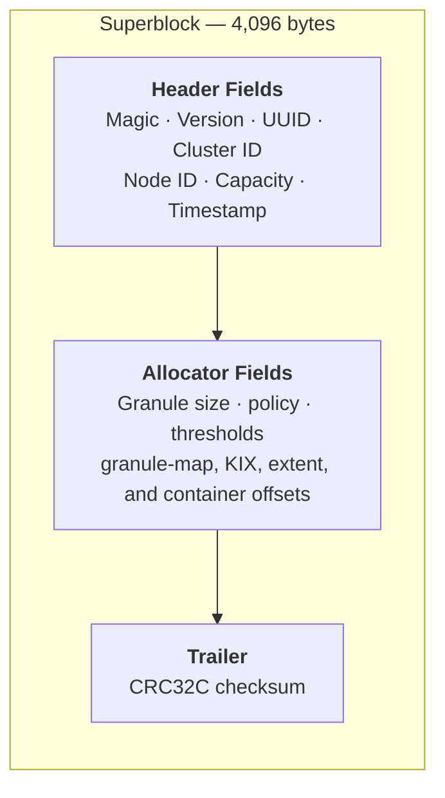

**Superblock Header Fields:**

| Offset | Size | Field |
|--------|------|-------|
| 0x0000 | 4 | Magic number: `0x4B45494E` ("KEIN" in ASCII) |
| 0x0004 | 4 | Format version: `1` |
| 0x0008 | 16 | Device UUID |
| 0x0018 | 32 | Cluster ID |
| 0x0038 | 32 | Node ID |
| 0x0058 | 8 | Device capacity in bytes |
| 0x0060 | 8 | Format timestamp |
| 0x0068 | 4 | Granule size in bytes |
| 0x006C | 4 | Allocator policy identifier |
| 0x0070 | 8 | Extent region offset |
| 0x0078 | 8 | Extent region length |
| 0x0080 | 8 | Packed-container region offset |
| 0x0088 | 8 | Packed-container region length |
| 0x0090 | 8 | Granule-map offset |
| 0x0098 | 4 | Granule-map length |
| 0x009C | 8 | KIX arena offset |
| 0x00A4 | 4 | KIX arena length |
| 0x0FF0 | 4 | Header CRC32C |

The storage daemon verifies the superblock checksum on startup. A secondary copy of the superblock is written at the last 4 KiB of the drive as a backup.

**Step 4 — Allocator metadata initialization.** The formatter writes a zeroed granule map, initializes empty extent free-space structures, creates an empty packed-container catalog, and writes the initial KIX arena header. The metadata write is a small sequential operation and completes in well under a second on NVMe.

**Step 5 — Registration.** If `--register` is provided, the formatter writes the device UUID, capacity, and allocator configuration to the metadata service, registering the drive as available cluster capacity. Drives can also be formatted offline and registered later when the storage daemon starts.

**Chunk on-disk format:**

Each stored fragment is written either as an extent-backed record or as an item inside a packed container. Both layouts are self-describing enough to support integrity verification and index rebuild.

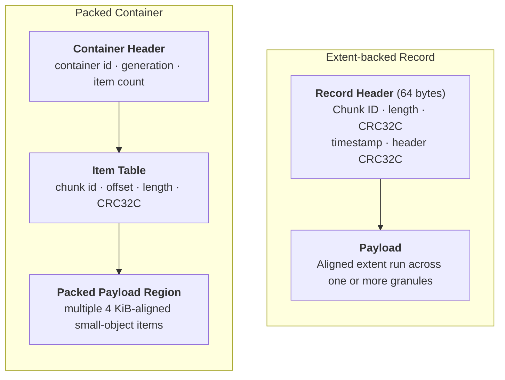

Extent-backed records are appropriate for large chunks and sequential write paths. Packed containers are appropriate for small objects below the configured threshold. Packed items are internally aligned to 4 KiB boundaries so the storage node can satisfy direct reads of small objects without copying unrelated bytes through an intermediate packer. In both cases, CRC32C protects payload integrity and the metadata required for rebuild.

**Index rebuild from disk:**

Because KIX is RAM-resident and its raw-drive checkpoint images are advisory rather than authoritative, index loss without data loss is an ordinary recoverable condition rather than an emergency. The index can always be reconstructed from the superblock, granule map, extent metadata, packed-container catalog, and the per-record/per-container metadata stored on the drive.

```bash
# Rebuild the chunk index from on-disk data
kix rebuild-index /dev/nvme0n1 /dev/nvme1n1

# Verify index consistency against on-disk data
kix verify-index --drives /dev/nvme0n1,/dev/nvme1n1
```

The rebuild process reads the superblock, loads the most recent valid KIX checkpoint image if present, replays any surviving KIX delta records, and then scans allocator metadata, extent records, and packed containers to verify or regenerate every chunk location record. If no valid checkpoint exists, the rebuild skips directly to the full metadata scan.

**Drive replacement workflow:**

When a failed drive is physically replaced with a new drive, the operator formats it and the system handles the rest.

```bash
# 1. Physical replacement complete. Format the new drive.
kix format /dev/nvme2n1 --node-id sn-042 --cluster-id prod-us-east --register

# 2. The storage daemon detects the new drive.
kst signal reload

# 3. The rebuilder detects the new capacity and begins rebalancing.
```

**Multi-drive discovery:**

On startup, the storage daemon discovers KeInFS-formatted drives by scanning all configured block devices, reading the first 4 KiB of each device, and checking for the `0x4B45494E` magic number and a valid superblock CRC32C. Drives that pass validation are activated and their KIX directories are reconstructed in parallel from checkpoint images, delta records, or a full allocator scan as required.

#### 4.1.2 KeInFS Index Engine (KIX)

The node-local chunk-index workload is unusually narrow. KeInFS needs extremely fast point lookups from `chunk_id` to physical location, very high concurrent read volume, batched inserts and deletes, no user-visible range scans, no secondary indexes, and no cross-key transactional semantics. The index is also rebuildable from device metadata. A general embedded database is therefore unnecessary machinery. KeInFS implements a native local index engine, **KIX**, instead.

KIX has two forms:

1. A **RAM-resident live directory** sharded across hot cores. Each locality domain owns its own shard group, ingress rings, hash tables, and checkpoint workers. Requests are routed first to the locality domain that owns the target drive and then to a shard within that domain by `hash(chunk_id) mod N`, where *N* is typically the number of dedicated storage hot cores assigned to that domain. In low-latency profiles, each shard worker is pinned to a dedicated busy-polled core local to the target drives.
2. A **drive-local raw KIX arena** reserved on each formatted drive. The arena stores compact checkpoint images and delta records for the chunks that currently reside on that drive. It is not a filesystem and it is not queried on the hot read path.

**Locality-aware layout.** KIX is designed for machines that are not uniform. On a multi-socket or multi-complex server, a lookup shard that serves a drive across a remote NUMA hop squanders the point of owning raw NVMe in the first place. Accordingly, KIX allocates its live-directory shard groups, appender workers, and hot polling cores per device locality domain. The steady-state objective is simple: the CPU core that resolves a chunk location and submits the I/O should be local to the drive that will complete that I/O, and the memory that holds the shard's hot directory should be allocated from the same NUMA node. Cross-domain ownership is reserved for rebalance, failover, or explicit operator override.

**Actionable diagnostics.** Locality decisions are surfaced explicitly at startup and during reconfiguration. If a drive's NUMA node cannot be determined, the daemon reports that fact, states the fallback placement it selected, and explains how the operator can override or verify it. If operator-supplied CPU pinning conflicts with device locality, the daemon emits a warning naming the drive, the inferred locality domain, the configured cores, and the expected performance consequence. Silent locality fallback is disallowed because it undermines both performance attribution and benchmark validity.

**KIX live-directory record format:**

```
Key:   chunk_id (32 bytes)
Value: {
    drive_id:        u16,
    location_kind:   u8,    // extent or packed_container
    physical_offset: u64,   // byte offset on the drive
    logical_length:  u32,   // client-visible length
    stored_length:   u32,   // bytes occupied on media
    generation:      u32,   // protects against reused extents/containers
    crc32c:          u32
}
```

For packed-container records, `physical_offset` points directly at the 4 KiB-aligned start of the packed item. The read path therefore remains a direct offset read on the target drive; no unpacking scan or container walk occurs on the steady-state hot path.

**Read path.** The client presents `chunk_id`. The storage node hashes the identifier to the owning KIX shard, performs a RAM lookup, obtains the location descriptor, and issues the direct I/O to the target drive. No filesystem lookup, no secondary database read, and no coordinator involvement occur once the request reaches the storage node.

**Write path.** After the allocator selects an extent or packed-container slot on a drive, the storage node writes the chunk bytes, commits the allocator metadata, and publishes the location into the live KIX directory. The shard then appends a compact delta record to the drive-local KIX arena in microbatches. Checkpoint images are written asynchronously and are excluded from the foreground acknowledgement path.

**Checkpointing and recovery.** Each drive periodically seals a compact KIX checkpoint image containing the current location records for chunks on that drive, followed by a stream of delta records for later updates. On restart, the storage node loads the newest valid checkpoint image from each drive in parallel, replays the delta tail, and verifies generations against allocator metadata. If any checkpoint image or delta tail is missing or corrupt, the node falls back to allocator-driven rebuild for that drive. KIX accelerates restart; it does not define truth.

**Why not a general embedded KV.** LSM engines bring compaction policy, SST layout, memtable tuning, bloom filters, write stalls, and a filesystem dependency to solve a problem that does not require any of them. SQLite and LMDB reduce the machinery but still impose concurrency models that are poorly matched to a hot-core, many-request storage node. KIX is deliberately narrower: point lookup only, shard-local ownership, raw-block persistence, and rebuild as a first-class recovery mechanism.

**What about the node's OS drive?** The storage daemon binary (`kst`), its configuration, systemd unit files, and log files still live on the node's OS drive. The OS drive carries no KeInFS data-path state. If the OS drive fails, the operator reinstalls the OS, starts `kst`, and the daemon rediscovers all data drives via superblock scanning and KIX recovery. No chunk data is lost.

#### 4.1.3 Drive Eviction and Superblock Destruction

Every KeInFS-formatted drive carries a unique 128-bit UUID in its superblock, generated at format time. This UUID is registered in the metadata service as part of the cluster's drive inventory. When a drive must be permanently removed from the cluster — whether due to hardware failure, decommissioning, or reassignment — it must go through a formal eviction process that ensures no stale data can accidentally re-enter the cluster.

**Why eviction matters.** Without explicit eviction, several dangerous scenarios become possible. An operator replaces a failed drive, but the old drive is later recovered from a parts bin and accidentally re-inserted into the same or a different node. The storage daemon sees a valid superblock with a recognized (or previously recognized) UUID and activates the drive, introducing stale chunks that conflict with chunks that were rebuilt elsewhere from EC parity. In a multi-cluster environment, a decommissioned drive from cluster A could be physically moved to cluster B, and if cluster B's daemon doesn't validate cluster affiliation, stale chunks from cluster A could contaminate cluster B's namespace. Both scenarios result in silent data corruption.

**The eviction workflow:**

```bash
# Step 1: Initiate graceful eviction (drain chunks to other drives first)
keinctl drive evict nvme0-uuid --drain

# Step 2: If drive is failed and cannot be drained, force-evict
keinctl drive evict nvme0-uuid --force

# Step 3: Physically remove the drive (or wipe it in-place)
kix destroy /dev/nvme2n1
```

**`keinctl drive evict --drain` (graceful eviction):**

The coordinator instructs the rebuilder to migrate all chunks currently stored on the target drive to other drives in the cluster, respecting EC placement constraints. This is identical to the rebuild process triggered by a drive failure, except it is initiated proactively. During the drain, the drive remains active and serves reads, but no new chunks are placed on it. The drain is complete when the metadata service contains zero chunk map entries referencing the target drive. At completion, the drive's UUID is moved to the `evicted` state in the drive registry, and the drive is deactivated.

**`keinctl drive evict --force` (immediate eviction):**

If the drive has already failed and cannot serve reads or participate in a drain, the force-evict command immediately marks the drive's UUID as `evicted` in the metadata service and triggers EC rebuild for all chunks that had copies on the evicted drive. This is the same codepath as an automatic failure detection, but explicitly operator-initiated.

**`kix destroy` (superblock destruction):**

This is the physical step that renders the drive inert. It performs the following operations:

```
1. Read the superblock from offset 0x0000
2. Verify the magic number ("KEIN") — refuse to destroy non-KeInFS devices
3. Verify the drive UUID matches a UUID in the 'evicted' state in the metadata service
   (prevents accidental destruction of a live drive)
4. Overwrite the primary superblock (offset 0x0000) with zeros (4 KiB)
5. Overwrite the backup superblock (last 4 KiB of device) with zeros
6. Overwrite allocator metadata regions (granule map, extent state, packed-container catalog)
7. Overwrite the KIX arena header and recovery tail with zeros
8. Issue an NVMe Secure Erase command if supported by the device firmware
   (NVME_FORMAT_SECURE_ERASE via ioctl), otherwise overwrite the first
   and last 1 MiB of the device with cryptographic random data
9. Remove the drive UUID from the metadata service's drive registry entirely
```

After `kix destroy`, the drive has no valid superblock and no allocator or KIX metadata that `kst` can interpret. The storage daemon's device discovery scan will skip it entirely because the magic number check fails. The drive is now a blank raw block device that can be reformatted for KeInFS (via `kix format`) or repurposed for any other use.

**Safeguards against accidental destruction:**

The `kix destroy` command requires the drive's UUID to be in the `evicted` state in the metadata service before it will proceed. This means an operator cannot accidentally destroy a live, active drive — they must first complete the eviction workflow (which drains data or triggers EC rebuild), and only then can they destroy the superblock. The `--force` flag on `destroy` bypasses the registry check, but requires an interactive confirmation prompt ("This drive contains KeInFS data that may not have been rebuilt. Type the drive UUID to confirm destruction: ") to prevent catastrophic operator error.

**Drive UUID lifecycle:**

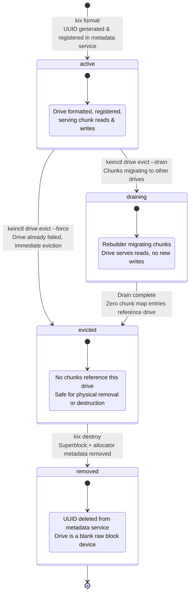

**Figure 8.** Drive UUID lifecycle in the metadata service. The eviction workflow ensures that a drive's superblock is never destroyed while chunks still reference it, and that a drive cannot re-enter a cluster after eviction without an explicit reformat that generates a new UUID.

**Cross-cluster protection.** The superblock contains the cluster ID (a 32-byte string set at format time). On device discovery, the storage daemon verifies that the cluster ID in each drive's superblock matches the daemon's configured cluster ID. A drive formatted for cluster `prod-us-east` will be rejected by a daemon configured for cluster `prod-us-west`, even if the drive has a valid superblock and the UUID is unknown to the local metadata registry. This prevents cross-cluster contamination when drives are physically moved between datacenters.

### 4.2 Coordinators

The control-plane services are designated **coordinators**. They authenticate requests, evaluate placement and policy, issue capabilities, and commit metadata. They do not relay native object data.

Coordinators are stateless HTTP/2 services that handle the control plane of object operations. They authenticate requests, evaluate placement and policy, issue signed chunk capabilities, commit metadata, enforce quotas, and serve the management API. For native clients (`libkeinfs` and `keinfs-fuse`), coordinators never relay object data. Native data transfer is excluded from coordinator responsibilities by design.

**Coordinator Responsibilities:**

The coordinator parses the client's credentials and attribution context, evaluates the EC profile, allocator policy, and failure-domain constraints, and returns the storage-node endpoints and short-lived signed capabilities needed for direct chunk I/O. On write commit, it executes a metadata-plane transaction that atomically publishes the object version and associated quota mutations. On read resolve, it returns the manifest metadata and direct storage-node access information — not the object bytes themselves.

Signed capabilities replace the earlier shared-HMAC token model. Coordinators mint short-lived signed capabilities, storage nodes verify them locally with a public key, and the native hot path does not call back into the metadata plane for permission checks.

Coordinators also enforce hierarchical quotas (tenant → team → project → job). For high-throughput dimensions such as request rate and bandwidth, they use local token buckets with periodic synchronization to the metadata plane, keeping exact accounting where it matters while avoiding distributed transactions in the per-packet hot path.

Coordinators are fully stateless and horizontally scalable. Any coordinator can handle any control-plane request. They can be added or removed without cluster reconfiguration.

#### 4.2.1 Load Balancers: When You Need Them and When You Don't

The load-balancing model follows directly from the separation of control and data planes.

**Native clients do not use a load balancer for data.** A native client contacts a coordinator for `initiate`, `resolve`, `commit`, and metadata operations. It then talks directly to storage nodes for chunk reads and writes. The client may maintain a list of coordinator endpoints for failover, but the native data plane is distributed by placement and direct fan-out rather than by proxy mediation.

**S3 clients do use a load balancer, because S3 is the proxy path.** S3 ingress runs on storage nodes. A standard L4 load balancer or DNS round-robin spreads S3 requests across those ingress-capable nodes. The chosen ingress node proxies the request, talks to coordinators for placement and commit logic, and fans out chunk operations to peer storage nodes on behalf of the S3 client. The cluster scales S3 throughput horizontally by adding ingress-capable storage nodes.

In practice, most deployments will run both paths simultaneously: native direct-path clients for performance-critical workloads, and load-balanced storage-node S3 ingress for ecosystem tooling and off-fabric access.

### 4.3 Metadata Service — The Namespace and the Brain

The metadata plane is defined as a **metadata service contract** that owns the namespace, object publish semantics, watches, leases, and workflow coordination, while isolating the rest of KeInFS from backend-specific implementation details. The current implementation direction is explicit: sharded `KMS` and separate `KAS` services backed by FoundationDB for durable truth and NATS for invalidation fan-out. The database is a substrate, not the architecture.

The critical distinction remains unchanged: **the metadata plane owns the namespace; storage nodes do not.** Tenant namespaces, projects or groups, bucket roots, collections, object heads, manifests, quotas, placement policy, operations, leases, and audit records live in the metadata plane. Storage nodes store opaque chunks and maintain only a node-local lookup index of chunk IDs to physical locations. If you delete every storage node, the namespace still exists but the data is gone. If you delete the metadata plane, the raw chunks still exist but the cluster no longer knows what any of them mean. That asymmetry is the design, not an accident.

**What the metadata plane must provide:**

```
/namespaces/{namespace}                       → Tenant-scoped namespace metadata
/namespaces/{namespace}/entries/{entry_id}    → Domain hierarchy entries
/buckets/{bucket}                             → Bucket root configuration and EC policy
/objects/{bucket}/{key}                       → Object head metadata
/objects/{bucket}/{key}/v/{version_id}        → Version metadata
/objects/{bucket}/{key}/v/{version_id}/s/{n}  → Stripe / extent manifests
/nodes/{node_id}/heartbeat                    → Storage node health and drive status
/placement/ring                               → Failure-domain topology and placement state
/quotas/{tenant}/{team}/{project}             → Hierarchical quota limits
/usage/{tenant}/{team}/{project}/{job}        → Usage counters and rollups
/config/cluster                               → Global cluster configuration
/services/{service}/leader                    → Leader election leases
/uploads/{upload_id}                          → In-progress upload state
/operations/{operation_id}                    → Long-running management workflow state
```

The important architectural change is that object manifests, object heads, namespace hierarchy entries, rebuild tasks, and allocator state are decomposed across explicit tables and records rather than stored as giant service-wide blobs. That is required for scale, regardless of which fashionable database logo someone wants to put on the slide deck.

#### 4.3.1 Current Laboratory Control-Plane Slice

The first implemented control-plane slice is organized explicitly around two services and two adjacent supporting components.

**KMS** (KeInFS Metadata Service) owns EC profile records, bucket records, write intents, immutable object-version manifests, current-object pointers, fragment-to-target secondary index records, and rebuild task state. In the current slice, KMS is the only control-plane API exposed to the smart client for object writes and reads. The client does not call the allocator directly.

**KAS** (KeInFS Allocator Service) owns target registration, target heartbeat state, failure-domain labels, free-span accounting, stripe-placement reservations, and replacement placement for rebuild. Its public model is already granule-based even though the first lab slice allocates exactly one `1 MiB` fragment per reservation.

The implemented metadata layout for the current slice is explicitly decomposed into record-class state rather than one service-wide catalog value. `KMS` stores shard-map entries, namespaces, namespace entries, profiles, buckets, object heads, manifests, write intents, fragment-index records, rebuild tasks, and metadata events separately. `KAS` stores target records, heartbeat rows, free-span rows, reserved-span rows, reservation records, and reservation-bin state separately. This is not aesthetic fussiness. It is required if thousands of smart clients are expected to hammer the control plane without turning the metadata path into one hot row and a recurring self-own.

**KEE** (KeInFS Erasure Engine) is a shared library used directly by the smart client and the rebuilder. It is not a network service. The EC profile stored in KMS records the codec identity and parameters, and each bucket stores only the immutable `ec_profile_id` reference. A bucket therefore does not silently drift to a different EC policy mid-life.

**KRS** (KeInFS Rebuild Service) is a per-server daemon. It leases rebuild tasks from KMS, asks KAS for replacement placement, reads surviving fragments directly from storage targets, reconstructs missing fragments through KEE, writes replacement fragments directly to targets, and then commits the repaired manifest back through KMS.

The current end-to-end laboratory slice is still intentionally constrained, but
it is no longer the original single-stripe toy:

- multi-stripe immutable objects are live on the current object path
- the active lab profile family is still `8+2` Reed-Solomon
- the current lab profile still uses `1 MiB` fragments
- latest-version reads only
- full-object reads, writes, and deletes only
- range reads are still not in the current slice

For the EPYC laboratory host, placement uses an explicit `drive-domain-lab` failure-domain mode across `10` distinct targets on one server, with `2` additional targets reserved as rebuild spares. That mode exists only so the full `8+2` stripe plus spare-target rebuild flow can be tested on one physical machine without pretending that one host is a substitute for a real multi-node failure topology.

**Current backend position:**

The current direction is FoundationDB plus NATS, with sharded `KMS`, separate
`KAS`, and in-memory shard-local caches and fat leased windows for the hot
path. FoundationDB is the durable transactional substrate under explicit
service ownership, and NATS provides invalidation and event fan-out. Neither
gets to masquerade as the architecture.

#### 4.3.2 Backend Evaluation Against the Metadata Contract

The metadata contract requires atomic publish of object heads and manifests, ordered prefix scans for namespace listing, watches or equivalent invalidation signals, lease-based leader election for background services, conflict-aware conditional updates, and resumable workflow state for rebuild, scrub, GC, and multipart upload management. A backend must satisfy all of these requirements.

| Requirement | FoundationDB + NATS | Design Implication |
|---|---|---|
| Transactional publish | Strong fit for bounded object-head and manifest publish with strict transactions and explicit key ranges | Publish must stay explicit and bounded per shard instead of turning into a global metadata blob |
| Ordered scans | Strong fit through ordered key prefixes and explicit namespace layouts | Namespace hierarchy, path resolution, and listing stay explicit instead of hiding in accidental table folklore |
| Watch replay | Durable events plus NATS wake-up and invalidation fan-out | `KMS` must own the watch protocol and resume semantics instead of outsourcing them to the substrate |
| HA | Built-in distributed durability plus service-level fan-out | Horizontal scale still comes from explicit `KMS` sharding, not from one giant metadata brain |
| Operational footprint | More distributed-systems honesty, less SQL nostalgia | Boring recovery semantics still matter more than slideware swagger |

The design requirement is now straightforward: KeInFS commits to the metadata contract and implements that contract through sharded `KMS` plus separate `KAS` services on FoundationDB and NATS, while keeping the service boundary explicit enough that the substrate never gets to masquerade as the whole architecture.

**What KIX stores (node-local chunk index — NOT the namespace):**

Each storage node's KIX directory remains purely local, non-distributed, and rebuildable. It maps chunk IDs to physical disk locations on that specific node's drives. The value is a location descriptor pointing either to contiguous extent runs or to packed-container offsets. The role of the index does not change: it is a fast local lookup table, not a source of truth.

Why this separation matters has not changed. The metadata plane defines what should exist. Storage nodes report which bytes they currently hold. The rebuilder and garbage collector reconcile the difference without requiring filesystem-level recovery procedures.

### 4.4 EC Engine — Hardware-Accelerated Data Protection

KeInFS offloads erasure coding onto the CPU's SIMD vector processing units using Intel's Intelligent Storage Acceleration Library (ISA-L). This is not a software fallback with an optional hardware path — it is a hardware-first design where the CPU's vector units are treated as dedicated data protection accelerators.

In the current laboratory slice, that EC behavior is surfaced through `KEE`, the shared KeInFS erasure-coding engine library. KEE is consumed directly by the smart client and the rebuild daemon. Its first-slice behavior is intentionally strict: `8+2` fragments, `1 MiB` fragment size, ISA-L preferred when available, and software Reed-Solomon fallback when ISA-L is unavailable. The codec identity used for a bucket is recorded in the bucket's immutable EC profile binding stored by KMS.

**How Reed-Solomon Erasure Coding Works in KeInFS:**

Reed-Solomon coding operates over a Galois Field (GF(2^8)), where each byte of data is treated as an element in a finite field and the parity chunks are computed as matrix multiplications over this field. For a `k+m` profile, ISA-L constructs a `(k+m) × k` encoding matrix. The first `k` rows are the identity matrix (the data chunks are the data). The remaining `m` rows are the parity generation matrix derived from a Cauchy or Vandermonde matrix. Encoding is: multiply the encoding matrix by the `k` data chunks to produce `k+m` output chunks. The matrix multiplication is over GF(2^8), which means each "multiply" is actually a table lookup and XOR operation.

ISA-L accelerates this by vectorizing the GF(2^8) multiplications using SIMD instructions. A single AVX-512 instruction operates on 64 bytes simultaneously, performing 64 parallel GF multiplications in one clock cycle. For a 4 MiB chunk, the entire encode is dominated by memory bandwidth, not computation.

**SIMD Acceleration Tiers:**

**Table 4.** ISA-L erasure coding throughput by SIMD instruction set for a 12+3 EC profile. Throughput is per physical CPU core and scales linearly with core count. GFNI (Galois Field New Instructions) provides native GF(2^8) arithmetic in silicon.

| Instruction Set | Vector Width | Throughput (12+3, per core) | CPUs |
|---|---|---|---|
| SSE (fallback) | 128-bit (16 bytes) | ~2 GB/s | Any x86-64 |
| AVX2 | 256-bit (32 bytes) | ~8 GB/s | Haswell+ (2013+) |
| AVX-512 | 512-bit (64 bytes) | ~15 GB/s | Skylake-SP+, Ice Lake+, Sapphire Rapids |
| AVX-512 + GFNI | 512-bit + native GF ops | ~25 GB/s | Ice Lake+, Sapphire Rapids+ |

ISA-L auto-detects the best available instruction set at initialization via CPUID and selects the optimal code path. On modern server CPUs (Ice Lake, Sapphire Rapids, Genoa), the GFNI (Galois Field New Instructions) extension provides native hardware GF(2^8) multiply-and-accumulate, eliminating the lookup table approach entirely. This is purpose-built silicon for exactly what KeInFS does.

**Additional Hardware-Accelerated Operations:**

ISA-L is not only erasure coding. KeInFS uses it for a suite of hardware-accelerated operations throughout the data path.

**CRC32C Checksums (SSE 4.2):** Every chunk is checksummed using CRC32C, which has a dedicated x86 instruction (`CRC32` opcode). Throughput is approximately 20 GB/s per core — effectively zero overhead. CRC32C is computed during the `io_uring` write path (the data is already in cache) and verified on read. This is the same checksum used by NVMe drives internally, enabling future end-to-end integrity verification without recomputation.

**AES-256-GCM Encryption (AES-NI):** TLS 1.3 encryption and decryption use AES-NI hardware acceleration, achieving throughput of 5–10 GB/s per core depending on the key size and CPU generation. The `AESENC`/`AESDEC` instructions perform one round of AES in a single clock cycle. Combined with `PCLMULQDQ` for GCM's GHASH polynomial multiplication, TLS encryption overhead on the data path is under 3% — indistinguishable from noise.

**HPACK Compression (BMI2):** HTTP/2's HPACK header compression benefits from BMI2 bit manipulation instructions (`PDEP`, `PEXT`) for efficient Huffman coding. This is a minor optimization but contributes to the overall design philosophy: every cycle counts, and if there is a hardware instruction for the operation, KeInFS uses it.

**SHA-256 for Request Signing and Integrity Metadata:** Intel SHA Extensions (available on Goldmont+, Ice Lake+) provide hardware-accelerated SHA-256 rounds for request-signing workflows and integrity-related metadata operations. Native chunk authorization uses signed capabilities verified locally at storage nodes; it does not depend on a shared-secret callback ritual in the hot path.

**Performance Implications:**

On a modern dual-socket server (e.g., 2× Intel Sapphire Rapids 4th Gen Xeon), the aggregate hardware-accelerated throughput available to KeInFS is approximately 400+ GB/s for EC encode/decode across all cores (far exceeding any network or storage I/O bottleneck), approximately 600+ GB/s for CRC32C checksumming, and approximately 150+ GB/s for AES-256-GCM encryption. The practical consequence is that protection (EC), integrity (CRC32C), and confidentiality (TLS) are never the bottleneck. The bottleneck is always the network or the storage devices — which is exactly how a well-designed system should behave.

**The Rust FFI wrapper provides a safe interface:**

```rust
pub struct ECProfile {
    pub data_shards: usize,    // k
    pub parity_shards: usize,  // m
}

pub struct ECEngine {
    // Pre-computed encode/decode matrices for the configured profile.
    // Matrices are generated once at initialization and reused for every
    // stripe operation. ISA-L selects the optimal SIMD code path via CPUID.
    encode_matrix: Vec<u8>,     // (k+m) × k encoding matrix over GF(2^8)
    decode_tables: Vec<u8>,     // Pre-computed lookup tables for each possible
                                // failure pattern (up to m failures)
    gf_tables: Vec<u8>,         // GF(2^8) multiply tables, SIMD-aligned
    profile: ECProfile,
}

impl ECEngine {
    /// Initialize the EC engine for a given profile. This pre-computes
    /// the encoding matrix and GF multiplication tables. The tables are
    /// aligned to 64-byte boundaries for AVX-512 access.
    pub fn new(profile: ECProfile) -> Self;

    /// Encode a full stripe of data into k+m chunks.
    /// Input: k × stripe_size bytes of source data
    /// Output: (k+m) chunks of stripe_size bytes each
    /// The first k chunks are the original data (identity rows).
    /// The last m chunks are parity (computed via SIMD GF matrix multiply).
    pub fn encode(&self, data: &[u8]) -> Vec<Vec<u8>>;

    /// Decode from any k of k+m chunks back to the original data.
    /// Missing chunks are indicated by None in the input array.
    /// ISA-L solves the linear system over GF(2^8) to recover missing data.
    /// For normal reads (all k data chunks available), this is a no-op memcpy.
    /// For degraded reads (some data chunks missing), this requires matrix
    /// inversion and GF multiplication — still at multi-GB/s SIMD speed.
    pub fn decode(&self, chunks: &[Option<Vec<u8>>]) -> Vec<u8>;

    /// Stream-oriented encode for a single stripe within a larger object.
    /// Used by the pipelined write path where encoding overlaps with network I/O.
    pub fn encode_stripe(&self, stripe: &[u8]) -> Vec<Vec<u8>>;

    /// Report which SIMD instruction set is active.
    /// Useful for diagnostics and performance validation.
    pub fn simd_level(&self) -> SimdLevel; // SSE | AVX2 | AVX512 | AVX512_GFNI
}
```

### 4.5 Background Services

Background services are singleton processes that perform cluster maintenance. Each service uses metadata-service lease-based leader election to ensure exactly one instance is active at any time. If the leader dies, the lease expires and another instance claims leadership within the TTL window (typically 10–15 seconds).

**Rebuilder:** Monitors storage node heartbeats and drive health reports in the metadata service. When a drive fails or a node goes offline, the rebuilder identifies all affected chunks (via metadata scan), reads the surviving chunks for each affected object from other storage nodes, performs EC reconstruction using ISA-L, writes the reconstructed chunks to healthy storage nodes, and atomically updates the chunk maps in the metadata service. Rebuild I/O is throttled via configurable bandwidth limits to avoid impacting production workloads.

**Rebalancer:** Ensures even data distribution across storage nodes. When nodes are added or removed, or when capacity utilization becomes significantly skewed, the rebalancer migrates chunks to achieve a target distribution. It operates at low priority and can be paused by the administrator.

**Scrubber:** Periodically reads chunks from storage nodes and verifies their CRC32C checksums against the values stored in the metadata service. This detects silent data corruption (bit rot) before it causes data loss. Corrupted chunks are rebuilt from EC parity.

**Garbage Collector:** Cleans up orphaned chunks — chunks that exist on storage nodes but are not referenced by any object in the metadata service. These can result from incomplete uploads, failed commits, or object deletions. The GC runs on a configurable schedule and uses a mark-and-sweep approach against metadata records.

**Usage Aggregator:** Rolls up per-request usage counters into hourly and daily aggregates for billing, chargeback, and capacity planning. Reads real-time counters from the metadata service and writes summarized records.

---

## 5. Data Path

### 5.1 Smart Write Path (libkeinfs)

The smart write path is a three-phase protocol where the coordinator authorizes and places but never touches the object data. This eliminates the coordinator as a bandwidth bottleneck and enables clients to saturate the aggregate bandwidth of all storage nodes involved in the write.

**Phase 1 — Initiate:**

The client sends an initiation request to a coordinator with the object metadata and size.

```
POST /v1/{bucket}/{key}?initiate HTTP/2
Host: coordinator.keinfs.local:8443
Authorization: Bearer <token>
x-keinfs-context: <signed attribution context>
Content-Length: 0
x-keinfs-object-size: 10737418240
```

The coordinator authenticates the request, checks quotas, reads the bucket's EC profile from the metadata service (cached), runs the placement engine to select storage nodes for each chunk position, and returns the initiation response:

```json
{
    "upload_id": "01HXYZ...",
    "ec_profile": { "k": 12, "m": 3 },
    "stripe_size": 4194304,
    "total_stripes": 640,
    "targets": [
        {
            "chunk_positions": [0, 15, 30, ...],
            "node": "https://sn-001.keinfs.local:9443",
            "capability": "eyJ..."
        },
        {
            "chunk_positions": [1, 16, 31, ...],
            "node": "https://sn-002.keinfs.local:9443",
            "capability": "eyJ..."
        }
    ]
}
```

Each capability is a signed blob authorizing the client to write specific chunks to a specific storage node within a time window. The storage node validates the signature locally, checks expiry, and accepts the write. No callback to the coordinator is required on the storage-node hot path.

**Phase 2 — Stream:**

The client opens persistent HTTP/2 connections to all 15 storage nodes (12 data + 3 parity for a 12+3 profile). It reads the source data in stripes (stripe size × k = 48 MiB per stripe for 4 MiB chunks and k=12). For each stripe, the client calls ISA-L to produce 12 data chunks and 3 parity chunks, then pipelines the chunk writes to the appropriate storage nodes. HTTP/2 multiplexing allows multiple stripes to be in flight simultaneously, keeping all storage nodes busy.

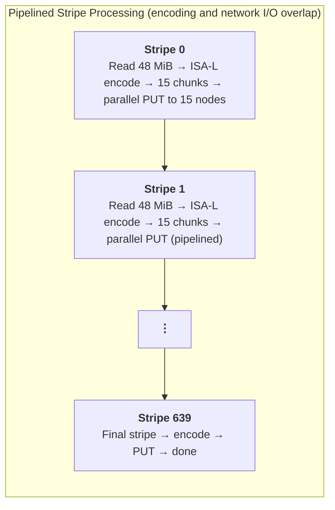

The client does not wait for stripe N to fully acknowledge before encoding stripe N+1. Encoding and network I/O overlap continuously.

**Phase 3 — Commit:**

Once all chunks have been acknowledged by storage nodes, the client sends the commit request to the coordinator:

```
POST /v1/{bucket}/{key}?commit HTTP/2
Host: coordinator.keinfs.local:8443
Authorization: Bearer <token>
Content-Type: application/json

{
    "upload_id": "01HXYZ...",
    "stripe_checksums": [
        {"stripe": 0, "chunks": [{"index": 0, "crc32c": "a1b2c3d4"}, ...]},
        ...
    ]
}
```

The coordinator verifies the checksums, writes the object metadata and complete chunk map to the metadata service in a single atomic transaction, and returns success to the client. The object is now visible to readers.

### 5.2 Smart Read Path (libkeinfs)

The smart read path supports two delivery modes, selected by the client via a request header. Both modes keep EC decoding on the client side, and both are direct between the client and storage nodes. There is no coordinator-mediated native push path.

```
GET /v1/{bucket}/{key} HTTP/2
Host: coordinator.keinfs.local:8443
Authorization: Bearer <token>
x-keinfs-context: <signed attribution context>
x-keinfs-delivery: push | pull
```

The `x-keinfs-delivery` header selects the native delivery mode. If omitted, the native client defaults to `pull`. Omission does **not** imply proxy fallback. If the caller wants S3-style proxying, it should use S3 and accept the consequences like an adult.

#### 5.2.1 Pull Mode (`x-keinfs-delivery: pull`)

Pull mode is the original two-phase resolve-then-fetch protocol. The client asks a coordinator for the manifest, receives it, then independently opens connections to storage nodes and fetches chunks in parallel.

**Phase 1 — Resolve:**

```
GET /v1/{bucket}/{key}?resolve HTTP/2
```

The coordinator looks up the manifest in the metadata plane and returns it with direct storage-node capabilities.

```json
{
    "ec_profile": { "k": 12, "m": 3 },
    "stripe_size": 4194304,
    "total_stripes": 640,
    "object_size": 10737418240,
    "version_id": "01HABCD...",
    "chunks": [
        {"index": 0, "node": "https://sn-001:9443", "capability": "eyJ..."},
        ...
    ]
}
```

**Phase 2 — Parallel Read:**

The client reads *k* chunks per stripe in parallel from the storage nodes. For each stripe, it calls ISA-L decode to reconstruct the original data. If any chunk read fails due to node or network failure, the client transparently reads parity or alternate chunks from other storage nodes and reconstructs locally. The application receives a seamless byte stream.

**When to use pull mode.** Pull mode is the default because it is the cleanest and most predictable fast path. It is optimal when the client has persistent connections to storage nodes, when the client sits on the same high-speed fabric as the storage tier, or when you want the shortest path from "resolve completed" to "bytes are moving."

#### 5.2.2 Push Mode (`x-keinfs-delivery: push`)

Push mode originates from storage nodes over client-opened direct streams. The client resolves through a coordinator first, but the coordinator is not part of the data path after resolution.

**The protocol flow:**

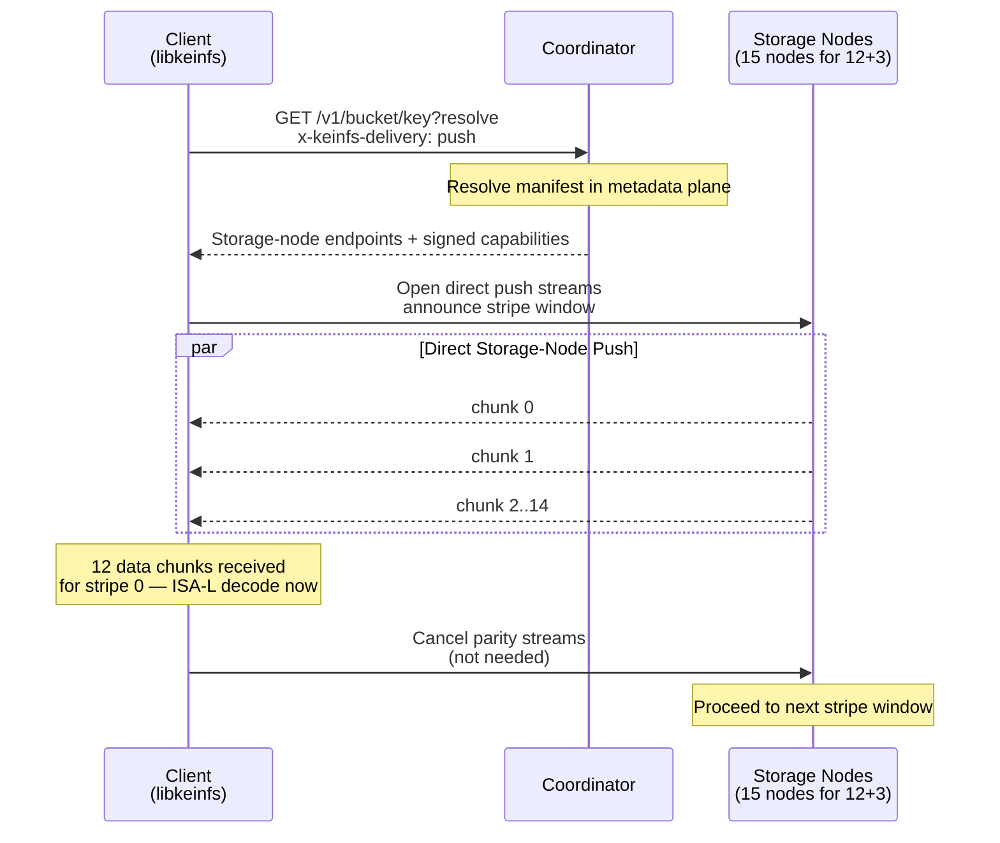

**Figure 9.** Direct storage-node push delivery flow for a read operation with a 12+3 EC profile. The coordinator resolves the manifest, then leaves the stage. Storage nodes stream chunks directly to the client over client-opened streams, and the client cancels unnecessary parity traffic once *k* chunks per stripe are available.

**How it works in detail.** The client first resolves the manifest through a coordinator, exactly as in pull mode. The coordinator returns the object metadata, storage-node endpoints, and signed capabilities required to join one direct push stream per selected storage node. The client then opens these direct streams and advertises a stripe window and flow-control budget. As each storage node has chunk data available for the requested stripe window, it streams chunk frames directly to the client. The client collects chunks per stripe, decodes as soon as *k* chunks are present, and cancels unnecessary parity traffic aggressively.

The direct-push path exists for clients that want a streaming model without issuing discrete chunk reads. It is not a convenience feature for clients that cannot reach storage nodes; those clients use S3 instead. Direct push, like direct pull, requires direct client reachability to the storage tier.

**When to use push mode.** Push mode is useful when the client prefers a stream-oriented delivery model, when prearranged client-opened streams are easier to manage than per-chunk fetches, or when the application wants direct storage-node fan-out without explicit read issuance for every stripe. Pull mode remains the default because it is operationally simpler.

### 5.3 S3 Proxy Path

The proxy path is explicitly **S3**. If a client cannot participate in the native negotiate/resolve protocol or cannot reach storage nodes directly, it uses S3.

| Operation | S3 Ingress Action |
|---|---|
| `PUT /{bucket}/{key}` | Storage-node S3 ingress buffers, encodes, fans out chunks |
| `GET /{bucket}/{key}` | Storage-node S3 ingress resolves, reads chunks, decodes, streams |
| `DELETE /{bucket}/{key}` | Coordinator marks delete in metadata plane, GC cleans chunks |
| `HEAD /{bucket}/{key}` | Coordinator returns object metadata |
| `GET /{bucket}?list-type=2` | Coordinator-backed S3 list operation |

The proxy path is functionally equivalent to the native path in terms of what data ends up stored and how it is protected. The difference is simply that an ingress storage node performs the fan-out and assembly on behalf of the client, and the object bytes therefore transit that ingress node's network interface and CPU. For many ecosystem tools this is perfectly adequate. For multi-gigabyte training data, checkpointing, and high-fanout ingest, the native path is dramatically faster and is the design center of the system.

### 5.4 Streaming EC for Large Objects

Multi-gigabyte files cannot be buffered entirely before encoding. Both the smart client and the proxy path use stripe-based streaming.

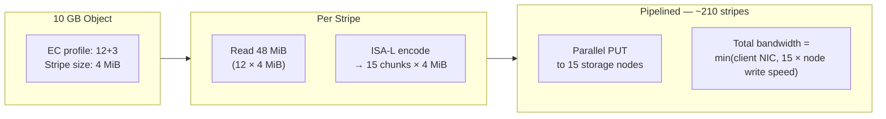

With 100 Gbps networking and NVMe storage, a single client can write a 10 GB object in approximately 1–2 seconds. Multiple clients writing different objects scale linearly.

---

## 6. Storage Classes and Erasure Coding Profiles

KeInFS supports configurable EC profiles per bucket, allowing administrators to balance storage efficiency, durability, and performance for different workloads.

**Pre-defined Profiles:**

**Table 2.** Pre-defined erasure coding profiles. The parameter *k* denotes the number of data chunks and *m* the number of parity chunks per stripe. Storage efficiency is calculated as *k / (k + m)*. "Survives" indicates the maximum number of simultaneous node or drive failures that can be tolerated without data loss.

| Profile Name | k | m | Efficiency | Survives | Min Nodes | Use Case |
|---|---|---|---|---|---|---|
| `kamikaze` | 8 | 0 | 100% | 0 failures | 8 | Scratch, recomputable data |
| `standard` | 8 | 2 | 80% | 2 failures | 10 | General purpose |
| `resilient` | 12 | 3 | 80% | 3 failures | 15 | Production training data |
| `fortress` | 16 | 4 | 80% | 4 failures | 20 | Critical datasets, checkpoints |

**Kamikaze Mode:**

Pure striping with no parity. 100% storage efficiency, maximum write throughput, zero durability guarantee. When a storage node or drive fails, objects with chunks on the failed device are irrecoverable. This mode exists because HPC workloads generate enormous volumes of intermediate data that is recomputable from source. Paying a 20%+ storage overhead and the CPU cost of parity computation for data that will be deleted in an hour is wasteful. Kamikaze mode makes this explicit: the system warns the user that data is unprotected, and the user accepts the tradeoff.

In kamikaze mode, the ISA-L encode step is skipped entirely. The client splits the object into k chunks and writes them directly to storage nodes. Reads reassemble without any decode step. Maximum throughput, minimum latency.

**Custom Profiles:**

Administrators can define custom EC profiles. ISA-L supports any k+m configuration up to approximately k+m=32 before encode/decode performance degrades meaningfully.

```
POST /v1/_admin/ec_profiles
{
    "name": "extreme",
    "k": 20,
    "m": 5,
    "description": "80% efficient, survives 5 failures, 25-node minimum"
}
```

**Small Object Threshold:**

For objects below a configurable threshold (default: 256 KiB), EC encoding is disproportionately expensive. KeInFS stores small objects using simple replication (3 copies by default) instead of EC. This is handled transparently; the storage class is recorded in the object metadata and the correct retrieval strategy is used on read.

---

## 7. Consistency and Concurrency Model

KeInFS provides a clear, simple consistency model built on the metadata service's transactional guarantees. There is no distributed lock manager.

**Guarantees:**

**Read-after-write consistency (same client):** A client that successfully completes a PUT will immediately see the new object on subsequent GET requests through the same coordinator path. This is guaranteed because the commit phase writes to the metadata service synchronously before returning success.

**Atomic object visibility:** Objects are never partially visible. A reader either sees the complete previous version or the complete new version. There is no window where a reader can observe a half-written object. This follows from the atomic metadata transaction in the commit phase: the chunk map is either fully committed or not committed at all.

**Last-writer-wins for concurrent writes:** If two clients simultaneously PUT the same key, both initiate independently, write their chunks to storage nodes, and attempt to commit. The metadata service's optimistic transaction model resolves this: one commit succeeds, the other receives a write conflict error and may retry. The winner's chunk map becomes the object. The loser's chunks become orphans for garbage collection.

**Conditional writes:** Clients can provide an expected version ID with their write request. The commit phase checks the current version in the metadata service: if it has changed since the client last read it, the commit fails with a 412 Precondition Failed response. This provides compare-and-swap semantics for workloads that require it.

```
POST /v1/{bucket}/{key}?commit
x-keinfs-if-version: 01HABCD...
```

**Version history:** Every successful write creates a new version. Previous versions are retained (with configurable retention policy) and can be retrieved by version ID. Versions are immutable once written.

**What KeInFS Does Not Guarantee:**

**Immediate cross-client read-after-write:** If client A writes an object and client B reads it immediately, client B may see the previous version for a brief window (typically under 5 ms) unless the metadata backend is read linearly on the fast path. For workloads that require strong cross-client consistency, the coordinator supports a `x-keinfs-consistent-read: true` header that forces a linearizable metadata read at the cost of a few milliseconds of additional latency.

**There is no byte-range locking, no advisory file locking, no POSIX `fcntl` semantics.** Objects are immutable once written. Modifications create new versions. This eliminates the entire class of problems that LDLM (Lustre's Distributed Lock Manager) exists to solve, along with all of its complexity, failure modes, and performance overhead.

### 7.2 Data Consistency During Failures

The most important question about any storage system is not how it performs when everything works, but what happens to your data when things break. KeInFS's consistency guarantees are designed to hold under every failure scenario, not just the happy path. Every scenario below has been explicitly considered in the architecture.

**Scenario 1: Storage node dies during a write (Phase 2 — streaming chunks)**

The client is in the middle of writing chunks to 15 storage nodes (12+3 profile). Storage node sn-009 crashes after receiving 40 of its 70 assigned chunks.

What happens: the client's connection to sn-009 drops. `libkeinfs` detects the failure (TCP RST or timeout). The client has not yet called commit (Phase 3), so no metadata has been written to the metadata service. The upload is simply abandoned. All chunks written to the 14 surviving nodes, and the 40 chunks written to sn-009 before it died, are orphans. The garbage collector will clean them up on its next sweep (it identifies chunks on storage nodes that have no corresponding object metadata in the metadata service).

Data consistency: **preserved**. No partial object exists in the namespace. The previous version (if any) is still intact. The client receives an error and can retry the entire write.

Optimization: `libkeinfs` can be smarter. Instead of abandoning the entire write, it can re-initiate with a coordinator to get a replacement node for sn-009, re-send only the chunks that were destined for sn-009 to the new target, and proceed with the commit. This requires the coordinator to issue new capabilities for the replacement node and the client to track which chunks were successfully acknowledged. This is an optimization, not a correctness requirement — the simple "abandon and retry" path is always safe.

**Scenario 2: Storage node dies during a write (Phase 3 — commit)**

All chunks have been written and acknowledged. The client sends the commit request to the coordinator. The coordinator begins the metadata transaction to write the object metadata. At this moment, sn-009 crashes.

What happens: the commit succeeds in the metadata service. The object metadata and chunk map are atomically written. The chunk map correctly records that chunks 2, 17, 32, 47, 62 are on sn-009. The metadata service does not know or care that sn-009 is dead — it is recording facts about where chunks were written, and those chunks were indeed written and acknowledged before sn-009 died.

Data consistency: **preserved**. The object is committed. The chunks on sn-009 are on disk (they were acknowledged before the crash). When sn-009 restarts, the chunks are still there. If sn-009 never restarts (permanent failure), the rebuilder detects the stale heartbeat, reads the chunk map from the metadata service, reconstructs the 5 missing chunks from the 10 surviving data and parity chunks, writes them to a healthy node, and updates the chunk map in the metadata service. The object is fully available throughout this process (degraded reads work because m=3 and only 1 node is down).

**Scenario 3: Coordinator dies during a commit**

The client sends the commit request. The coordinator starts the metadata transaction and then crashes before returning the response to the client.

What happens: this depends on whether the metadata transaction committed or not. Metadata transactions are atomic — either the entire transaction (object metadata + chunk map) is durably written to a quorum-backed backend, or it is not. If committed: the object exists in the namespace, the client did not receive the success response (because the coordinator died), and the client retries. On retry, the client hits a different coordinator, attempts to commit again, and receives a conflict error because the object already exists at a newer version. The client can then issue a HEAD request to confirm the object was written successfully. If not committed: the object does not exist in the namespace. The chunks on storage nodes are orphans. The client retries and the write succeeds on the next attempt. The orphaned chunks from the failed attempt are cleaned up by the garbage collector.

Data consistency: **preserved**. The metadata plane guarantees that the transaction either fully committed or fully did not. There is no partial state.

**Scenario 4: Client dies during a write**

The client crashes after writing some chunks but before calling commit.

What happens: no commit was issued, so no metadata was written to the metadata service. The chunks are orphans. The upload ID in the metadata service's `/uploads/` namespace has an associated TTL (default: 24 hours). After the TTL expires, the garbage collector identifies the upload as abandoned, deletes the upload record, and marks the associated chunks for cleanup.

Data consistency: **preserved**. The namespace is clean.

**Scenario 5: Metadata backend node dies**

One of the metadata backend nodes crashes.

What happens: if the chosen backend maintains quorum after the loss, reads and writes continue without interruption. The surviving metadata nodes re-elect leaders or renew leases as required by the backend, typically within seconds, and the backend restores its target replication over time.

Data consistency: **preserved**. The cluster continues serving at full capability with slightly reduced metadata redundancy until the replacement replicas are created.

**Scenario 6: Multiple metadata backend nodes die simultaneously**

Enough metadata backend nodes fail at the same time to threaten quorum, but not necessarily to destroy it.

What happens: if quorum survives, reads and writes continue, though some metadata partitions may see elevated latency or temporary unavailability while the backend repairs itself. If quorum does not survive, new metadata operations pause until quorum is restored. Existing committed object data on storage nodes remains intact; what is affected is the system's ability to publish new namespace mutations, not the validity of already-written chunks.

Data consistency: **preserved**. Some metadata operations may experience elevated latency during re-election. No data loss occurs.

**Scenario 7: Storage node comes back after being declared dead**

Sn-009 crashed, was declared dead, its chunks were rebuilt to other nodes, and now sn-009 comes back online with its old chunks still on disk.

What happens: when sn-009 starts heartbeating again, the rebuilder has already updated the chunk maps in the metadata service to point to the new locations. The chunks on sn-009 are now orphans — they are not referenced by any current chunk map. Sn-009's local KIX directory may still have entries for these chunks, but the garbage collector's next sweep will identify them as unreferenced (cross-referencing metadata chunk maps with the node's reported chunk inventory) and delete them, freeing the space.

Data consistency: **preserved**. The "zombie" node's stale chunks are never served to clients because the coordinator always resolves chunk locations from the metadata service, which has been updated to point elsewhere. The stale chunks are simply garbage to be collected.

**Scenario 8: Network partition between coordinators and storage nodes**

Coordinators can reach the metadata service but cannot reach some storage nodes. Or: some clients can reach some storage nodes but not others.

What happens: chunk writes or reads to unreachable storage nodes time out. For writes: the client (or S3 ingress in proxy mode) fails to write all chunks and either retries with replacement nodes (if the coordinator can re-initiate) or fails the write entirely. No commit occurs for a write with missing chunks. For reads: `libkeinfs` transparently reads parity chunks from reachable nodes and performs EC reconstruction. If fewer than k nodes are reachable, the read fails. The object is not corrupted — it is simply temporarily unavailable due to the partition.

Data consistency: **preserved**. Network partitions cannot cause data corruption because all metadata mutations are serialized through the metadata service (which is on the other side of the partition from the storage nodes). Storage nodes cannot unilaterally modify chunk mappings.

**Scenario 9: Silent data corruption (bit rot) on a storage node's drive**

A chunk's data is silently corrupted on disk due to a media error that was not caught by the drive's internal ECC.

What happens: on the next read of this chunk, the CRC32C checksum (stored in the metadata chunk map and verified by the client or S3 ingress after reading) does not match the computed checksum of the received data. The reader discards the corrupted chunk and reads a parity chunk from another node instead, performing EC reconstruction. The corrupted chunk is reported to the scrubber, which triggers a targeted rebuild: read k good chunks, reconstruct the correct data, write it to a new location (or the same location after overwrite), and update the chunk map.

Additionally, the scrubber performs periodic background reads of all chunks (configurable rate, typically completing a full scan every 2–4 weeks) to detect bit rot proactively, before a client encounters it.

Data consistency: **preserved**. Silent corruption is detected and repaired automatically.

**Scenario 10: Concurrent rebuild and read of the same object**

The rebuilder is in the process of reconstructing chunks for an object (because a node died). Simultaneously, a client reads the same object.

What happens: the client resolves the chunk map from the metadata service. At the time of resolution, the chunk map still points to the dead node for some chunks. `libkeinfs` attempts to read those chunks and fails (connection refused or timeout). It falls back to reading parity chunks from other nodes and performs EC reconstruction locally. This is a degraded read — slower than normal but correct. Meanwhile, the rebuilder eventually writes the reconstructed chunks to new nodes and atomically updates the chunk map in the metadata service. Future reads will use the new chunk locations and not experience degradation.

There is no race condition between the rebuilder's metadata update and the client's read because the client resolved the chunk map before the update. Even if the client resolved the chunk map after the update, the new chunk locations are valid and the read succeeds normally.

Data consistency: **preserved**. Degraded reads and rebuilds are independent, concurrent, and correct.

### 7.3 Path Emulation for Hierarchical Access

For teams migrating from POSIX filesystems who are accustomed to thinking in terms of directory trees, KeInFS provides transparent path emulation over its flat object namespace.

**How it works:**

Objects in KeInFS are identified by a bucket and a key. The key is a flat string with no inherent hierarchy. However, by convention (and enforced by the API), keys may contain `/` characters that act as logical directory separators.

```
Bucket: training-data
Key:    imagenet/2024/train/shard-00042.parquet
```

The coordinator's LIST operation supports a `delimiter` parameter (defaulting to `/`) and a `prefix` parameter, enabling directory-like traversal:

```
GET /v1/training-data?list&prefix=imagenet/2024/&delimiter=/
→ Returns:
    common_prefixes: ["imagenet/2024/train/", "imagenet/2024/val/", "imagenet/2024/test/"]
    objects: []

GET /v1/training-data?list&prefix=imagenet/2024/train/&delimiter=/
→ Returns:
    common_prefixes: []
    objects: [
        {key: "imagenet/2024/train/shard-00000.parquet", size: 1073741824, ...},
        {key: "imagenet/2024/train/shard-00001.parquet", size: 1073741824, ...},
        ...
    ]
```

This is the same mechanism S3 uses for "folder" emulation, but KeInFS extends it with additional features for teams that need stronger directory semantics.

**Extended path features:**

**Empty directory markers:** KeInFS supports creating empty "directories" by writing a zero-byte object with a trailing-slash key (e.g., `imagenet/2024/results/`). This allows clients to create directory structures before populating them with objects, which matches the workflow many teams expect from POSIX filesystems.

**Atomic rename:** Renaming an object (changing its key) is an atomic operation in the metadata service: read the old metadata, write the new key, delete the old key, all in a single transaction. This is faster and more correct than POSIX rename on a distributed filesystem, which in systems like Lustre requires coordinated lock acquisition across the MDS and potentially multiple OSTs.

**Prefix rename (directory move):** Renaming an entire "directory" (all objects with a given prefix) is performed as a batched metadata transaction. For directories containing up to ~10,000 objects, this is atomic. For larger directories, the rename is performed in batches with a progress marker in the metadata service to support resume after failure. The client receives a 202 Accepted response with a status URL for tracking the rename.

**Recursive listing with depth control:** The LIST operation supports a `max_depth` parameter that enables listing the full subtree under a prefix, rather than requiring iterative per-level listing. This is significantly more efficient than POSIX `readdir()` + `stat()` for large hierarchies because the metadata service can scan a key range in a single operation.

**Path metadata:** Each "directory" (prefix) can have metadata attached by writing a hidden metadata object at the prefix path. This supports use cases like per-directory quota tracking, access control inheritance, and custom annotations.

**The fundamental equivalence:**

A POSIX directory is an index mapping names to inodes. A metadata-service key prefix is an index mapping names to objects. For the access patterns that dominate AI workloads — listing a directory of training shards, writing a checkpoint to a specific path, organizing datasets by date or experiment — these are semantically equivalent. The KeInFS implementation is arguably superior because it is backed by a distributed transactional metadata plane rather than a single-point-of-failure MDS with a journaling filesystem.

What KeInFS intentionally does not provide: hardlinks (no inode model), symlinks (use key aliases or client-side indirection), byte-range writes to existing objects (create a new version instead), POSIX permission bits (use KeInFS's IAM-style access control), and `chown`/`chgrp`/`chmod` (use bucket-level or prefix-level policies in the metadata service). These omissions are not limitations — they are the deliberate removal of abstractions that cause distributed filesystems to be slow, complex, and fragile.

### 7.4 Concurrency Model — Why KeInFS Does Not Need Locks

Every storage architect's first question about a new system is "how do you handle locking?" This section explains why KeInFS's concurrency model is not just adequate for AI workloads, but fundamentally superior to traditional distributed lock managers.

**The Problem with Distributed Locks:**

Traditional distributed filesystems like Lustre, GPFS, and CephFS implement POSIX file locking semantics via a Distributed Lock Manager (DLM). Lustre's LDLM, for example, manages extent locks, inode locks, dentry locks, and group locks. Every file open, every read, every write, every `stat()` call requires acquiring or checking one or more distributed locks. This involves a network round-trip to the lock manager (the MDS in Lustre), waiting if the lock is contended, callback processing when locks are revoked, and complex recovery protocols when the lock manager or a lock holder crashes.

The cost is measured in latency (every metadata operation includes lock acquisition), complexity (LDLM is one of the largest and most bug-prone subsystems in Lustre), and failure mode explosion (lock recovery after an MDS failover is one of the most common sources of outages in production Lustre deployments). All of this machinery exists to support a single capability: multiple writers concurrently modifying the same file at different byte ranges. This is a capability that AI training and inference workloads essentially never use.

**AI workload access patterns are naturally lock-free:**

Consider what AI training actually does with storage. During the data loading phase, hundreds of workers read different training data shards in parallel. Each worker reads a complete file (a Parquet shard, a TFRecord, an image). No two workers write to the same file. There is no byte-range contention. During checkpointing, one process (typically rank 0 in distributed training) writes a single checkpoint file. No other process writes to the same checkpoint simultaneously. During inference, model files are read-only. Configuration files are read-only. Only output logs and result files are written, typically to unique paths per request.

The dominant access patterns are: read an entire object, write an entire object, list a directory, and delete an object. None of these require byte-range locking. All of them are naturally atomic in an object storage model where writes create new immutable versions.

**KeInFS's concurrency primitives:**

Instead of a distributed lock manager, KeInFS provides three concurrency mechanisms built on the metadata service's transactional guarantees, each of which maps naturally to real AI workload requirements.

**Mechanism 1 — Object-level atomic writes (default):** Every write to a key in KeInFS creates a new immutable version. The version becomes visible atomically when the metadata commit transaction succeeds. There is no window where a reader can observe a partially written object. Two concurrent writers to the same key both succeed at the chunk-writing level (they write to different upload IDs and different chunk locations), and the commit phase resolves the conflict via optimistic concurrency control: one transaction commits, the other detects a write-write conflict and fails. The winner's version is the current object. The loser receives a 409 Conflict response and can retry.

This is the default behavior and requires no client-side awareness. It is equivalent to `O_CREAT | O_TRUNC` semantics in POSIX — except that the atomicity guarantee is end-to-end (the entire object is visible or not), rather than filesystem-dependent (POSIX does not guarantee atomicity of large writes across multiple blocks).

**Mechanism 2 — Conditional writes (compare-and-swap):** For workloads that need stronger ordering guarantees — for example, a distributed training coordinator that maintains a shared state file — KeInFS provides conditional writes using optimistic concurrency control.

```
POST /v1/{bucket}/{key}?commit
x-keinfs-if-version: 01HABCD...
```

The commit succeeds only if the object's current version matches the specified version ID. If another writer has modified the object since the client last read it, the commit fails with 412 Precondition Failed. The client can re-read, re-compute, and retry. This is the standard optimistic concurrency control (OCC) pattern used by DynamoDB, Cosmos DB, and etcd. It provides serializable consistency for the specific keys that need it, without imposing any overhead on keys that do not.

For AI workloads, conditional writes are useful for updating shared configuration objects (hyperparameter files that multiple experiment runners may update), coordinating distributed training barriers (a shared "ready" flag that rank 0 sets after writing a checkpoint), and implementing distributed counters or accumulators (read-modify-write with version check).

**Mechanism 3 — Distributed advisory leases (for coordination):** For workloads that require exclusive access to a resource for a period of time — for example, a data preprocessing pipeline that should not run concurrently on the same dataset — KeInFS provides advisory leases via the metadata service.

```
POST /v1/{bucket}/{key}?lease
x-keinfs-lease-duration: 300
```

The coordinator atomically writes a lease record to the metadata service containing the lease holder's identity and an expiration timestamp. Subsequent lease requests for the same key will fail with 423 Locked until the lease expires or is explicitly released. The lease does not prevent reads or writes — it is advisory. Its purpose is coordination, not enforcement. Applications that respect the lease protocol will not step on each other; applications that ignore it can still access the object.

This is sufficient for the coordination patterns that AI workloads actually need: "only one preprocessor should transform this dataset at a time," "only one trainer should own this experiment directory," or "this checkpoint is being written, wait for it to complete before reading."

**Why this model is superior for AI workloads:**

The comparative analysis for the three dominant AI storage operations is as follows.

**Training data reads (the overwhelmingly dominant operation):** In Lustre, every file open acquires an inode read lock on the MDS, and every read acquires an extent lock. For a 16,000-worker training job reading tens of millions of shards per epoch, this is tens of millions of lock acquisitions per epoch — each a network round-trip to the MDS. The MDS becomes a serialization bottleneck. In KeInFS, training data reads require zero locking. The client resolves the chunk map from the metadata service (a key lookup, not a lock), reads chunks directly from storage nodes, and decodes locally. There is no serialization point. Sixteen thousand workers reading different shards are fully independent — they do not contend on any shared resource.

**Checkpoint writes (occasional, high-value):** In Lustre, writing a 50 GB checkpoint file requires acquiring extent locks on the MDS for each stripe, writing to multiple OSTs with the locks held, and releasing the locks on close. If the MDS is busy (due to the 16,000 workers' metadata operations), the lock acquisition itself can take hundreds of milliseconds. In KeInFS, writing a checkpoint is an initiate → stream → commit sequence. The initiate phase is a single coordinator round-trip (~3 ms). The streaming phase writes chunks directly to storage nodes without any centralized coordination. The commit phase is a single metadata transaction (~3 ms). Total metadata overhead: ~6 ms, regardless of how busy the cluster is with other operations.

**Model serving reads (latency-sensitive):** In Lustre, reading a model file for inference requires lock acquisition, which adds variable latency depending on MDS load. Under heavy metadata load (which is common in shared multi-tenant clusters serving 1 million inference requests per second), p99 latency for file open can reach tens of milliseconds. In KeInFS, resolving a chunk map is a metadata lookup with consistent latency (~1–2 ms for a cached key, ~3–5 ms for an uncached key, backend permitting). There is no lock contention because there are no locks. At 1 million requests per second, the difference between a lock-free key lookup and a distributed lock acquisition is the difference between a system that comfortably serves production traffic and one that collapses under its own coordination overhead.

**What KeInFS explicitly does not support and why:**

**Byte-range writes to existing objects.** POSIX allows multiple processes to write to different byte ranges of the same file concurrently, with `fcntl()` locks providing mutual exclusion. This is what makes distributed filesystems complex. KeInFS objects are immutable once written. "Modifying" an object means writing a new version. This is not a limitation for AI workloads — training data is write-once-read-many, checkpoints are written atomically as complete files, and model artifacts are immutable. The vanishingly rare case where byte-range mutation is needed (e.g., updating a header in a large file) can be handled by rewriting the object, which KeInFS performs at full parallel bandwidth.

**Mandatory locking.** POSIX mandatory locking (enforced by the filesystem regardless of whether applications request it) is not provided because it is a source of deadlocks, performance degradation, and system-level stalls in distributed systems. Even Linux's mandatory locking implementation is widely considered broken and is deprecated. KeInFS's advisory leases provide coordination for applications that need it without the risk of system-level deadlocks.

**`flock()` and `fcntl()` record locking.** These POSIX primitives are not supported because they assume a shared-state mutable file model. KeInFS's immutable-version model eliminates the need. Applications using keinfs-fuse that attempt `flock()` will receive `ENOSYS`. The FUSE client logs a warning on first occurrence with a pointer to this documentation, explaining the alternative approach using conditional writes or leases.

**The honest tradeoff:**

If your workload requires multiple processes to concurrently write to different byte ranges of the same file, with POSIX lock semantics ensuring mutual exclusion, KeInFS is not the right tool. Use Lustre, GPFS, or CephFS. These systems pay the complexity and performance costs of distributed locking because your workload requires it.

If your workload is AI training and inference — where data is read in parallel, checkpoints are written atomically, and models are immutable — KeInFS's lock-free concurrency model eliminates an entire layer of distributed systems complexity, removes a class of failure modes (lock recovery, deadlocks, callback storms), and provides lower and more predictable latency for every operation. The locking tax that other systems pay on every operation is simply not collected, because the workload never needed what it was paying for.

---

## 8. Security Architecture

KeInFS assumes a hostile network and enforces security at every layer.

### 8.1 Transport Security

All communication between all components uses TLS 1.3. There are no plaintext paths. The mandatory cipher suites are TLS_AES_256_GCM_SHA384, TLS_CHACHA20_POLY1305_SHA256, and TLS_AES_128_GCM_SHA256. TLS 1.2 and below are not supported.

ALPN negotiation is required for HTTP/2 (`h2`). Connections that fail ALPN negotiation are terminated. HTTP/1.1 is not supported on any KeInFS endpoint.

### 8.2 Mutual TLS (mTLS)

Inter-component communication (coordinator ↔ storage node, coordinator ↔ metadata service, background services ↔ metadata service, background services ↔ storage nodes, storage-node S3 ingress ↔ coordinators) uses mutual TLS with X.509 certificates issued by a cluster-internal CA. Each component has its own certificate with a Subject Alternative Name (SAN) identifying its role and node ID. The CA certificate is distributed to all components at deployment time.

mTLS ensures that a rogue process cannot impersonate a coordinator to a storage node or inject traffic into the intra-cluster network. Certificate rotation is supported via graceful reload (SIGHUP or control API).

Client connections (from `libkeinfs`, `keinfs-fuse`, or external HTTP clients) to coordinators use standard TLS with server-side certificates by default. mTLS for client connections is optional and configurable per tenant or globally.

### 8.3 Chunk-Level Signed Capabilities

When a smart client initiates a write or resolves a read, the coordinator issues short-lived, scoped capabilities for each storage node involved.

```json
{
    "upload_id": "01HXYZ...",
    "node": "sn-001",
    "op": "PUT",
    "chunk_positions": [0, 15, 30],
    "expires": 1708300800,
    "sig": "..."
}
```

The capability is signed by the coordinator with a cluster keypair whose public half is cached locally on every storage node. The storage node validates the signature, checks the expiry, verifies that the requested operation matches the capability's scope, and rejects anything that does not match. This means that even if a client somehow obtains a capability for node A, it cannot use it on node B. Even if it obtains a PUT capability, it cannot use it for a GET. Even if it obtains a valid capability, it cannot use it after expiry. Crucially, the storage node does all of this locally; it does not call back into the metadata plane on the chunk hot path.

Capabilities are typically valid for 5–15 minutes (configurable), which is long enough to complete a large upload but short enough to limit the window of misuse.

### 8.4 Client Authentication

Clients authenticate to coordinators using one of three mechanisms.

**HMAC-SHA256 Signed Requests** follow a request signing scheme similar to AWS Signature V4. Each request is signed with a secret key, and the signature covers the HTTP method, path, query string, selected headers, and a hash of the request body. This is the primary authentication method for `libkeinfs` and SDK-based clients.

**Bearer Tokens** are opaque tokens issued by the coordinator's `/v1/_auth/token` endpoint (or by an external identity provider via OIDC federation). They are suitable for short-lived sessions, CI/CD pipelines, and integration with existing identity infrastructure.

**mTLS Client Certificates** provide certificate-based authentication for environments with PKI infrastructure. The client's certificate is validated against the cluster CA or a configured external CA.

### 8.5 DDoS Protection and Rate Limiting

KeInFS implements several layers of defense against denial-of-service attacks.

**Connection Rate Limiting:** The coordinator limits the rate of new connections per source IP. Default: 100 new connections per second per IP, configurable. Excess connections receive a TCP RST.

**Request Rate Limiting:** Per-tenant and per-IP request rate limits are enforced at the coordinators. Limits are configurable and can be set per tenant, per team, or globally. Exceeding the limit results in a 429 Too Many Requests response with a `Retry-After` header.

**Concurrent Stream Limits:** HTTP/2 `MAX_CONCURRENT_STREAMS` is set conservatively (default: 256 per connection). This prevents a single client from exhausting coordinator resources.

**Request Size Limits:** Maximum request header size, maximum request body size (for S3 proxy uploads), and maximum metadata size are all configurable with sensible defaults.

**Slowloris Protection:** Idle connection timeouts and minimum transfer rate enforcement prevent slow clients from holding connections open indefinitely.

**IP Blocklist:** The coordinators support a configurable IP blocklist and integrate with external threat intelligence feeds (via periodic fetch of blocklists in standard formats).

---

## 9. High Availability and Self-Healing

### 9.1 Failure Tolerance by Design

KeInFS is designed to survive the simultaneous loss of multiple components without data loss or service interruption.

**Table 3.** Failure tolerance by component. Each row lists the redundancy mechanism and the maximum number of simultaneous failures each component layer can tolerate while maintaining full data availability.

| Component | Redundancy | Survives |
|---|---|---|
| Object data | EC profile (e.g., 12+3) | 3 node failures simultaneously |
| Metadata service | Quorum-backed transactional store | Backend-dependent quorum loss tolerance |
| Coordinators | Stateless, N instances | N-1 failures |
| Background services | Leader-elected via metadata leases | Leader failure (new election in seconds) |
| Storage nodes | Independent, EC protects data | Any number up to parity count |

### 9.1.1 Failure Domains and Placement Constraints

Erasure coding provides mathematical data protection — a 12+3 profile can reconstruct any three missing chunks from the remaining twelve. But this guarantee holds only if the three missing chunks are actually caused by *independent* failures. If all fifteen chunks of a stripe happen to land on drives in the same rack, and that rack loses power, all fifteen chunks are gone simultaneously — and no amount of parity arithmetic can reconstruct data from nothing. The failure domain model exists to ensure that the physical placement of chunks reflects the failure independence that the erasure coding math assumes.

**What is a failure domain.** A failure domain is a boundary within which components share a common fate — a single event that can take out everything inside the boundary simultaneously. Failure domains are hierarchical: a drive failure affects one drive, but a node failure takes out all drives in that node; a rack failure (top-of-rack switch, PDU, or circuit breaker) takes out all nodes in that rack; a power zone failure (utility feed, UPS, generator) takes out all racks in that zone. Each level of the hierarchy represents a progressively larger blast radius.

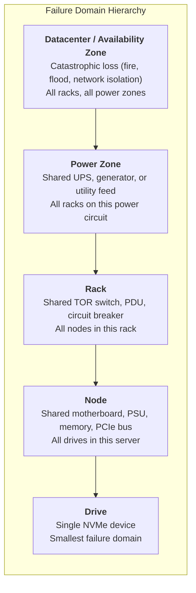

**Figure 12.** Failure domain hierarchy. Each level represents a physical boundary within which all components share a common fate. The placement engine distributes chunks across these boundaries to ensure that correlated failures never exceed the EC profile's parity tolerance.

**How the placement engine uses failure domains.** When the coordinator runs the placement engine to determine which storage nodes will hold an object's chunks, it does not simply pick the fifteen nodes with the most free space. It evaluates placement against a configurable failure domain constraint — typically "rack" for production deployments — and guarantees that no two chunks from the same stripe land within the same failure domain at the configured level. For a 12+3 profile with rack-level failure domain isolation, the fifteen chunks of each stripe are placed on storage nodes in at least fifteen different racks. If the cluster has fewer racks than chunks per stripe, the placement engine falls back to node-level isolation and logs a warning that full rack-level protection is not achievable with the current topology.

The placement algorithm is Rendezvous hashing (also called Highest Random Weight / HRW hashing). For each chunk position in a stripe, the engine computes a deterministic score for every eligible storage node by hashing the object's key, version, stripe index, and chunk index together with the node's ID. Nodes are ranked by score, and the engine walks down the ranked list, selecting the first node that does not violate the failure domain constraint. This produces deterministic, consistent placement that any coordinator can compute independently — there is no central placement coordinator and no placement state to synchronize between coordinators.

The failure domain topology is stored in the metadata service under `/placement/ring` and is configured by the administrator when nodes are registered. Each storage node's registration includes its failure domain path — a hierarchical label such as `datacenter=us-east-1/power-zone=pz-a/rack=r42/node=sn-107`. This topology is cached locally at each coordinator and refreshed on a short TTL. When a node's failure domain assignment changes (e.g., a node is physically moved to a different rack), the administrator updates the registration in the metadata service, and subsequent writes will respect the new topology. Existing chunk placements are not retroactively migrated unless the administrator triggers a rebalance — this is a deliberate choice to avoid unnecessary data movement for what is an infrequent topology change.

**A concrete example.** Consider a cluster with 60 storage nodes distributed across 20 racks (3 nodes per rack), using a 12+3 EC profile with rack-level failure domain isolation. When an object is written, the placement engine selects 15 nodes from 15 different racks for each stripe's chunks. If rack R7 loses power (taking out 3 storage nodes and all their drives), at most one chunk per stripe is lost — because only one of the 15 chunks was placed in R7. The EC profile tolerates up to 3 missing chunks, so the object remains fully readable with no degradation. The rebuilder detects the missing chunks, reconstructs them from parity, and places the rebuilt chunks on nodes in other racks, restoring full 12+3 protection.

Now consider what happens without failure domain enforcement. If the placement engine simply picked nodes by available capacity, it might place 4 of the 15 chunks on the 3 nodes in rack R7 (because those nodes happened to have the most free space). A rack R7 power failure would destroy 4 chunks simultaneously — exceeding the 3-parity tolerance of the 12+3 profile. The object would be unrecoverable, permanently. The data would be gone. Failure domain enforcement is the difference between "a rack failure is a routine event that self-heals in minutes" and "a rack failure is a data loss incident."

**Configurable failure domain levels.** The failure domain constraint level is configurable per EC profile, allowing administrators to match placement policy to the physical infrastructure.

| Failure Domain Level | Constraint | Use Case |
|---|---|---|
| `drive` | No two chunks on the same drive | Minimum: protects against individual drive failures only |
| `node` | No two chunks on the same node | Protects against node failures (motherboard, PSU, memory) |
| `rack` | No two chunks in the same rack | **Production default.** Protects against rack-level events (TOR switch, PDU, breaker) |
| `power-zone` | No two chunks in the same power zone | High durability: protects against shared UPS/generator failures |
| `datacenter` | No two chunks in the same datacenter | Multi-site: requires a multi-datacenter deployment |

**Table 7.** Configurable failure domain levels. Each level provides progressively stronger isolation against correlated failures, at the cost of requiring more independent failure domains than the EC profile's chunk count (*k + m*).

Most production deployments use rack-level isolation because rack failures (TOR switch failures, PDU trips, circuit breaker events) are the most common correlated failure mode in datacenter environments. Drive and node failures are already handled by any failure domain level, since each drive is in a different node and each node is in a different rack when rack-level isolation is enforced. Power-zone and datacenter isolation provide additional protection for environments with stringent durability requirements or multi-site deployments, but require correspondingly larger cluster topologies — a 12+3 profile with datacenter-level isolation requires at least 15 datacenters, which is rarely practical.

The placement engine validates the failure domain topology at startup and on every placement operation. If the cluster has insufficient failure domains for the requested isolation level (e.g., a 12+3 profile with rack-level isolation but only 12 racks), the coordinator logs a persistent warning and can optionally reject writes that cannot achieve full isolation, or fall back to the next lower isolation level. This is a safety mechanism to prevent silent degradation of durability guarantees when the physical topology does not match the configured policy.

### 9.2 Automatic Rebuild

When a storage node or drive fails, the following sequence occurs automatically.

**Detection:** The storage node's heartbeat goes stale in the metadata service (for node failure) or the heartbeat reports a drive as failed (for drive failure). Detection latency is configurable (default: 30 seconds for node failure, immediate for reported drive failure).

**Assessment:** The rebuilder service (leader-elected) queries the metadata service to enumerate all chunks that were stored on the failed device. For a large storage node with multiple drives, this may be hundreds of thousands of chunks.

**Reconstruction:** For each affected chunk, the rebuilder reads k surviving chunks of the same object from other storage nodes, decodes via ISA-L to reconstruct the missing chunk, selects a healthy storage node with available capacity (respecting placement constraints), writes the reconstructed chunk to the new location, and atomically updates the chunk map in the metadata service.

**Parallelism:** Rebuild is embarrassingly parallel. The lost chunks belong to many different objects, whose surviving chunks are distributed across the entire cluster. Every surviving storage node contributes a small amount of read bandwidth. The rebuilder can reconstruct many chunks concurrently. In a large cluster, the aggregate rebuild bandwidth can exceed hundreds of GB/s, allowing even large drive failures to be repaired in minutes.

**Throttling:** Rebuild I/O is throttled to prevent impacting production workloads. The administrator configures maximum rebuild bandwidth per storage node and maximum concurrent rebuild operations.

```json
{
    "rebuild": {
        "max_bandwidth_per_node_mbps": 500,
        "max_concurrent_operations": 50,
        "io_priority": "low"
    }
}
```

### 9.3 Administrative Maintenance

**Draining a Node:**

Before performing maintenance on a storage node (hardware replacement, firmware update, etc.), the administrator initiates a drain.

```
keinctl node drain sn-042
```

The system stops placing new chunks on the node, reads and reconstructs all chunks currently on the node to other healthy nodes (using the same EC reconstruction process as failure rebuild), and marks the node as drained when complete. The administrator can then safely power off the node. When maintenance is complete, the node is re-added and the rebalancer gradually fills it with chunks.

**Expanding the Cluster:**

Adding new storage nodes requires no data migration. New nodes simply join the cluster (register with the metadata service, start heartbeating) and become eligible for new chunk placement. The rebalancer optionally migrates chunks from heavily loaded nodes to new nodes for even distribution, but this is not required for the cluster to function.

---

## 10. Observability Framework

### 10.1 Philosophy

Monitoring AI storage infrastructure with external tools is fundamentally broken. Attaching eBPF probes to kernel I/O paths, scraping `/proc/diskstats`, parsing Lustre `lctl get_param` output, correlating kernel-space events with userspace application context — all of this is fragile, incomplete, and invariably loses the one piece of information that matters: **which job generated this I/O.**

KeInFS does not need monitoring bolted on. Observability is embedded in the protocol. Every request carries a signed attribution context that identifies the tenant, team, project, job, and rank. Every component emits metrics tagged with this full context. Every operation can be traced end-to-end with a single trace ID. The system answers operational questions directly, without requiring the administrator to stitch together data from five different tools.

### 10.2 Attribution Context

Every KeInFS/2 request carries an `x-keinfs-context` header containing a signed attribution token.

```json
{
    "tenant": "acme",
    "team": "ml-research",
    "project": "llm-v3",
    "job": "train-run-42",
    "rank": "0/16384",
    "scheduler": "slurm",
    "scheduler_job_id": "889421",
    "iat": 1708300800,
    "exp": 1708387200,
    "sig": "hmac..."
}
```

This context is injected at job launch, not by the application. Integration with Slurm, Kubernetes, and other schedulers is provided via plugins or environment variable injection. The training code never needs to know about KeInFS attribution. `libkeinfs` reads the `KEINFS_CONTEXT` environment variable automatically.

```bash
# Slurm integration
#SBATCH --keinfs-project=llm-v3
srun python train.py

# Kubernetes — admission webhook injects env var
# KEINFS_CONTEXT is auto-populated from pod labels

# Manual / direct
export KEINFS_CONTEXT=$(keinctl context create \
    --team ml-research \
    --project llm-v3 \
    --job train-run-42)
python train.py
```

### 10.3 Metrics

Every KeInFS component exposes a Prometheus/OpenMetrics endpoint at `/metrics`. Metrics are tagged with the full attribution context where applicable.

**Coordinator Metrics (per-job, per-operation):**

```
keinfs_request_bytes_total{tenant, team, project, job, op, bucket}
keinfs_request_duration_seconds{tenant, team, project, job, op, quantile}
keinfs_active_streams{tenant, team, project, job}
keinfs_bandwidth_bytes_per_sec{tenant, team, project, job, direction}
keinfs_ec_encode_seconds{profile, quantile}
keinfs_ec_decode_seconds{profile, type, quantile}  // type: normal|degraded
keinfs_quota_usage_ratio{tenant, team, project, dimension}
keinfs_quota_throttle_total{tenant, team, project}
keinfs_tokens_issued_total{operation}
keinfs_auth_failures_total{reason}
```

**Storage Node Metrics:**

```
keinfs_drive_bytes_read_total{node, drive}
keinfs_drive_bytes_written_total{node, drive}
keinfs_drive_io_queue_depth{node, drive}
keinfs_drive_latency_seconds{node, drive, op, quantile}
keinfs_drive_health{node, drive}
keinfs_drive_capacity_bytes{node, drive}
keinfs_drive_used_bytes{node, drive}
keinfs_chunk_count{node, drive}
keinfs_io_uring_submissions_total{node}
keinfs_io_uring_completions_total{node}
keinfs_allocator_cluster_utilization{node, drive}
keinfs_allocator_packed_container_utilization{node, drive}
```

**Cluster Metrics (aggregated):**

```
keinfs_cluster_capacity_total_bytes
keinfs_cluster_capacity_used_bytes
keinfs_cluster_nodes_healthy
keinfs_cluster_nodes_degraded
keinfs_cluster_nodes_dead
keinfs_cluster_rebuild_progress_ratio
keinfs_cluster_objects_degraded_total
keinfs_cluster_aggregate_bandwidth_bytes_per_sec
```

### 10.4 End-to-End Tracing

KeInFS integrates with OpenTelemetry for distributed tracing. Every request generates a trace that follows it through the entire system.

**Figure 6.** Example distributed trace for a GET operation, showing span hierarchy from coordinator resolution through parallel storage node reads. The trace immediately identifies sn-009 as the latency outlier at 45 ms.

```mermaid
gantt
    title Trace: GET /v1/training-data/shard-00042.parquet — Total: 49 ms
    dateFormat x
    axisFormat %L ms
    todayMarker off

    section Coordinator
    auth.verify              :a1, 0, 200
    quota.check              :a2, 200, 500
    metadata.resolve         :a3, 500, 1300
    issue_capabilities       :a4, 1300, 1600

    section Storage Reads
    sn-003.get_chunk (11 ms)  :s3, 1600, 12600
    sn-001.get_chunk (12 ms)  :s1, 1600, 13600
    sn-002.get_chunk (14 ms)  :s2, 1600, 15600
    sn-009.get_chunk (45 ms) ⚠️ SLOW :crit, s9, 1600, 46600

    section Client
    ec_decode (ISA-L)        :d1, 46600, 49600
```

This trace tells the operator instantly: the read took 49 ms because storage node sn-009 was slow at 45 ms, while everything else completed in under 15 ms. Cross-referencing sn-009's drive metrics reveals it was saturated from a concurrent rebuild operation.

**Trace Sampling:**

At high request rates, tracing every request is prohibitive. KeInFS supports configurable sampling.

```json
{
    "tracing": {
        "default_sample_rate": 0.01,
        "error_sample_rate": 1.0,
        "slow_request_sample_rate": 1.0,
        "slow_request_threshold_ms": 200,
        "per_project_overrides": {
            "llm-v3": { "sample_rate": 0.1 }
        }
    }
}
```

All errors and slow requests are traced at 100%. Normal requests are sampled at 1% by default, with per-project overrides for debugging.

### 10.5 Job-Level Intelligence

The combination of per-request attribution and real-time metrics enables a class of operational queries that no existing storage system can answer.

**"What is this job doing right now?"**

```
$ keinctl job stats train-run-42

Job: train-run-42
Project: llm-v3 | Team: ml-research | Tenant: acme
Status: ACTIVE | Running: 2h 34m | Ranks: 16,384

Current I/O:
    Read bandwidth:  2.8 TB/s (across 16,384 ranks)
    Write bandwidth:  124 GB/s
    Active streams:  32,768

Buckets accessed:
    training-data:  2.75 TB/s read  (98% of job I/O)
    checkpoints:    124 GB/s write

Lifetime totals:
    Read:    24.1 PB
    Written:  1.1 PB
    Objects read:    148,000,000
    Objects written:    2,840
```

**"Why is my training run slow?"**

```
$ keinctl job diagnose train-run-42

Diagnosis for train-run-42:
    ⚠ Rank 142 p99 read latency = 850 ms (cluster avg: 45 ms)
        → Rank 142 is reading from storage node sn-009
        → sn-009 drive nvme2 queue depth = 128 (saturated)
        → sn-009 nvme2 is rebuilding 12,000 chunks (sn-007 failure)

    Recommendation:
        Rebuild is impacting sn-009. Current rebuild throttle: 500 MB/s.
        Run: keinctl rebuild throttle --max-bandwidth 200MB/s
        Or wait ~8 minutes for rebuild to complete.
```

**"Which teams are consuming the cluster?"**

```
$ keinctl usage --by team --period 24h

Team             Read       Write     Capacity   Quota%
ml-research      1.2 PB     89 TB     142 TB     71%
ml-platform      340 TB     12 TB      38 TB     19%
data-eng          89 TB     45 TB      95 TB     48%
inference-prod   890 TB      2 TB      12 TB     60%
```

---

## 11. Quota Management

Quotas are hierarchical and enforced in real time at the coordinators.

### 11.1 Quota Dimensions

Quotas can be set on five dimensions: capacity (bytes stored), object count, bandwidth (bytes/sec, read + write), request rate (operations/sec), and concurrent connections. Each dimension can be set independently at each level of the hierarchy.

### 11.2 Hierarchy

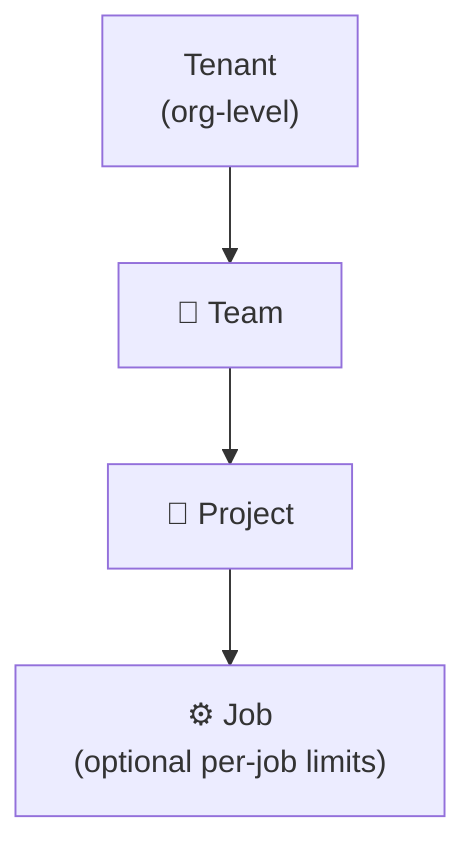

A request must satisfy all applicable quota levels. A job cannot exceed its own limit, cannot push its project over the project limit, cannot push the team over the team limit, and cannot push the tenant over the tenant limit. This is analogous to Linux cgroups but for storage I/O.

### 11.3 Enforcement

Capacity and object count quotas are exact: they are updated transactionally in the metadata service as part of the object commit phase.

Bandwidth and request rate quotas use a local token bucket at each coordinator, synchronized with the metadata service periodically (every 1 second by default). This avoids putting the metadata service in the per-request fast path for rate enforcement. The tradeoff is that enforcement is accurate within a 1-second window: a brief burst above the limit is possible before the coordinators synchronize.

When a quota is exceeded, the coordinator returns a 429 Too Many Requests (for rate limits) or 507 Insufficient Storage (for capacity limits) with a `Retry-After` header and a JSON error body identifying which quota was exceeded and at which level.

```json
{
    "error": "QuotaExceeded",
    "dimension": "bandwidth",
    "level": "project",
    "project": "llm-v3",
    "limit": "50 Gbps",
    "current": "51.2 Gbps",
    "retry_after_seconds": 2
}
```

### 11.4 Administration

```
keinctl quota set --tenant acme --capacity 500TB --bandwidth 200Gbps
keinctl quota set --tenant acme --team ml-research --capacity 200TB
keinctl quota set --tenant acme --team ml-research --project llm-v3 --capacity 50TB
keinctl quota show --tenant acme --recursive
keinctl quota alert --team ml-research --threshold 80%
```

---

## 12. Audit Logging

KeInFS provides an optional audit log that records every control-plane operation for compliance, forensics, and operational review.

### 12.1 What Is Logged

Audit log entries are generated for all object write, delete, and version management operations, all bucket create, delete, and configuration change operations, all quota changes, all administrative operations (drain, rebuild control, configuration changes), all authentication failures, and all cluster membership changes (node join, leave, failure).

Read operations are optionally auditable (configurable per bucket). For high-throughput training data reads, audit logging of every GET is typically disabled, as the metrics and tracing systems provide sufficient visibility.

### 12.2 Log Format

Each audit entry is a structured JSON record.

```json
{
    "timestamp": "2026-02-19T10:30:05.123456Z",
    "request_id": "req-01HXYZ...",
    "trace_id": "trace-01HABCD...",
    "operation": "PutObject",
    "bucket": "training-data",
    "key": "shard-00042.parquet",
    "version_id": "01HEFGH...",
    "context": {
        "tenant": "acme",
        "team": "ml-research",
        "project": "llm-v3",
        "job": "train-run-42"
    },
    "auth": {
        "method": "hmac",
        "identity": "svc-training-pipeline"
    },
    "result": "success",
    "object_size": 1073741824,
    "ec_profile": "12+3",
    "coordinator": "coord-003",
    "client_ip": "10.0.42.17",
    "duration_ms": 1250
}
```

### 12.3 Storage and Retention

Audit logs are written to the metadata service with a configurable retention period (default: 90 days). They can also be streamed to external systems (syslog, Kafka, S3-compatible storage) for long-term archival and SIEM integration.

For the truly self-referential: KeInFS can store its own audit logs in a dedicated audit bucket within KeInFS itself, though this creates a dependency loop that should be carefully considered.

---

## 13. Administration Interface

`keinctl` is the unified administration tool for KeInFS clusters.

**Cluster Operations:**

```
keinctl cluster status           Cluster health summary
keinctl cluster topology         Node, drive, and failure domain map
keinctl cluster config show      Current cluster configuration
keinctl cluster config set       Update cluster configuration
```

**Node Operations:**

```
keinctl node list                List all storage nodes with status
keinctl node status <node>       Detailed node status
keinctl node drain <node>        Initiate graceful drain
keinctl node rejoin <node>       Re-enable node after maintenance
keinctl drive status <node> <d>  Per-drive SMART and I/O stats
```

**Job Operations:**

```
keinctl job list                 Active jobs with I/O summary
keinctl job stats <job>          Real-time job I/O statistics
keinctl job diagnose <job>       Automated bottleneck analysis
keinctl job history <job>        Lifetime I/O summary
```

**Usage and Quotas:**

```
keinctl usage --by team          Usage by team
keinctl usage --by project       Usage by project
keinctl usage --project <p>      Detailed project breakdown
keinctl quota set ...            Set quota limits
keinctl quota show ...           Show quota status
keinctl quota alert ...          Configure quota alerts
```

**Rebuild and Maintenance:**

```
keinctl rebuild status           Current rebuild progress
keinctl rebuild throttle         Adjust rebuild bandwidth
keinctl scrub status             Scrub progress and findings
keinctl gc status                Garbage collection status
```

**Tracing and Debugging:**

```
keinctl trace <trace-id>         Show full request trace
keinctl trace slow --last 1h     Find slow requests
keinctl trace search --job <j>   Find traces for a job
```

---

## 14. Client Libraries and FUSE Integration

### 14.1 libkeinfs (C)

The C client library is designed for embedded devices, high-performance ingest clients, and cross-platform integration where a C ABI is required. It links against ISA-L (with runtime SIMD detection for AVX-512, AVX2, SSE, and NEON), nghttp2 (HTTP/2), and mbedTLS (or OpenSSL) for TLS 1.3. The library compiles on Linux (x86_64, aarch64), macOS (arm64, x86_64), and Windows (x86_64) with no platform-specific code in the public API — the same `keinfs_put()` / `keinfs_get()` calls work identically regardless of whether the process is running on bare metal, in a container, in a VM, or on a developer's laptop.

```c
#include <keinfs.h>

// Connect to cluster
keinfs_handle_t *h = keinfs_connect("coord-001.keinfs.local:8443,coord-002.keinfs.local:8443", &opts);

// PUT — library handles negotiate, EC encode, parallel fan-out, commit
keinfs_put(h, "bucket", "key", data, len, &put_opts);

// GET — library handles resolve, parallel chunk read, EC decode
keinfs_get(h, "bucket", "key", &buf, &buf_len, &get_opts);

// Cleanup
keinfs_disconnect(h);
```

The application does not interact with chunks, tokens, storage nodes, or EC profiles. All of that is handled internally. The `KEINFS_CONTEXT` environment variable provides attribution automatically.

### 14.2 keinfs-rs (Rust)

A native Rust client library with async/await support, built on `hyper`, `rustls`, and the ISA-L FFI bindings. Cross-compiled for all supported platforms via `cargo build --target` with no conditional compilation in the public API. The Rust client is the reference implementation from which the C and Python libraries are derived.

```rust
use keinfs::Client;

let client = Client::connect("coord-001.keinfs.local:8443,coord-002.keinfs.local:8443").await?;

// Smart path — direct chunk I/O
client.put("bucket", "key", data).await?;
let data = client.get("bucket", "key").await?;

// Streaming — for large objects
let writer = client.put_stream("bucket", "key", size).await?;
writer.write_all(&data).await?;
writer.commit().await?;
```

### 14.3 keinfs-py (Python)

A Python SDK wrapping the Rust client via PyO3, or a pure-Python implementation for environments where the native library is not available.

```python
import keinfs

client = keinfs.connect("coord-001.keinfs.local:8443,coord-002.keinfs.local:8443")

# Smart path
client.put("bucket", "key", data)
data = client.get("bucket", "key")

# Streaming
with client.put_stream("bucket", "key", size=10_000_000_000) as w:
    for chunk in data_source:
        w.write(chunk)

# Works with PyTorch DataLoader
dataset = keinfs.Dataset("bucket", prefix="training-data/")
loader = torch.utils.data.DataLoader(dataset, num_workers=8)
```

### 14.4 keinfs-fuse — POSIX Filesystem Mount

The FUSE (Filesystem in Userspace) client is a first-class KeInFS client that presents a POSIX interface northbound and uses the native KeInFS direct path southbound. It supports both read and write. Its purpose is to preserve compatibility with existing tools and training code while maintaining the direct native data path.

**Why FUSE and not a kernel module:**

FUSE is a userspace filesystem interface. It does not require compiling or loading kernel modules. It does not need DKMS. It does not break on kernel upgrades. It is installed via a package manager (`apt install keinfs-fuse` or a single static binary) and requires only the standard `/dev/fuse` device, which is available on every modern Linux distribution by default. This is consistent with KeInFS's "no kernel modules" philosophy — FUSE uses a stable kernel ABI that has not changed materially in over a decade.

**Mount a bucket as a filesystem:**

```bash
# Mount a bucket
keinfs-fuse mount \
    --coordinators c-001.keinfs.local:8443,c-002.keinfs.local:8443 \
    --bucket training-data \
    --mountpoint /mnt/training-data \
    --cache-dir /tmp/keinfs-cache \
    --cache-size 50G \
    --read-ahead 256M \
    --read-mode pull \
    --latency-profile hot-core-busy-poll \
    --busy-poll \
    --poll-core 7

# Now it's a filesystem
ls /mnt/training-data/imagenet/2024/train/
cp /local/new-dataset/* /mnt/training-data/datasets/new/
python train.py --data-dir /mnt/training-data/imagenet/2024/
```

Training scripts that read files from a directory, data preprocessing pipelines that use `glob()` and `open()`, Spark jobs that expect HDFS-like paths, legacy tools that cannot speak HTTP — all of these work against a `keinfs-fuse` mount immediately. More importantly, they do so without demoting themselves onto a fake “slow path” that exists only because someone could not bear to let go of a proxy.

**Architecture:**

The FUSE client runs as a userspace daemon that translates VFS operations into KeInFS/2 protocol calls via `libkeinfs`. It uses the native path internally, which means it performs EC encoding and decoding locally and issues parallel direct chunk I/O to storage nodes for both reads and writes. Coordinators are contacted only for metadata operations (`initiate`, `resolve`, `commit`, list, lookup, quota decisions). If object bytes are flowing through the coordinator, the FUSE client is misconfigured or the design has been violated.

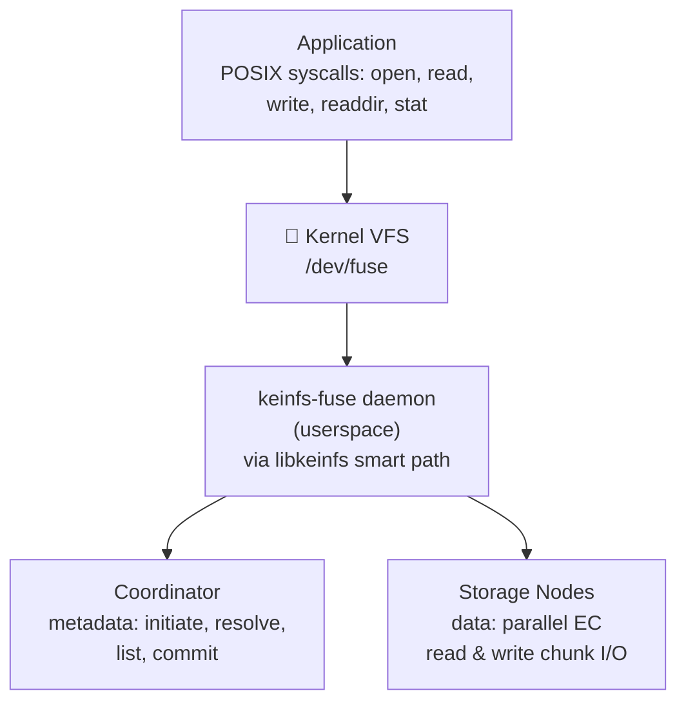

**Performance considerations:**

FUSE adds overhead relative to native `libkeinfs` because of kernel-to-userspace context switches and POSIX translation. The design objective is to minimize that overhead through aggressive buffering, queue pinning, and direct storage-node I/O.

**Hot-core busy poll:** The low-latency profile pins a dedicated core to the FUSE event loop and keeps it hot. That core busy-polls the FUSE request queue, direct storage-node sockets, and completion rings rather than relying on scheduler wakeups. The same profile is assumed on coordinators and storage nodes for latency-sensitive deployments. It consumes a core deliberately in exchange for lower and more predictable I/O latency.

**Read-ahead buffering:** The FUSE client pre-fetches data aggressively. When an application performs sequential reads (the dominant pattern for training data), the client detects the access pattern and pre-fetches upcoming stripes in the background. By the time the application issues the next `read()` syscall, the data is already decoded and waiting in a userspace buffer. Direct `pull` is the default read mode. Direct `push` remains available for workloads that benefit from storage-node-originated streaming over client-opened connections. Configurable read-ahead window (default: 256 MiB).

**Local NVMe write-back cache:** The FUSE client maintains a local cache on fast storage (NVMe SSD). For reads, recently accessed objects and pre-fetched data are cached locally, eliminating repeated network I/O for epoch-based training workloads where the same dataset is read multiple times. For writes, data is staged locally, coalesced into stripe-aware buffers, and then flushed to KeInFS as a new object version asynchronously or on `fsync()` / `release()`, providing low-latency write acknowledgment for bursty checkpoint writes without lying about the underlying object model. Cache eviction follows LRU with configurable size limits.

```bash
# Cache configuration
keinfs-fuse mount \
    --cache-dir /nvme-scratch/keinfs-cache \
    --cache-size 200G \          # Total cache budget
    --read-cache-ratio 0.8 \     # 80% of cache for read-ahead
    --write-cache-ratio 0.2 \    # 20% for write buffering
    --write-flush-interval 5s \  # Flush writes every 5 seconds
    --write-flush-size 1G \      # Or when buffer exceeds 1 GiB
    --latency-profile hot-core-busy-poll \
    --busy-poll \
    --poll-core 7
```

**Parallel readdir:** POSIX `readdir()` + `stat()` on a large directory is notoriously slow on network filesystems because each `stat()` is a separate metadata round-trip. The FUSE client batches these into a single KeInFS/2 LIST request with `include_metadata=true`, retrieving all entries and their metadata in one metadata-service range scan. A directory with 100,000 files is listed in a single network round-trip rather than 100,001.

**Splice/zero-copy reads:** On Linux kernels 4.20+, the FUSE client uses splice to transfer data directly from userspace buffers to the application's file descriptors without an additional copy through the kernel page cache.

**Write coalescing and stripe-aware flush:** For sequential writes, the FUSE client coalesces user writes into stripe-aligned buffers, performs client-side EC encoding, and flushes full stripe groups directly and in parallel to storage nodes. Small writes remain supported, but the highest-performance path assumes batched writes.

**What FUSE provides:**

The FUSE client supports the POSIX operations that AI workloads actually use: `open`, `read`, `write`, `pwrite`, `close`, `stat`, `fstat`, `readdir`, `mkdir`, `rmdir`, `unlink`, `rename`, `truncate`, `fsync`, and `statvfs`. It supports `O_RDONLY`, `O_WRONLY`, `O_CREAT`, `O_TRUNC`, and `O_APPEND` open flags, and it supports `O_RDWR` through local staging plus version commit rather than through in-place distributed mutation across an immutable-object backend. File permissions are mapped from KeInFS's IAM policies (the FUSE client presents a configurable uid/gid/mode for all files). Extended attributes (`xattr`) are mapped to KeInFS user metadata.

**What FUSE intentionally does not provide:**

Hard links (KeInFS has no inode model), `mmap()` for shared writable memory semantics, and POSIX advisory or mandatory file locking via `fcntl()`/`flock()` (see Section 7.4 for KeInFS's locking model). Random byte-range writes are supported through local staging and version publish, but they do not become in-place distributed block mutation.

**Performance expectations:**

For large sequential reads (the dominant AI workload), `keinfs-fuse` with read-ahead and the hot-core busy-poll profile enabled is expected to achieve 80–90% of native `libkeinfs` throughput. The remaining gap is primarily the kernel-to-userspace context switch overhead on `read()` syscalls, which is amortized by large read-ahead buffers and direct parallel chunk fetches. For small random reads, the gap is larger, but the hot-core profile improves tail latency relative to default scheduling behavior.

For writes, the local NVMe write-back cache and stripe-aware flush path provide application-perceived write latency comparable to a local filesystem, with the actual KeInFS write occurring asynchronously in the background and then fanning out directly to storage nodes in parallel. This is ideal for checkpoint writes where the training job should not block on storage.

**Table 5.** Estimated throughput and latency comparison between native `libkeinfs`, cached FUSE, and uncached FUSE access on a single client with 100 Gbps networking and NVMe storage. FUSE overhead is dominated by kernel-to-userspace context switch costs, which are amortized by read-ahead buffering for sequential workloads.

| Operation | libkeinfs (native) | keinfs-fuse (cached) | keinfs-fuse (uncached) |
|---|---|---|---|
| Large sequential read | 12 GB/s | 9.5–11 GB/s | 8–9 GB/s |
| Large sequential write | 10 GB/s | 8.5–9.5 GB/s (async, direct) | 6–7 GB/s (sync) |
| Small random read | ~5 ms | ~6–8 ms | ~12 ms |
| Small random write | ~6 ms | ~8–9 ms | ~14 ms |
| readdir (100K entries) | ~3 ms | ~5 ms | ~5 ms |

**The migration path:**

Phase 1: mount with `keinfs-fuse`, existing scripts and tools work immediately, and teams start using KeInFS without immediate application rewrites.

Phase 2: tune the mount properly. Provide local NVMe, enable read-ahead, and turn on the hot-core busy-poll profile if the workload justifies dedicating the core. FUSE performance is highly sensitive to these settings.

Phase 3: identify performance-critical paths (training data loading, checkpoint I/O) via KeInFS's built-in per-job observability. The `keinctl job diagnose` output will explicitly flag FUSE overhead as a bottleneck when it is one.

Phase 4: migrate the truly hot paths to `libkeinfs` or the Python SDK. Replace `open()/read()` with `keinfs.get()` in the data loader. Leave the rest on FUSE if that remains operationally useful.

Phase 5 (optional): FUSE mounts remain for tooling, ad-hoc access, data browsing, write-heavy preprocessing stages, and any workflow where POSIX compatibility is more important than squeezing out the last margin of native-client throughput.

```python
# Phase 1: POSIX via FUSE mount — works immediately
dataset = torchvision.datasets.ImageFolder("/mnt/training-data/imagenet/2024/train/")

# Phase 3: Native KeInFS — 30% faster data loading
dataset = keinfs.TorchDataset("training-data", prefix="imagenet/2024/train/")
```

---

## 15. Performance Analysis

### 15.1 Comparison to Lustre (Same Hardware)

On identical hardware (100 Gbps Ethernet, NVMe storage, 8 storage targets), KeInFS in kamikaze mode should outperform Lustre by 10–20% for large sequential I/O. The performance advantage comes from the elimination of the filesystem layer on storage nodes.

**Table 1.** Architectural comparison of I/O path overhead between Lustre and KeInFS on identical hardware. Each factor represents a stage in the write path that contributes to aggregate latency and throughput reduction.

| Factor | Lustre | KeInFS |
|---|---|---|
| Storage node filesystem | ldiskfs (ext4 variant), journaled | None (raw block) |
| Write path | VFS → LLITE → LOV → OSC → LDLM → LNet → OFD → ldiskfs → journal → block | libkeinfs → initiate → direct parallel chunk PUTs → capability check → io_uring → block |
| Journal overhead | 5–15% bandwidth | 0% |
| Lock manager | LDLM (distributed, network round-trips) | None (objects are immutable, metadata-service transactions) |
| Kernel involvement | Full kernel path (modules) | Userspace only (io_uring for I/O) |
| Client striping | Kernel LOV driver | libkeinfs userspace library |

For EC-protected writes (e.g., 12+3), KeInFS has the additional overhead of parity computation (negligible with ISA-L at 10+ GB/s) and writing 1.25x the data volume, but eliminates Lustre's journal and lock overhead. Net performance is comparable for writes and faster for reads (no lock acquisition on read path).

### 15.2 Throughput Estimates

**Single client, kamikaze mode (k=8), 100 Gbps network:**

Large sequential write: approximately 12 GB/s (96% of wire speed, limited by the sum of 8 storage nodes' NVMe write bandwidth or the client's NIC, whichever is lower).

Large sequential read: approximately 12 GB/s (parallel read from 8 nodes, no decode overhead).

**Single client, EC 12+3 mode, 100 Gbps network:**

Large sequential write: approximately 10 GB/s (client encodes at ISA-L speed, writes 15 chunks in parallel, NIC is the bottleneck).

Large sequential read: approximately 12 GB/s (reads 12 of 15 chunks in parallel, ISA-L decode at 10+ GB/s is not the bottleneck).

**Multiple clients scale linearly** until the aggregate demand saturates either the storage nodes' NVMe bandwidth or the network fabric.

---

## 16. Implementation Technology

| Component | Technology | Rationale |
|---|---|---|
| Coordinator | Rust, hyper, rustls | HTTP/2 native, TLS 1.3, high performance |
| Storage node daemon | Rust, io-uring crate, custom KIX engine | Direct I/O, zero-copy, shard-local ownership |
| EC engine | ISA-L via Rust FFI (isa-l-sys) | AVX2/AVX-512 SIMD, BSD licensed, industry standard |
| Metadata / coordination | KeInFS metadata service over pluggable transactional backend | Keeps the architecture backend-agnostic while preserving strict metadata semantics |
| Chunk index (local) | KIX: RAM-sharded hash directory + raw checkpoint arenas | Point lookup only, no filesystem dependency, no compaction stalls |
| Client library (C) | C, nghttp2, ISA-L, mbedTLS | Minimal footprint, embedded-friendly |
| Client library (Rust) | Rust, hyper, rustls, ISA-L FFI | Native async, zero-cost abstractions |
| Client library (Python) | PyO3 wrapping Rust client | Python-native API with Rust performance |
| Serialization | serde + bincode (internal), JSON (API) | Fast binary internal, human-readable external |
| Tracing | OpenTelemetry (opentelemetry crate) | Industry standard, Jaeger/Tempo compatible |
| Metrics | Prometheus exposition format | Universal, every monitoring stack supports it |

### 16.1 Metadata Backend Contract and Current Direction

KeInFS requires a metadata backend that satisfies a specific contract. If a backend satisfies that contract and the operational tradeoffs are acceptable, it is a candidate. If it does not, it is not.

**Required metadata contract:**

- Transactional object publish for `initiate` → direct write → `commit`.
- Ordered prefix scans for LIST and path emulation.
- Watches or invalidation primitives for client cache coherence and background workflows.
- Conflict-aware conditional writes for immutable publish, rename, and lease acquisition.
- Leader or lease coordination for rebuilder, scrubber, GC, and rebalance services.
- Operationally predictable failure recovery for a large-scale production cluster.

**FoundationDB + NATS.** This is the current implementation direction. FoundationDB provides the durable transactional substrate for object-head publish, ordered keyspace queries, listings, and workflow state. NATS provides invalidation and event fan-out. Horizontal scale comes from explicit `KMS` sharding, stateless frontends, and hot caches, not from pretending one metadata service can be infinite by attitude alone.

**Why not let the substrate become the architecture?** Because KeInFS needs explicit namespace ownership, explicit watch replay semantics, and explicit allocator isolation. `KMS` owns those contracts. FoundationDB and NATS are underneath that contract; they are not the contract itself.

**Metadata Backend Position.** The current KeInFS direction is sharded `KMS` plus separate `KAS`, backed by FoundationDB for durable truth and NATS for fan-out in a low-latency HA model. Other substrates are not the current target direction unless they beat that model on measured behavior instead of slideware enthusiasm.

### 16.2 Current Prototype Lineage

The current KeInFS proof-of-concept is organized around four explicitly named components.

- **`KIX`** is the drive-local chunk index engine and maintenance tool. It owns the RAM-resident chunk directory, raw KIX arena, replay logic, rebuild-from-media logic, and runtime observability for the local index path.
- **`KST`** is the storage target service. It exposes the direct single-chunk and packed same-target data path on raw HTTP/2, owns the target-local execution model, and wires chunk-media operations into KIX publication state.
- **`KSC`** is the smart client prototype. It owns per-target session management, pacing, overlap avoidance, and the direct single-target and multi-target benchmark path.
- **`KP2`** is the protocol crate and specification. It is the single source of truth for native data-plane framing, headers, packed transaction rules, and rate-limit semantics.
- **`KMS`** is the metadata service prototype. It owns EC profiles, bucket bindings, write intents, manifests, current pointers, fragment-index records, and rebuild task state.
- **`KAS`** is the allocator service prototype. It owns target inventory, free spans, reservations, and replacement placement.
- **`KEE`** is the shared erasure-coding engine. It provides encode, reconstruct, verify, and runtime backend selection for the first `8+2` slice.
- **`KRS`** is the rebuild daemon. It leases tasks from KMS, asks KAS for replacement placement, reconstructs through KEE, and writes repaired fragments directly through KST.

The current POC is Linux-only on the storage-node side and uses raw block devices with `O_DIRECT` and `io_uring` throughout the storage-node data path. On March 19, 2026, the single-target direct `1 MiB` baseline on `10.0.0.20` measured approximately `4.10 GiB/s` read throughput, `2.83 GiB/s` write throughput, and a clean `70/30` mixed run at roughly `2.71 GiB/s` read plus `1.16 GiB/s` write with zero payload mismatches. These numbers do not constitute a final product claim; they are the current measured POC baseline for the direct single-target path.

---

## 17. Deployment Model

### 17.1 Minimum Viable Cluster

A minimal KeInFS cluster requires:

- a quorum-capable metadata backend satisfying the KeInFS metadata contract
- 2 coordinator nodes for auth, namespace, control-path orchestration, management, and quota enforcement
- enough storage nodes to satisfy the EC profile's minimum node count (e.g., 15 for a 12+3 profile)

For small deployments, coordinators and metadata nodes may be colocated. Storage nodes require dedicated raw block devices (NVMe recommended). S3 ingress runs on the storage nodes themselves and is fronted by DNS round-robin or an L4 load balancer. Native clients using `libkeinfs` or `keinfs-fuse` require direct routable or VPN access to storage nodes; if they do not have that reachability, they use S3.

### 17.2 Current Laboratory Deployment Slice

The current laboratory deployment is intentionally narrower than the general architecture.

- one `3`-node etcd DCS
- one FoundationDB durability layer shared by the control plane
- one NATS fan-out layer for invalidation and event delivery
- one `KMS` container
- one `KAS` container
- one storage server exposing `12` real `KST` targets on ports `18080..18091`
- one `KRS` daemon on that same storage server

The first end-to-end object test uses:

- one immutable `8+2` EC profile
- one bucket bound to that profile
- `10` distinct targets for the stripe
- `2` spare targets for rebuild

This deployment is a functional laboratory slice, not a claim of metadata high availability or a recommendation to collapse real production failure domains onto one machine. Its purpose is narrower and more honest: validate the control plane, object manifest flow, direct fragment I/O, and rebuild mechanics before the design is spread across multiple servers and more realistic failure domains.

### 17.2 Deployment Model

KeInFS components are distributed as static Rust binaries with zero runtime dependencies (other than libc). There are no JVMs, no Python runtimes, no Node.js processes. A storage node is a single binary (`kst`) that takes a configuration file and a list of block devices.

```
kst --config /etc/keinfs/storage.toml --devices /dev/nvme0n1,/dev/nvme1n1
```

The control plane is two binaries — `kms` (metadata service) and `kas` (allocator service) — each taking a configuration file. (The design's single unified coordinator is realized as the `kms` + `kas` pair in the POC.)

```
kms --config /etc/keinfs/kms.toml
kas --config /etc/keinfs/kas.toml
```

Storage nodes optionally expose an S3 ingress service alongside the native chunk service.

```
kst \
  --config /etc/keinfs/storage.toml \
  --devices /dev/nvme0n1,/dev/nvme1n1 \
  --enable-s3-ingress
```

Background services are built into the coordinator binary and activated via configuration. The leader election mechanism ensures only one instance runs each service at a time, so all coordinators can have background services enabled.

### 17.3 Configuration

All persistent configuration is stored in the metadata service. Local configuration files contain only bootstrap information: metadata-service endpoint addresses, TLS certificate paths, block device paths, and optional CPU pinning or busy-poll defaults. This means cluster-wide configuration changes (EC profiles, quota limits, rebuild throttles, tracing settings, allocator policy defaults, latency profiles) take effect immediately without restarting any component.

### 17.4 Platform Portability

One of KeInFS's most consequential architectural properties is that it imposes no constraints on the client's operating system, virtualization layer, or container runtime, provided the client can either reach storage nodes directly for the native path or use S3 for the proxied path. This is not a feature that was engineered into KeInFS — it is an emergent property of the decision to build the entire data path on userspace HTTP/2 over TLS. When the client-side contract is "make HTTPS requests and decode the response," the platform question largely evaporates.

**The KeInFS client runs identically in all of the following environments:**

```mermaid
flowchart LR
    subgraph Platforms["KeInFS Client Runs On"]
        direction TB
        BM["Bare Metal Linux"]
        DC["🐳 Docker Container"]
        K8["☸️ Kubernetes Pod"]
        VM["🖧 KVM / QEMU VM"]
        Mac["🍎 macOS (ARM / x86)"]
        Win["🪟 Windows"]
        WSL["🐧 WSL2"]
    end

    subgraph Modes["Client Modes"]
        direction TB
        LIB["libkeinfs (C / Rust / Python)"]
        FUSE["FUSE Mount"]
        S3["S3 API"]
        HTTP["Generic HTTP / tooling"]
    end

    subgraph Result["Same Outcome Everywhere"]
        direction TB
        R1["Full KeInFS/2 smart path<br/>(push & pull modes)"]
        R2["Client-side EC encode / decode"]
        R3["ISA-L SIMD auto-detection<br/>(AVX-512 · AVX2 · NEON)"]
    end

    Platforms --> Modes --> Result

```

| Environment | Client Modes | Functionality |
|---|---|---|
| **Bare metal Linux** | libkeinfs · FUSE · S3 · HTTP tooling | Full native path (pull & push), FUSE mount, S3 |
| **Docker container** | libkeinfs · FUSE · S3 · HTTP tooling | Full native path, FUSE (with `--device /dev/fuse`) |
| **Kubernetes pod** | libkeinfs · S3 · HTTP tooling · FUSE (CSI) | Full native path if storage nodes are directly reachable; otherwise S3. FUSE via CSI driver or privileged sidecar |
| **KVM / QEMU VM** | libkeinfs · FUSE · S3 · HTTP tooling | Full native path if directly reachable, plus FUSE and S3. No special guest kernel modules |
| **macOS (ARM / x86)** | libkeinfs · S3 · HTTP tooling · FUSE | Full native path if directly reachable; S3 otherwise. FUSE via macFUSE. ISA-L uses NEON on ARM |
| **Windows** | libkeinfs · S3 · HTTP tooling · FUSE | Full native path if directly reachable; S3 otherwise. FUSE via WinFSP. ISA-L uses AVX2/AVX-512 |
| **WSL2** | libkeinfs · FUSE · S3 · HTTP tooling | Identical to bare metal Linux, subject to the same network reachability rules |

**Table 6.** KeInFS client platform support matrix. Every environment supports the S3-compatible endpoint. Native KeInFS/2 requires direct reachability to storage nodes. FUSE mount availability depends on the platform's FUSE implementation.

In every case, the native core data path — HTTP/2 to the coordinators for control, direct chunk I/O to storage nodes for bytes, ISA-L erasure coding, and parallel fan-out — is functionally identical. The same `libkeinfs` library is compiled for each target (Linux x86_64, Linux aarch64, macOS arm64, macOS x86_64, Windows x86_64) using Rust's cross-compilation toolchain. ISA-L's SIMD kernels are selected at runtime based on CPU feature detection: AVX-512 on Intel Xeon, AVX2 on older Intel and AMD, NEON on ARM64 (Apple Silicon, Graviton). The HTTP/2 and TLS stacks (`hyper`/`rustls` in Rust, `nghttp2`/`mbedTLS` in C) are pure userspace with no platform-specific kernel dependencies. None of this portability extends to the backend: the storage nodes, coordinators, and the metadata, allocator, and rebuild services run on Linux only. The client is the sole KeInFS component that crosses operating systems.

FUSE mount support varies by platform because FUSE itself is a platform-specific mechanism: it uses `/dev/fuse` on Linux, macFUSE (or FUSE-T) on macOS, and WinFSP on Windows. In all three cases the KeInFS FUSE client is the same codebase with platform-specific FUSE adapter layers. In containerized environments, FUSE requires either device access (`--device /dev/fuse` in Docker) or a privileged sidecar, but the non-FUSE client modes (`libkeinfs`, Python SDK, S3, generic HTTP tooling) require no special privileges at all — they are unprivileged userspace processes making outbound HTTPS connections. For the native path, what matters is direct reachability to storage nodes; if that reachability does not exist, the documented answer is S3, not coordinator tunneling by euphemism.

**Seamless development-to-production continuum.** The most consequential implication of platform invariance is not that the KeInFS client runs in many places — it is that the boundary between those places disappears. A researcher prototyping a training pipeline on a macOS laptop writes `client = keinfs.connect("coord-001.keinfs.local:8443,coord-002.keinfs.local:8443")` and iterates against real data on the shared cluster. The same code, the same credentials, the same bucket paths, and the same API semantics transfer without modification when that pipeline graduates to a 16,000-node GPU cluster or a Kubernetes batch job. There is no "porting" step. There is no moment where the researcher must translate local file paths into cluster-specific mount points, rewrite data loading code to use a different SDK, or coordinate with infrastructure teams to provision kernel modules on compute nodes. The laptop and the cluster are equivalent citizens of the same storage namespace.

This frictionless transition from desktop to datacenter collapses the traditional gap between experimentation and production. In conventional HPC environments, the storage system itself creates a phase boundary: code written against local files or NFS shares must be rewritten to use the parallel filesystem's client libraries or mount conventions, often with subtle behavioral differences that only manifest at scale. With KeInFS, the research notebook that reads training shards on a laptop is the same code that reads training shards on the cluster — unchanged, untranslated, unported. The storage layer becomes invisible infrastructure rather than a deployment constraint, which is exactly what infrastructure should be.

**Contrast with traditional parallel filesystems.** This platform agnosticism stands in stark contrast to the operational reality of traditional parallel filesystems — Lustre, GPFS/Spectrum Scale, BeeGFS, WekaFS, and others in the same architectural lineage. These systems share a common design pattern: a kernel module on every client that intercepts VFS calls and translates them into the filesystem's proprietary wire protocol. The kernel module must be compiled against the exact running kernel version, creating a cascade of constraints that fundamentally limit where clients can run.

The kernel module dependency means that clients for these filesystems are restricted to Linux, and typically to a specific set of supported kernel versions for which the vendor or community has compiled and tested the module. Upgrading the kernel on a client node is not a routine operation; it requires verifying module compatibility, rebuilding via DKMS if necessary, and accepting the risk that a kernel ABI change introduces silent breakage. In practice, this means clusters running traditional parallel filesystems often lag years behind current kernel releases, forgoing security patches, performance improvements, and hardware enablement because the filesystem module has not been validated against a newer kernel.

Running these clients inside a container is technically possible but requires the host kernel to have the module loaded and the container to bind-mount the host's filesystem mount — the container does not independently speak the protocol. Running inside a KVM virtual machine requires the guest kernel to have its own compatible module. Running on macOS or Windows is generally not possible at all. Running in Kubernetes pods requires either a CSI driver that bind-mounts the host's mount into the pod (which means every node in the cluster must have the kernel module and a mount pre-configured) or an experimental FUSE-based client that sacrifices the performance the parallel filesystem was chosen for in the first place.

The result is that teams choose their compute platform based on what their storage system supports, rather than choosing their storage system based on what their compute platform needs. A researcher on a macOS laptop must copy data to local disk to work with it. A platform team adopting Kubernetes must ensure every node pool has the kernel module installed before a single pod can access shared data. A VM-based cloud environment must maintain custom images with the correct module for each kernel version.

KeInFS eliminates this entire category of operational constraint. A researcher on a macOS laptop runs `pip install keinfs` and calls `client.get()`. A Kubernetes pod includes `libkeinfs` in its container image and reads data — no host configuration, no kernel modules, no privileged mounts. A KVM guest runs the same client binary as a bare metal host. The compute platform and the storage system are fully decoupled, as they should be.

### 17.5 Cloud Provisioning and Instant Resource Availability

In cloud and managed HPC environments, storage provisioning time directly translates to compute cost. GPU clusters at the 16,000 to 32,000 GPU scale are not billed at list price — organizations operating at this tier negotiate multi-year reserved capacity agreements with significant volume discounts. Nevertheless, even at heavily discounted rates, idle GPU time during storage provisioning represents a substantial and entirely avoidable expense.

**GPU cost reference (as of early 2026).** Public on-demand pricing for NVIDIA H100 80GB SXM GPUs ranges from approximately $2.00–4.00/GPU-hour depending on the provider: hyperscalers (AWS, GCP, Azure) list on-demand H100 instances at approximately $3.50–4.50/GPU-hour after the mid-2025 price corrections, while specialized GPU cloud providers (Lambda, CoreWeave, GMI Cloud, Nebius) offer on-demand rates of $2.00–3.00/GPU-hour [15][16][17]. However, no organization operating a 16,000+ GPU fleet pays on-demand rates. Enterprise reserved capacity commitments of 1–3 years typically yield 30–50% discounts off on-demand pricing [18][19], and at the scale of 16,000–32,000 GPUs, custom enterprise agreements with additional volume negotiation are standard. Assuming a conservative effective rate of $1.50–2.50/GPU-hour after enterprise discounts (a 40–50% reduction from on-demand, consistent with publicly documented reserved instance pricing tiers), the cost of idle GPU time during storage provisioning is:

For a **16,000-GPU cluster** at $1.50/GPU-hour (conservative enterprise floor): a two-hour storage provisioning delay costs **$48,000**. At $2.50/GPU-hour (moderate enterprise rate): **$80,000**. For a **32,000-GPU cluster** at the same range: **$96,000 to $160,000** per provisioning event. At on-demand rates (which apply during unplanned scaling events or burst capacity), these figures roughly double.

These costs recur every time the cluster scales, every time a new storage tier is added, every time a failed node is replaced and its drives reformatted. Over the lifetime of a large training infrastructure with periodic capacity expansions and hardware refreshes, the cumulative cost of storage provisioning delays reaches into the millions — for an operation that KeInFS reduces to under two minutes.

The fundamental bottleneck is `mkfs`. When a traditional parallel filesystem provisions new storage capacity, every new block device must be formatted with a full filesystem: inode tables, journal logs, allocation groups, directory structures, superblock trees. For a single 3.84 TB NVMe drive, `mkfs.ext4` (or its Lustre variant `mkfs.lustre` on ldiskfs) creates approximately 1.5 GB of filesystem metadata — inode tables, group descriptors, journal — and must write this data sequentially before the device can serve a single byte of user data. This takes seconds to minutes per drive. At cluster scale, the problem compounds: provisioning a storage tier for a 16,000-GPU training cluster might involve 500 to 1,000 NVMe drives across 60 to 120 storage nodes, each requiring `mkfs`, distributed lock manager state initialization, metadata server registration, and consistency checks. Depending on the filesystem and the operational automation in place, this process can take anywhere from one to several hours. For large capacity expansions at multi-petabyte scale, provisioning windows of a day or more are not uncommon.

KeInFS eliminates this bottleneck entirely because there is no filesystem to create. Formatting a KeInFS device writes a 4 KiB superblock, initializes the granule map, the allocator metadata, and the raw KIX arena header, and completes. On a modern NVMe drive, this finishes in under one second — regardless of drive capacity. A 3.84 TB drive and a 15.36 TB drive take the same time to format because the operation writes the same fixed amount of metadata. There are no inode tables proportional to capacity, no journals proportional to bandwidth, and no allocation groups proportional to size.

At cluster scale, the difference is transformative. Provisioning 1,000 NVMe drives across 120 storage nodes takes under two minutes with KeInFS (limited by SSH parallelism and network round-trips, not by formatting speed), compared to hours for a traditional parallel filesystem. The `keinctl cluster format` command formats all devices across all nodes concurrently, registers them in the metadata service, and the storage daemons begin serving chunks immediately. From the moment a cloud provisioning portal confirms that new storage nodes are allocated, the path to serving data is: deploy a single static binary, run `keinctl cluster format --confirm`, and the cluster is ready. No multi-hour `mkfs` runs, no MDS registration workflows, no lock manager initialization, no post-format consistency checks.

This makes KeInFS exceptionally well-suited for integration with cloud provisioning portals, infrastructure-as-code pipelines (Terraform, Pulumi, Ansible), and Kubernetes operators that dynamically scale storage in response to workload demand. The provisioning API surface is minimal: deploy a binary, point it at raw block devices, run a single format command. This is trivially automatable, and the sub-second per-device format time means that storage provisioning never appears on the critical path of cluster startup. A researcher clicks "provision" in the self-service portal and has GPUs training within minutes — not sitting idle for hours while the storage system prepares itself.

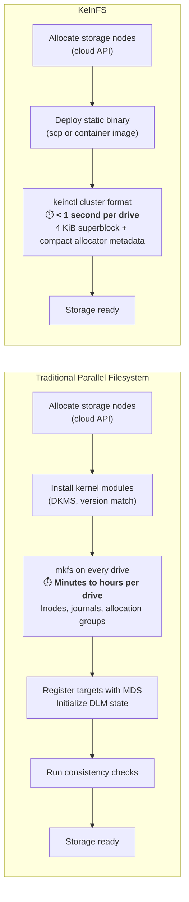

**Figure 10.** Provisioning timeline comparison. KeInFS reduces storage provisioning from a multi-hour critical path to a sub-minute operation. At enterprise-discounted GPU rates of $1.50–2.50/GPU-hour, each hour of provisioning delay on a 16,000-GPU cluster costs $24,000–40,000 in idle compute.

**The hidden second day: client-side orchestrator configuration.** As outlined in Section 1.1, server-side provisioning is only half the story. Even after the storage system is nominally "ready," there is a second critical path that is rarely accounted for in vendor provisioning estimates: configuring the GPU cluster's job scheduler to actually use the storage. With traditional parallel filesystems, this client-side integration is a multi-step, error-prone process that routinely consumes an additional day before the first user job runs.

In a Slurm-managed cluster, the administrator must ensure that every compute node has the correct kernel module installed and loaded (and that it matches the server version), configure the mount points in `/etc/fstab` or an equivalent automount system, verify that the mounts are functional on all nodes (which inevitably reveals a subset of nodes where the module failed to load, the mount timed out, or a DNS entry is wrong), configure Slurm's job prolog scripts to verify mount health before job launch, set up the filesystem-specific tuning parameters (stripe count, stripe size, cache settings) in each node's client configuration, and test the end-to-end path from job submission to data access. In Kubernetes, the equivalent process involves deploying a CSI driver (which itself requires the host-level kernel module), configuring PersistentVolume and PersistentVolumeClaim resources, validating that the StorageClass correctly provisions volumes, testing pod scheduling with the storage mounts, and debugging the inevitable permission and mount propagation issues that arise. Each step has dependencies on the previous one, and each step can fail in ways that are opaque to diagnose without specialized filesystem expertise.

In practice, the time from "storage servers are formatted and running" to "a user can submit a job that reads training data" is not measured in minutes. It is measured in hours to days, depending on the cluster size, the complexity of the orchestrator configuration, and the availability of staff with the specific filesystem knowledge required.

KeInFS collapses this entire client-side integration to a small handful of userspace configuration values. The job scheduler does not need to know about mount points, kernel modules, stripe configurations, or storage-specific client tuning. A Slurm job that uses `libkeinfs` or the Python SDK needs only the coordinator endpoint list and a credential — both of which can be injected via environment variables (`KEINFS_COORDINATORS`, `KEINFS_TOKEN`) in the scheduler's global configuration. A Kubernetes pod needs only those same variables in its pod spec, or a single ConfigMap reference. There are no host-level mounts to configure, no CSI drivers to deploy, no kernel modules to validate across node pools. Native clients additionally require direct storage-node reachability, which is a network architecture decision rather than a client-installation ritual. The client is a userspace library linked into the application container — it ships with the application, not with the infrastructure.

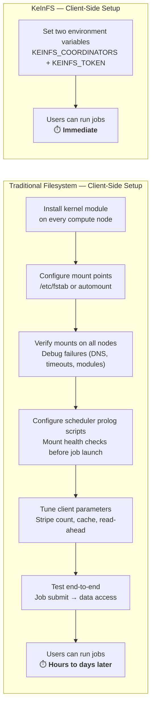

**Figure 11.** Client-side orchestrator integration comparison. Traditional parallel filesystems require multi-step configuration on every compute node before users can access data. KeInFS requires two environment variables.

**Storage expertise that scales with you.** As introduced in Section 1.1, the operational simplicity of KeInFS extends beyond provisioning speed to a fundamental change in how storage expertise scales within an organization. Building a 16,000-GPU training cluster is one of the most stressful infrastructure projects an engineering team can undertake. The networking alone — configuring InfiniBand fabrics, NCCL topology files, RDMA over Converged Ethernet, spine-leaf switch hierarchies — demands deep specialist knowledge. The GPU stack — driver versions, CUDA compatibility matrices, NVLink configurations, MIG partitioning — demands another set of specialists. The job scheduler, the monitoring infrastructure, the power and cooling, the physical racking — every subsystem requires focused expertise and careful integration.

With traditional parallel filesystems, the storage tier adds another full staffing requirement to this already strained buildout. Lustre, GPFS, and their peers are operationally complex systems that require deep knowledge of their specific failure modes, tuning parameters, and recovery procedures. Configuring striping policies, managing OST pools, tuning the distributed lock manager, diagnosing metadata server performance, running filesystem checks after failures — this is a specialized discipline. Organizations that run large parallel filesystems typically employ dedicated storage SRE teams whose primary role is keeping each filesystem instance healthy and performing. Critically, this staffing need scales with the number of filesystem instances: each new Lustre deployment is another filesystem to patch, monitor, tune, and operate through failures. As the organization's GPU fleet grows from one cluster to three to ten, the storage team must grow proportionally — or each additional filesystem gets less operational attention, which eventually manifests as performance degradation or unplanned outages.

KeInFS breaks this linear staffing dependency. The operational surface is deliberately minimal: deploy static binaries, format raw devices (a one-second operation), and monitor via the built-in observability stack. There is no striping policy to optimize because the EC profile is set once per bucket and applies uniformly. There is no distributed lock manager to tune because there are no locks. There is no filesystem check to run after failures because there is no filesystem — the self-healing rebuilder detects failures and reconstructs data automatically. There is no monolithic metadata server to scale because the metadata plane is a contract over a quorum-capable backend, operated with the same standard discipline any distributed database or transactional metadata service already demands.

The practical consequence is that an organization's existing storage SMEs become dramatically more effective. The team that today is fully occupied managing two or three Lustre filesystems can manage a substantially larger fleet of KeInFS clusters — because each cluster demands less specialized intervention, fewer emergency procedures, and simpler failure recovery. This does not eliminate the need for storage expertise; it means the expertise the organization already has goes further. New cluster buildouts do not stall waiting for a storage hire. Capacity expansions do not require filing a staffing request three months in advance. The storage layer does not become the headcount bottleneck that delays the next GPU deployment — because the operational burden per cluster is an order of magnitude smaller than what traditional parallel filesystems demand. The team's attention stays where it matters most during a buildout: getting the GPUs, the network fabric, and the training framework working together. The storage is infrastructure that stays out of the way, which is the highest compliment infrastructure can receive.

---

## 18. S3 Compatibility Layer

S3 API backward compatibility is a first-class feature of KeInFS, not a future add-on. The entire AI/ML ecosystem — PyTorch, TensorFlow, Hugging Face, DVC, MLflow, Spark, Airflow, dbt, and thousands of other tools — speaks S3. Requiring users to rewrite their toolchain to adopt a new storage system is a non-starter. KeInFS provides native S3 compatibility so that adoption is zero-friction for existing workflows, while KeInFS/2 provides the high-performance path for workloads that need it.

### 18.1 Implementation

KeInFS runs S3-compatible ingress on the storage nodes rather than on the coordinators. Both APIs serve the same underlying data from the same metadata service and the same storage nodes. An object written via S3 `PutObject` is readable via KeInFS/2 `GET`, and vice versa. There is no data duplication, no synchronization layer, and no eventual consistency gap between the two APIs.

The S3 endpoint implements the core subset of the S3 API required for real-world compatibility. This includes PutObject, GetObject, DeleteObject, HeadObject, ListObjectsV2, CreateBucket, DeleteBucket, HeadBucket, CreateMultipartUpload, UploadPart, CompleteMultipartUpload, AbortMultipartUpload, CopyObject, and GetBucketLocation. Authentication supports AWS Signature V4.

### 18.2 What S3 Clients Get

S3 clients get the full benefit of KeInFS's backend: erasure coding, self-healing, quota enforcement, and audit logging. The storage-node S3 ingress handles EC encoding and decoding on behalf of S3 clients. S3 clients do not get the performance benefits of the KeInFS/2 native path (direct client-side EC plus direct client-to-storage-node chunk I/O), because the S3 protocol has no mechanism for `initiate`/`resolve` semantics. For workloads where S3 throughput is sufficient, this is acceptable, but it remains slower than the native path.

### 18.3 Migration Path

KeInFS is designed to be a drop-in replacement for S3-compatible storage in existing AI pipelines. Point your `AWS_ENDPOINT_URL` at the KeInFS S3 ingress VIP, and existing tools work immediately. When throughput becomes a bottleneck, migrate specific high-throughput paths (training data loading, checkpoint writing) to `libkeinfs`, `keinfs-fuse`, or the KeInFS Python SDK for parallel direct I/O. The data is the same; only the access path changes.

```bash
# Existing S3 workflow — works immediately
export AWS_ENDPOINT_URL=https://s3.keinfs.local:8443
aws s3 cp model.pt s3://checkpoints/
python -c "import boto3; s3 = boto3.client('s3'); s3.download_file('training-data', 'shard-0.parquet', '/tmp/shard-0.parquet')"

# High-performance path — switch when ready
import keinfs
client = keinfs.connect("coord-001.keinfs.local:8443,coord-002.keinfs.local:8443")
data = client.get("training-data", "shard-0.parquet")  # parallel EC reads, 10x faster
```

---

## 19. Future Directions

**Client-Side Caching:** An optional local NVMe cache on client nodes (similar to Lustre's LPCC) that caches frequently accessed chunks. The cache is populated on read and invalidated via metadata-plane watch or changefeed notifications. This would significantly accelerate epoch-based training data access patterns where the same dataset is read repeatedly.

**Tiered Storage:** Support for multiple storage tiers (NVMe, SSD, HDD, cloud object storage) with automatic data movement based on access frequency. Metadata-plane placement rules make this straightforward: a background service monitors access patterns and migrates objects between tiers.

**Multi-Region Replication:** Asynchronous replication of objects between KeInFS clusters in different regions, using object-version history plus metadata-plane change propagation as the replication log.

**GPU Direct Storage (GDS) — Aspirational:** Integration with NVIDIA GPUDirect Storage to enable direct DMA transfers from storage nodes to GPU memory, bypassing the CPU entirely. This requires a kernel component (cuFile driver) and is therefore architecturally at odds with KeInFS's userspace-only philosophy. However, the performance potential for training data loading is significant enough that this is a long-term research direction. A possible implementation would provide a thin kernel shim that bridges the cuFile interface to KeInFS's chunk protocol, keeping the storage system itself in userspace while enabling the GPU DMA path. This is explicitly not in scope for the initial release.

---

## 20. Conclusion

KeInFS is erasure-coded parallel object storage on raw block devices. It is HTTP/2 native, coordinated by a dedicated control plane, backed by a metadata service defined through contract, ISA-L erasure coded, and filesystem-free. It provides two client paths: an S3 path that proxies through storage-node ingress for ecosystem integration, and a native path (`libkeinfs` and `keinfs-fuse`) that performs direct parallel I/O to storage nodes without routing native object bytes through coordinators. The wire protocol is KeInFS/2.

Observability is not a monitoring layer attached to the side of the system. It is woven into the protocol: every request carries attribution, every operation is traceable, and the system can answer "why is my training run slow?" in a single command.

Security is default-on: TLS 1.3 everywhere, mTLS for inter-component auth, short-lived signed native capabilities, rate limiting, and no unauthenticated paths.

The system self-heals: drives and nodes fail, chunks are reconstructed from EC parity, and the administrator's job is to replace hardware at their convenience.

There is no filesystem. There are no kernel modules. There is no distributed lock manager. There is no POSIX. There are objects, erasure coding, and raw blocks. Everything else is just plumbing.

**Kein Filesystem. KI Storage. Kein Problem.**

---

## 21. References

[1] K. Shvachko, H. Kuang, S. Radia, and R. Chansler, "The Hadoop Distributed File System," in *Proc. IEEE 26th Symposium on Mass Storage Systems and Technologies (MSST)*, 2010. — Foundational work on distributed storage for large-scale data processing.

[2] S. A. Weil, S. A. Brandt, E. L. Miller, D. D. E. Long, and C. Maltzahn, "Ceph: A Scalable, High-Performance Distributed File System," in *Proc. 7th USENIX Symposium on Operating Systems Design and Implementation (OSDI)*, 2006. — Architecture and design of the Ceph distributed storage system, including CRUSH placement and RADOS object store.

[3] P. Schwan, "Lustre: Building a File System for 1000-node Clusters," in *Proc. Linux Symposium*, 2003. — Original design paper for the Lustre parallel filesystem, including the distributed lock manager (LDLM) and object storage target architecture.

[4] J. S. Plank, "Erasure Codes for Storage Systems: A Brief Primer," in *;login: The USENIX Magazine*, vol. 38, no. 6, 2013. — Accessible introduction to Reed-Solomon and other erasure coding schemes for storage applications.

[5] Intel Corporation, "Intel Intelligent Storage Acceleration Library (ISA-L)," [Online]. Available: https://github.com/intel/isa-l — Open-source library providing SIMD-accelerated erasure coding, CRC computation, and data compression routines.

[6] D. Huang, Q. Liu, Q. Cui, Z. Fang, et al., "TiDB: A Raft-based HTAP Database," in *Proc. VLDB Endowment*, vol. 13, no. 12, 2020. — Background reference on TiKV/TiDB-style distributed transactional systems evaluated during earlier KeInFS metadata design work.

[7] J. Axboe, "Efficient IO with io_uring," 2019, [Online]. Available: https://kernel.dk/io_uring.pdf — Design document for the Linux io_uring asynchronous I/O interface.

[8] E. Rescorla, "The Transport Layer Security (TLS) Protocol Version 1.3," RFC 8446, IETF, August 2018. — Specification of TLS 1.3, including the mandatory cipher suites and handshake protocol used by KeInFS/2.

[9] M. Thomson and C. Benfield, "HTTP/2," RFC 9113, IETF, June 2022. — Current specification of the HTTP/2 protocol that forms the transport layer of KeInFS/2. Obsoletes RFC 7540 (Belshe, Peon, Thomson, 2015).

[10] P. O'Neil, E. Cheng, D. Gawlick, and E. O'Neil, "The Log-Structured Merge-Tree (LSM-Tree)," *Acta Informatica*, vol. 33, no. 4, pp. 351–385, 1996. — Foundational paper on general-purpose write-optimized key-value indexing, relevant as a contrast to KIX's narrower point-lookup design.

[11] D. Ongaro and J. Ousterhout, "In Search of an Understandable Consensus Algorithm," in *Proc. USENIX Annual Technical Conference (ATC)*, 2014. — Foundational reference on Raft-style consensus, relevant to metadata-system design alternatives evaluated for KeInFS.

[12] Facebook, Inc., "RocksDB: A Persistent Key-Value Store for Fast Storage Environments," [Online]. Available: https://rocksdb.org — Representative embedded LSM-tree implementation considered and rejected for the KeInFS local chunk index hot path.

[13] R. Rizzo, "netmap: A Novel Framework for Fast Packet I/O," in *Proc. USENIX Annual Technical Conference (ATC)*, 2012. — Relevant background on kernel-bypass I/O techniques that inform KeInFS's userspace-only data path design.

[14] A. Aghayev, S. Weil, M. Kuchnik, M. Nelson, G. R. Ganger, and G. Amvrosiadis, "File Systems Unfit as Distributed Storage Backends: Lessons from 10 Years of Ceph Evolution," in *Proc. 27th ACM Symposium on Operating Systems Principles (SOSP)*, pp. 353–369, 2019. — Empirical analysis demonstrating the overhead of local filesystems as backends for distributed object stores, supporting KeInFS's raw-block-device approach.

[15] IntuitionLabs, "H100 Rental Prices Compared: $1.49–$6.98/hr Across 15+ Cloud Providers," November 2025. [Online]. Available: https://intuitionlabs.ai/articles/h100-rental-prices-cloud-comparison — Survey of on-demand and reserved H100 GPU cloud pricing across hyperscalers and specialist providers. Reports AWS and GCP on-demand H100 at approximately $3–4/GPU-hr, specialist providers at $1.49–2.99/GPU-hr, and 1–3 year commitments yielding 30–50% discounts.

[16] GMI Cloud, "GPU Cloud Pricing for AI & HPC Workloads," January 2026. [Online]. Available: https://www.gmicloud.ai/pricing — NVIDIA H100 on-demand from $2.10/GPU-hr, H200 from $2.50/GPU-hr. Documents 40–70% savings versus hyperscaler on-demand pricing for specialized GPU cloud providers.

[17] Jarvislabs, "NVIDIA H100 Price Guide 2026: GPU Costs, Cloud Pricing & Buy vs Rent," January 2026. [Online]. Available: https://docs.jarvislabs.ai/blog/h100-price — Comprehensive cloud pricing comparison showing H100 rates from $2.99–$9.98/GPU-hr across providers, with reserved instances at 30–40% discounts.

[18] Amazon Web Services, "EC2 Instance Savings Plans," [Online]. Available: https://aws.amazon.com/savingsplans/ — Documentation of 1-year and 3-year commitment-based discounts for EC2 GPU instances, yielding 30–45% reductions from on-demand pricing.

[19] Nebius AI Cloud, "NVIDIA GPU Pricing," [Online]. Available: https://nebius.com/prices — Up to 35% discount on reserved large-scale GPU clusters with multi-month commitments. Pricing for H100 and H200 instances at scale.

---

*Document revision history: v0.1-draft, February 2026. Initial architecture and design specification.*
