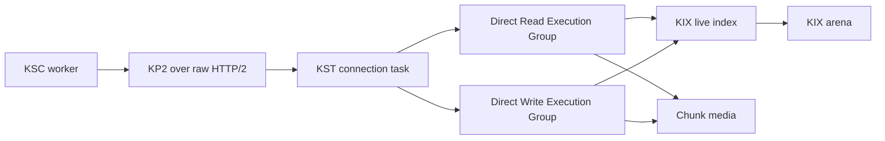
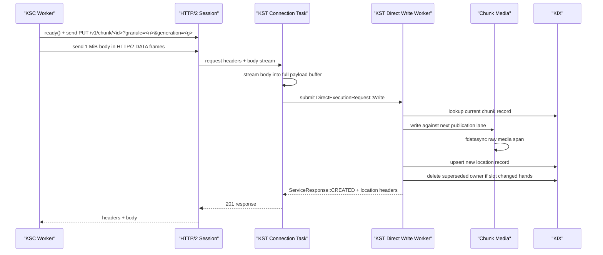
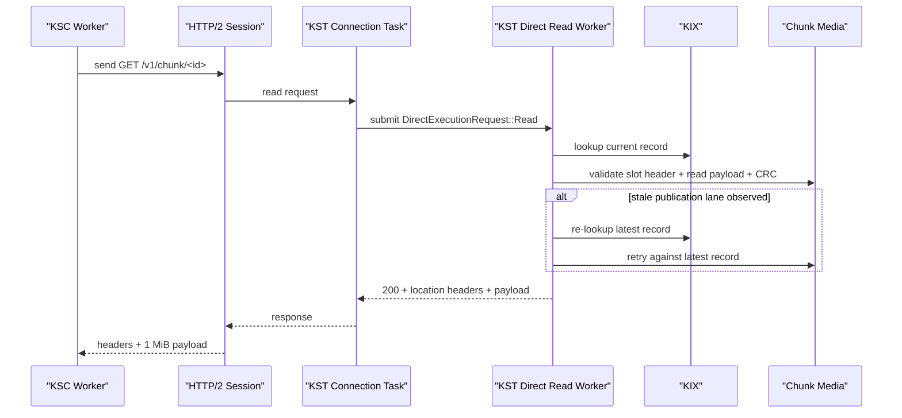
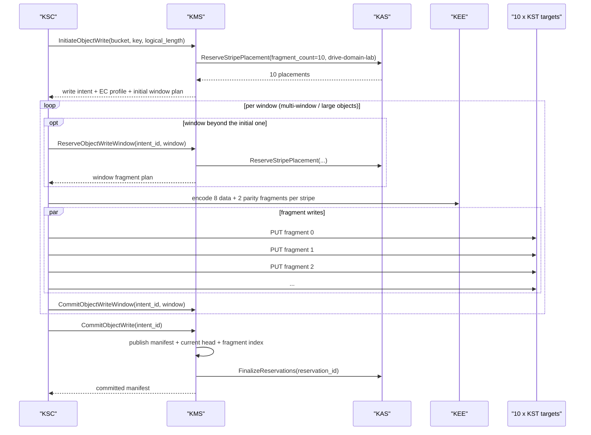
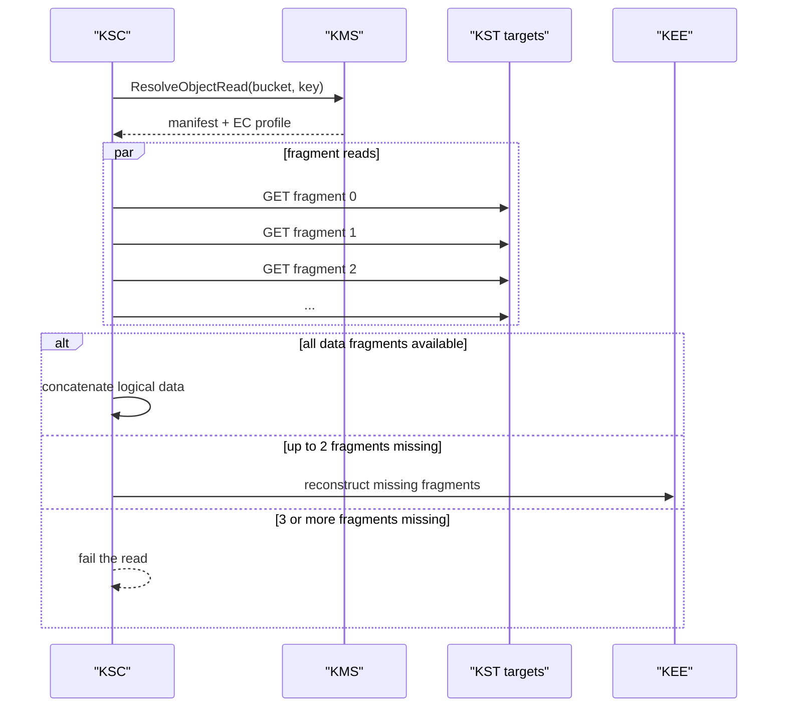
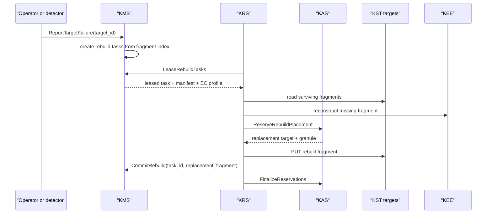

# Current I/O Lifecycle

This document describes the current native I/O stack as it exists in the POC on
March 19, 2026.

Scope:

- current native object and fragment path
- `KSC` -> `KMS` / `KAS` -> `KP2` -> `KST` -> `KIX` / chunk media
- `KRS` rebuild path included
- direct single-chunk `1 MiB` path first
- packed KP2 path second
- observability surfaces that show where time is actually spent

This is a current-state reference, not a final architecture promise.

## Components

- [KSC](/Users/akrause/devel/local/KeInFS/poc/ksc/README.md)
  Native smart client. Opens HTTP/2 sessions, emits direct and packed KP2
  traffic, applies per-target pacing, and records client-side latency phases.
- [KP2](/Users/akrause/devel/local/KeInFS/poc/kp2/README.md)
  Native data protocol over raw HTTP/2. The `kp2` crate is the single source of
  truth for framing and protocol constants.
- [KST](/Users/akrause/devel/local/KeInFS/poc/kst/README.md)
  One-target, one-drive storage target. Owns stream admission, direct execution
  groups, packed routes, target runtime stats, and the live publication view for
  logical slots.
- [KIX](/Users/akrause/devel/local/KeInFS/poc/kix/README.md)
  Raw-device chunk index. Holds the live location map in memory, persists deltas
  to the raw KIX arena, and provides rebuild and recovery support.
- `chunk_media`
  Raw-device chunk payload area. Stores the actual chunk bytes plus slot headers
  used for validation and rebuild-from-media.
- [KMS](/Users/akrause/devel/local/KeInFS/poc/kms/README.md)
  Namespace service for tenant-scoped namespaces, domain hierarchy, bucket
  roots, write intents, object heads, manifests, fragment index records, and
  rebuild task state.
- [KAS](/Users/akrause/devel/local/KeInFS/poc/kas/README.md)
  Allocator service for target inventory, free spans, placement reservations,
  and replacement placement.
- [KEE](/Users/akrause/devel/local/KeInFS/poc/kee/README.md)
  Shared erasure-coding engine used by `KSC` and `KRS`.
- [KRS](/Users/akrause/devel/local/KeInFS/poc/krs/README.md)
  Per-server rebuild daemon that leases tasks from `KMS`, asks `KAS` for
  replacement placement, and writes rebuilt fragments back through `KST`.

## Stack Overview

## Runtime Surfaces

The current stack exposes three live runtime surfaces:

- KSC runtime tree
  Usually under the configured stats root. Key files include `summary`,
  `latency`, `phases/read`, `phases/write`, and `target`.
- KST runtime tree
  `/run/keinfs/kst/<target-id>-<pid>/`
  Key files include `summary`, `identity`, `connections`, `streams`,
  `rpcs/read`, `rpcs/write`, and the embedded KIX runtime path.
- KIX runtime tree
  `/run/keinfs/kix/kix-<pid>/`
  Key files include `summary`, `hardware`, `shards/<id>`, and `drives/<id>`.

Those three surfaces are how the current stack explains where an I/O spent its
time instead of shrugging and blaming the moon.

The current control-plane slice adds three more:

- KMS runtime tree
  `/run/keinfs/kms/kms-<shard-id>-<pid>/summary`
- KAS runtime tree
  `/run/keinfs/kas/kas-<pid>/summary`
- KRS runtime tree
  `/run/keinfs/krs/krs-<pid>/summary`

Those trees explain intent churn, reservation activity, rebuild leasing, and
repair progress instead of forcing the operator to reconstruct the story from
grief and packet captures.

## Direct Single-Chunk `1 MiB` Write

The direct write fast path is the best-understood and best-performing path in
the current POC.

### Step-by-Step

1. A KSC worker picks a target and opens or reuses one HTTP/2 session.
2. KSC calls `ready()` on the session and records `ready_wait`.
3. KSC builds the `PUT /v1/chunk/<chunk-id>?granule=<granule>&generation=<generation>`
   request and records `request_prepare`.
4. KSC sends headers, then sends the `1 MiB` payload in a single `1 MiB` HTTP/2
   DATA frame. That shows up as `send_headers` and `send_body`.
5. KST accepts the request in the per-connection task, classifies it as a write,
   applies active-stream and write-stream admission, and starts the RPC timer.
6. Because this is the direct single-chunk fast path, KST does not route the
   request through the general write ingress queue. It receives the body stream
   directly in the connection task and records `body_stream_receive`.
7. Once the full payload has been received, KST submits
   `DirectExecutionRequest::Write` to the direct write execution group. Queue
   residence here is recorded as `execution_queue_wait`.
8. The direct write worker enters `route_execute` and calls
   `write_chunk_with_payload()`.
9. KST takes the slot-scoped publication guard for the logical slot. That keeps
   same-slot writes serialized in the current prototype.
10. KST asks KIX for the current chunk mapping and, if present, the current slot
    owner. KIX lookup latency is recorded as `kix_lookup`.
11. KST asks `chunk_media` to write the new payload against the current slot
    state. The current implementation chooses the next publication lane for the
    logical slot instead of writing over the currently published lane.
12. `chunk_media` prepares the slot header and payload, writes them with direct
    I/O, and then calls `fdatasync` on the raw media file descriptor. KST records:
    - `media_write_prepare`
    - `media_write_io`
    - `media_fsync`
13. KST publishes the new `LocationRecord` into KIX with `upsert()`.
14. If the slot previously belonged to a different chunk, KST deletes the old
    chunk mapping from KIX after the new mapping is live. That work is included
    in `kix_publish`.
15. KST updates the in-memory slot publication state to the new owner and builds
    the response location headers. Location-record-to-slot translation is
    recorded as `location_map`.
16. KST returns `201 Created` with location headers.
17. KSC waits for the response, records `wait_response`, collects the response
    body as `collect_response`, and treats the write as complete.

### What Actually Dominates Today

For the current direct `1 MiB` write path, the remaining dominant server-side
costs are:

- `media_fsync`
- `kix_publish`
- `media_write_io`

The earlier disaster class, `ingress_queue_wait`, is no longer the main tax on
this path.

## Direct Single-Chunk `1 MiB` Read

The direct read fast path is the clean reverse of the write path, with one
important twist: it may retry publication resolution if it catches a stale lane
under active slot publication churn.

### Step-by-Step

1. KSC picks a target session, calls `ready()`, and sends `GET /v1/chunk/<id>`.
2. Because there is no request body, KSC records almost all client-side time in
   `ready_wait`, `send_headers`, `wait_response`, `collect_response`, and
   `payload_validate`.
3. KST accepts the request, applies stream admission, and recognizes the direct
   chunk-read fast path.
4. The request bypasses the buffered ingress machinery and is submitted to the
   direct read execution group as `DirectExecutionRequest::Read`.
5. The direct read worker records `execution_queue_wait`, enters
   `route_execute`, and calls `handle_direct_chunk_read()`.
6. KST asks KIX for the current `LocationRecord`. That is an in-memory live-index
   lookup and is recorded as `kix_lookup`.
7. KST asks `chunk_media` to validate and read the payload described by that
   record.
8. `chunk_media`:
   - validates the slot header and record identity
   - reads the payload from raw chunk media
   - copies payload bytes into the result buffer
   - recomputes CRC for validation
9. KST records:
   - `media_header_validate`
   - `media_payload_read`
   - `media_payload_copy`
   - `media_crc`
10. If the read caught a stale publication lane while a newer version is already
    in KIX, KST treats that as retryable publication churn. It re-looks up the
    chunk in KIX and retries the media read. That time is recorded as
    `publication_retry`.
11. KST maps the final `LocationRecord` back to the logical slot for response
    headers and records `location_map`.
12. KST sends `200 OK` with:
    - raw chunk bytes as the response body
    - slot/generation/location headers
13. KSC waits for the response, collects the payload, and validates it locally.

### What Actually Dominates Today

For the current direct `1 MiB` read path, the main server-side costs are:

- `media_payload_read`
- `media_header_validate`
- `media_payload_copy`

KIX lookup is effectively background noise on this path.

## Publication Safety Under Mixed Load

The current POC is no longer using the old same-slot overwrite clown show.

The current mixed-load safety model is:

- each logical slot has two physical publication lanes
- each write publishes to the next lane for that logical slot
- KST holds a slot-scoped publication guard while deciding the next write
- KIX is updated only after the new lane has been written and synced
- reads resolve through KIX and can retry if they observe a stale lane while
  publication is moving

This is not the final storage-target publication model. It is the current
prototype mechanism that keeps validated `70/30` mixed traffic from returning
garbage when read and write overlap on hot keys.

## Packed KP2 Write Lifecycle

Packed KP2 is implemented and working, but it is not yet as mature as the direct
single-chunk path.

Current packed write flow:

1. KSC groups chunks by target.
2. KSC uses the shared `kp2` crate to encode one packed write body and apply the
   KP2 packed headers.
3. KSC sends `PUT /v1/kp2/chunk-pack`.
4. KST validates packed headers and decodes the packed request body.
5. KST iterates the entries in the pack, currently in-process and sequentially,
   and applies the same chunk-media plus KIX publication logic entry by entry.
6. KST records aggregate write-side phases such as `media_write_prepare`,
   `media_write_io`, `media_fsync`, `kix_publish`, and `location_map`.
7. KST returns one binary `KP2A` packed write acknowledgement with per-entry
   success or failure.
8. KSC decodes the reply, validates the echoed KP2 metadata, and applies any
   rate-limit feedback to the specific target that pushed back.

Current packed write limitation:

- the packed path is functionally correct, but it still carries more whole-pack
  handling and response assembly overhead than the direct single-chunk path

## Packed KP2 Read Lifecycle

Current packed read flow:

1. KSC groups same-target read keys and encodes one packed read query with the
   `kp2` crate.
2. KSC sends `POST /v1/kp2/chunk-pack/read`.
3. KST validates packed headers, decodes the query, and iterates chunk ids.
4. For each chunk id, KST:
   - looks up the current record in KIX
   - reads and validates the current chunk-media payload
   - maps the final record back to a logical slot
5. KST builds the packed read response body, applies KP2 packed headers, and
   sends the packed result back.
6. KSC collects the full response body, validates the KP2 headers and declared
   counts, decodes the packed response, and validates each returned payload.

Current packed read limitation:

- the path still builds and returns whole-pack results instead of behaving like a
  truly streaming packed data path

## Current Object Write Lifecycle

The current control-plane slice adds a real object write path above the
fragment path. The active lab profile remains `8+2` with `1 MiB` fragments, but
the object path now iterates that stripe flow across multi-stripe objects
instead of stopping at the old `8 MiB` toy limit.

### Step-by-Step

1. `KSC` calls `KMS InitiateObjectWrite`.
2. `KMS` loads the bucket and the immutable EC profile bound to it.
3. `KMS` asks `KAS` for `10` distinct placements under
   `drive-domain-lab`.
4. `KAS` chooses `10` targets, reserves one `granule_index` on each, and
   returns the reservation to `KMS`.
5. `KMS` resolves the bucket inside the namespace hierarchy, persists a write
   intent with a TTL, and returns the intent, EC profile, and fragment plan to
   `KSC`.
6. `KSC` uses `KEE` to encode the logical object into `8` data fragments and
   `2` parity fragments.
7. `KSC` writes those fragments directly to the `10` target endpoints over
   native `KP2`.
8. If any fragment write fails, `KSC` calls `AbortObjectWrite`, and `KMS`
   releases the reservation in `KAS`.
9. If all fragment writes succeed, `KSC` calls `CommitObjectWrite`.
10. `KMS` persists:
    - the immutable version manifest
    - the latest object-head pointer
    - fragment-to-target secondary index entries for rebuild discovery
11. `KMS` finalizes the `KAS` reservation and returns the committed manifest.

The diagram and steps above are the small, single-window case. For
multi-window/large objects, `InitiateObjectWrite` returns only the initial
window's fragment plan, and `KSC` drives a per-window loop: it reserves each
subsequent window with `ReserveObjectWriteWindow` (which pulls fresh placement
from `KAS`), writes that window's fragments, and commits the window with
`CommitObjectWriteWindow` before advancing to the next one. The final
`CommitObjectWrite` then seals the whole object once every window is durable.

## Single-Stripe Object Read Lifecycle

### Step-by-Step

1. `KSC` calls `KMS ResolveObjectRead`.
2. `KMS` resolves the bucket path inside the namespace hierarchy and returns the
   latest committed manifest plus the bucket's immutable EC profile.
3. `KSC` reads fragments directly from the target endpoints listed in the
   manifest.
4. If all required data fragments arrive, `KSC` assembles the logical object
   directly.
5. If one or two fragments are unavailable, `KSC` reconstructs through `KEE`.
6. If three or more fragments are unavailable, the read fails because the
   `8+2` profile cannot perform miracles on demand.

## Rebuild Lifecycle

### Step-by-Step

1. A failed target is reported to `KMS`.
2. `KMS` expands fragment-index entries into rebuild tasks.
3. `KRS` leases one or more tasks.
4. `KRS` reads surviving fragments directly from `KST`.
5. `KRS` reconstructs the missing fragment through `KEE`.
6. `KRS` asks `KAS` for replacement placement on a spare target.
7. `KRS` writes the rebuilt fragment directly to the replacement `KST` target.
8. `KRS` calls `CommitRebuild` on `KMS`, which updates the manifest and
   fragment index.
9. `KRS` finalizes the reservation in `KAS`.

## How To Trace One I/O End To End

If one I/O is slow, the current stack gives six honest places to look.

### KSC

Look in the KSC runtime tree:

- `summary`
- `latency`
- `phases/read`
- `phases/write`

Interpretation:

- high `ready_wait`
  client-side stream readiness or local session pressure
- high `send_body`
  client-side body transmission cost
- high `wait_response`
  server-side work or network round-trip delay
- high `collect_response`
  response-body collection cost
- high `payload_validate`
  client-side payload checking cost

### KST

Look in:

- `/run/keinfs/kst/<target-id>-<pid>/summary`
- `/run/keinfs/kst/<target-id>-<pid>/rpcs/read`
- `/run/keinfs/kst/<target-id>-<pid>/rpcs/write`
- `GET /v1/stats`

Interpretation:

- high `body_stream_receive`
  request body arrival is slow
- high `execution_queue_wait`
  direct execution workers are saturated or undersized
- high `kix_lookup`
  something is wrong above the expected KIX fast path
- high `media_payload_read`
  raw read path is the main tax
- high `media_fsync`
  durability is dominating writes
- high `kix_publish`
  location publication is dominating writes
- non-zero `publication_retry`
  read path is seeing live publication churn

### KIX

Look in:

- `/run/keinfs/kix/kix-<pid>/summary`
- `/run/keinfs/kix/kix-<pid>/shards/<id>`
- `/run/keinfs/kix/kix-<pid>/drives/<id>`

Interpretation:

- high get latency with low media cost elsewhere
  KIX is becoming suspect
- write errors or rebuild-required drives
  the target may be functionally alive but structurally compromised
- drive append latency spikes
  raw KIX arena durability is part of the write problem

### KMS

Look in:

- `/run/keinfs/kms/kms-<shard-id>-<pid>/summary`

Interpretation:

- rising `initiate_object_write_requests` with failing commits
  the object path is stalling between reservation and publish
- rising `expired_write_intents`
  clients are abandoning or timing out write intents
- rising `report_target_failure_requests` and `lease_rebuild_tasks_requests`
  the system is in active repair territory

### KAS

Look in:

- `/run/keinfs/kas/kas-<pid>/summary`

Interpretation:

- high `reserve_stripe_requests` with rising errors
  placement is the current choke point
- high `reserve_rebuild_requests`
  rebuild pressure is consuming spare space
- high register or heartbeat churn
  target inventory is unstable

### KRS

Look in:

- `/run/keinfs/krs/krs-<pid>/summary`

Interpretation:

- rising `failed_tasks`
  rebuild logic or replacement placement is failing
- `active_task` stuck for too long
  fragment read, reconstruct, or replacement write is wedged
- low `rebuilt_bytes` with rising leased tasks
  the repair loop is alive but ineffective

## Current Baseline For This Stack

Current validated single-target baseline on `10.0.0.20` for direct single-chunk
`1 MiB` traffic:

- `100%` read: `4102.72 MiB/s`
- `100%` write: `2833.09 MiB/s`
- `70/30` mixed: `2713.73 MiB/s` read plus `1162.47 MiB/s` write

These numbers describe the current direct path, not the packed path and not the
final product.

## Current Limits

- direct GET/PUT is the cleanest and best-performing path today
- packed KP2 is working, but still carries more whole-pack overhead than it
  should
- write latency is still materially shaped by raw durability cost and KIX
  publication cost
- read latency is still materially shaped by chunk-media validation and payload
  movement
- push delivery remains a protocol foundation decision in KP2, not a completed
  production path
