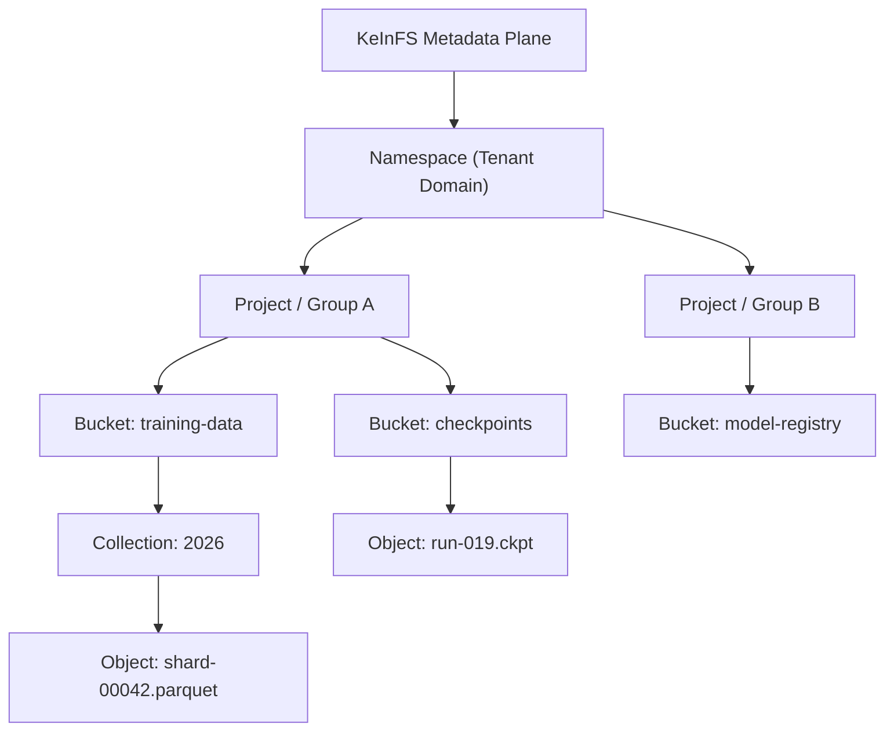
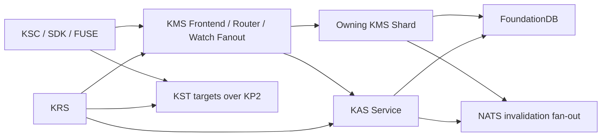
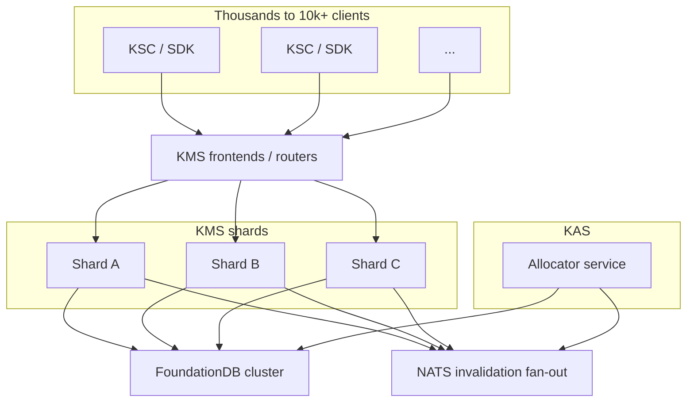
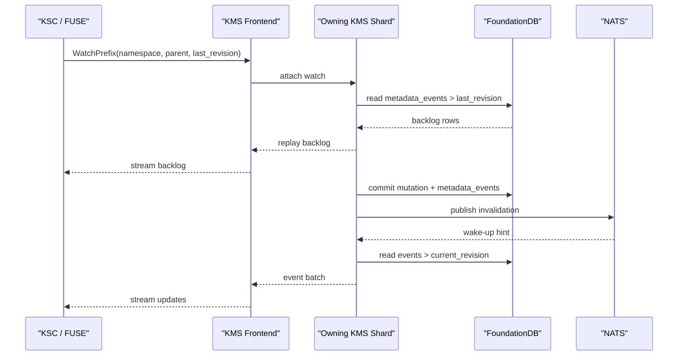

# KeInFS Metadata and Namespace Architecture

This document records the current target direction for the KeInFS metadata and
allocator plane after the FoundationDB and NATS cutover.

The short version:

- `namespace` means a tenant-scoped metadata domain
- a namespace can contain multiple projects, groups, teams, or workspaces
- those domain entries can contain multiple buckets
- buckets contain collections and objects
- `KMS` owns namespace truth
- `KAS` owns placement truth
- target inventory is partitioned into allocation shards
- one `KAS` leader owns mutations for one allocation shard at a time
- FoundationDB is the durable substrate
- NATS provides invalidation and event fan-out
- watches are a `KMS` contract, not a database feature we pretend is an API

## Canonical Hierarchy

## Service Ownership

`KMS` owns:

- namespace records
- namespace domain hierarchy
- bucket definitions
- immutable EC profile binding
- path resolution
- object heads
- immutable manifests
- write intents
- fragment-to-target index
- rebuild task state
- metadata event log (planned; not yet persisted)
- watch replay contract

`KAS` owns:

- allocation-shard leader leases
- target inventory
- target heartbeats
- failure-domain labels
- free spans
- reservations
- rebuild replacement placement

## Scale Model

The design is not "one heroic metadata box saves the cluster."

It is:

- more `KMS` shards for more metadata capacity
- more stateless `KMS` frontend instances for more clients and watches
- shard-local hot caches and fat reservation windows for the hot path
- allocation-shard-local `KAS` leadership instead of multiple allocators
  mutating the same targets and then acting surprised
- FoundationDB for durable truth and recovery boundaries
- NATS for invalidation and event fan-out

## Shard Rule

Current v1 ownership rule:

- one namespace maps to one `kms_shard_id`
- all metadata under that namespace lives on that shard
- hot-namespace path-range splitting is a planned extension, not a day-one lie

`ShardMapEntry` carries:

- `shard_id`
- `namespace_id`
- optional `path_prefix_start`
- optional `path_prefix_end`
- `leader_endpoint`
- `replica_endpoints`
- `revision`

## Allocation Shard Rule

Current allocator ownership rule:

- each target carries one `allocation_shard_id`
- each allocation shard has exactly one active `KAS` leader at a time
- only that leader may mutate free-span, reservation, and reservation-bin state
  for targets in that shard
- `KMS` may reserve across multiple allocation shards to assemble one stripe
- allocator shards are not the same thing as failure domains or placement
  domains

The point is not decorative taxonomy. The point is making overlapping allocator
mutation impossible by construction instead of by hope.

## Watch and Replay Model

Clients do not talk raw backend notification semantics. That would be lazy and
fragile.

The watch contract belongs to `KMS`. What exists today:

- `KMS` publishes ephemeral `MetadataInvalidationEvent` hints on NATS; the
  default invalidation subject is `keinfs.kms.events`
- `WatchEntry`, `WatchPrefix`, and `ListMetadataEvents` are defined in the proto
  and wired through the service layer, but their store-side event readers
  currently return no rows, so there is no durable backlog and revision-based
  resume is a no-op

Planned (not yet implemented):

- durable events in a `metadata_events` record family
- a monotonically increasing revision on every visible mutation
- client resume by replaying `revision > last_seen_revision`

The diagram below shows that **target** durable watch/replay flow (planned):

## Current Record Families

### KMS

- shard-map records
- namespace records
- namespace entries
- EC profiles
- bucket contexts
- object heads
- object-version manifests
- write intents
- fragment indexes
- rebuild tasks
- metadata events (planned; not yet persisted)

### KAS

- allocation-shard leader leases
- targets (with inline heartbeat/health state)
- target free spans
- reservations
- reservation bins

The important improvement over the old lab slice is not merely the backend swap.
It is the end of the old "one metadata blob and a prayer" anti-pattern.
Record classes are explicit now, which is what lets the services scale without
pretending one giant hot value was a personality trait.

## Compatibility Path

- existing `bucket + key` APIs remain valid
- internally, a bucket is one namespace entry kind, not the whole universe
- `KMS` may keep compatibility wrappers while the fully sharded namespace model
  finishes growing up
