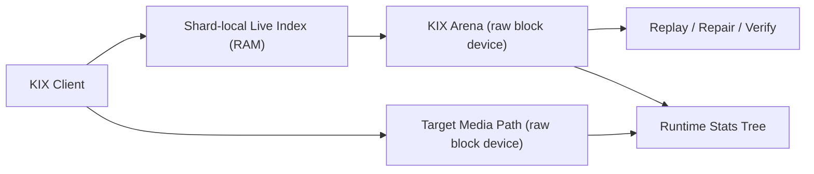
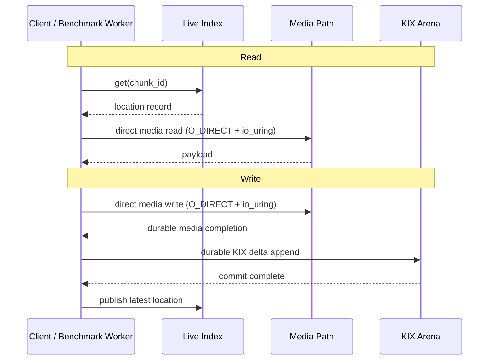

# KIX POC

KIX is the raw-device chunk-location index prototype for KeInFS storage targets.

This POC is intentionally narrow. It exists to answer a few hard questions before a larger storage target is built around it:

- Can KIX publish and recover chunk locations directly on raw block devices without a filesystem in the path?
- Can the hot lookup path stay cheap while the durable append path remains explicit and measurable?
- Can one drive-backed target be made fast without lying about durability or locality?
- Can the benchmark and maintenance tooling report what they are doing in a way a human can actually trust?

## First Principles

- Linux only.
- Raw block devices only for benchmark and maintenance workflows.
- Direct `O_DIRECT` + `io_uring` only in the active KIX path.
- One physical drive means one target. No synthetic "virtual drives" on top of one NVMe.
- The live chunk index is RAM-resident on purpose. KIX should not become the bottleneck it exists to avoid.
- Startup failures, repair outcomes, and topology warnings must be explicit and actionable.

## Workspace Layout

- `crates/kix`: KIX engine, arena, recovery, runtime stats, hardware inventory
- `crates/kix-bench`: raw-device throughput and recovery benchmark harness
- `crates/kix/src/bin/kix.rs`: raw KIX arena maintenance CLI
- `TODO.md`: active backlog for the prototype

## Runtime Shape



## Request Lifecycle



## Host Requirements

- `kernel.io_uring_disabled = 0`
- direct access to the raw target device
- enough privilege to open the device with `O_DIRECT`
- a spare raw span for destructive recovery tests

Useful packages:

- `fio`
- `perf`
- `nvme-cli`

## What KIX Actually Measures

`throughput_ops_s` is request rate, not bytes per second.

KIX now prints both request counts and payload throughput so the workload shape is explicit:

- `read_ops` / `write_ops`
- `media_read_ops` / `media_write_ops`
- `read_payload_stored_bytes` / `write_payload_stored_bytes`
- `read_payload_stored_MiB_s` / `write_payload_stored_MiB_s`

Phase timing is also split out:

- `read_lookup_*`
- `read_media_*`
- `write_media_*`
- `write_commit_*`

That matters because a "fast" result is meaningless if it only means "the lookup stayed in RAM while the slow part hid elsewhere."

## Benchmark Workflow

Build:

```bash
~/.cargo/bin/cargo build --release -p kix -p kix-bench
```

Read-heavy throughput example:

```bash
~/.cargo/bin/cargo run --release -p kix-bench -- \
  --raw-device /dev/nvme0n1 \
  --raw-offset-bytes 68719476736 \
  --raw-slice-bytes 8589934592 \
  --read-path media-read \
  --media-raw-device /dev/nvme0n1 \
  --media-raw-offset-bytes 128849018880 \
  --media-raw-slice-bytes 4294967296 \
  --threads 8 \
  --prefill-keys 2048 \
  --key-space 2048 \
  --ops-per-thread 2000 \
  --write-percent 0 \
  --extent-bytes 1048576 \
  --media-queue-depth 16 \
  --media-read-batch-size 16
```

Write-heavy throughput example:

```bash
~/.cargo/bin/cargo run --release -p kix-bench -- \
  --raw-device /dev/nvme0n1 \
  --raw-offset-bytes 85899345920 \
  --raw-slice-bytes 8589934592 \
  --read-path media-read \
  --media-raw-device /dev/nvme0n1 \
  --media-raw-offset-bytes 137438953472 \
  --media-raw-slice-bytes 8589934592 \
  --threads 8 \
  --key-space 4000 \
  --ops-per-thread 500 \
  --write-percent 100 \
  --extent-bytes 1048576 \
  --media-queue-depth 16 \
  --media-write-batch-size 2 \
  --media-flush-mode per-batch
```

Recovery benchmark example:

```bash
~/.cargo/bin/cargo run --release -p kix-bench -- \
  --benchmark-mode recovery \
  --raw-device /dev/nvme0n1 \
  --raw-offset-bytes 171798691840 \
  --raw-slice-bytes 4294967296 \
  --media-raw-device /dev/nvme0n1 \
  --media-raw-offset-bytes 206158430208 \
  --media-raw-slice-bytes 68719476736 \
  --key-space 40000 \
  --recovery-live-entries 20000 \
  --recovery-delta-batches 512 \
  --recovery-deltas-per-batch 64 \
  --recovery-key-space 40000 \
  --recovery-loops 5 \
  --recovery-fault first-frame \
  --recovery-auto-rebuild
```

## Current Validated Results

All results below are from March 19, 2026 and correspond to the current direct-only code path.

### EPYC Raw-Read Sanity

Drive: `WD_BLACK SN850P 2TB` on `/dev/nvme0n1`

Official vendor sheet for the `2TB` model:

- up to `7,300 MB/s` sequential read
- up to `6,600 MB/s` sequential write

Source: [WD SN850P datasheet](https://studio.westerndigital.com/content/dam/doc-library/en_us/assets/public/western-digital/product/internal-drives/wd-black-ssd/data-sheet-wd-black-sn850p-nvme-ssd-for-ps5.pdf)

Independent `fio` sanity on the same EPYC host and raw device:

- sequential read, `1 MiB`, `QD32`: about `5.94 GB/s`
- random read, `1 MiB`, `8 jobs x QD1`, `2 GiB` working set: about `6.86 GB/s`
- random read, `1 MiB`, `8 jobs x QD16`, `2 GiB` working set: about `7.36 GB/s`

Current KIX read results on the same box and same `1 MiB` extent shape:

- `media_queue_depth=1`, `media_read_batch_size=1`: `6,582 MiB/s`
- `media_queue_depth=16`, `media_read_batch_size=16`: `6,983 MiB/s`

Conclusion:

- the KIX read numbers are aggressive but plausible
- they are in the same range as matching `fio` runs
- the benchmark is not secretly using buffered file I/O

### Current Write Snapshot

EPYC, `1 MiB` extent writes, direct raw media plus durable KIX commit:

- `per-op` flush, batch `1`: about `2,299 MiB/s`
- `per-batch` flush, batch `2`: about `2,343 MiB/s`
- `per-batch` flush, batch `8`: about `2,174 MiB/s`

Conclusion:

- small group commit can help
- oversized write waves punish latency and do not automatically improve throughput
- read batching and write durability policy must stay separate knobs

### Recovery Snapshot

Raw-device replay and fault handling:

- clean replay, `20k` checkpoint entries + `512` delta frames:
  - `dev-ws`: about `27.1 ms p50`
  - `EPYC`: about `80.6 ms p50`
- recoverable tail corruption with auto-truncate:
  - truncate repair stayed sub-millisecond on both hosts
- hard first-frame corruption:
  - correctly returned `rebuild_required` on every loop
- rebuild-from-media on deterministic chunk-media spans:
  - `dev-ws`, `4,096` live entries + `64` delta batches over `8,192` slots: about `2.15 s`
  - `EPYC`, `8,192` live entries + `128` delta batches over `16,384` slots: about `8.16 s`
  - rebuilt arenas reopened cleanly as fresh checkpoint-only spans with the expected live-entry digest

Conclusion:

- replay works
- tail repair is cheap
- hard corruption is detected quickly
- rebuild-from-media works when the chunk-media span is intact
- rebuild refuses to checkpoint partial media scans with corrupt headers, corrupt payloads, or layout mismatches

### `kix check` Validation

Validated on raw arena slices on `/dev/nvme0n1`:

- clean formatted span: `check_state=clean`, `result=clean`
- recoverable `tail-crc` damage: `check_state=tail-corruption`, `fix_action=repair-tail`, `after_check_state=clean`, `verify=result=verified-clean`
- `first-frame` damage with a raw chunk-media span: plain `check` reported `safe_fix_available=yes`, `destructive_fix_required=no`, and recommended `--fix`
- the same damaged arena with `check --fix` performed `fix_action=rebuild-from-media`, reopened cleanly, and `verify` returned `result=verified-clean`
- `first-frame` damage without a media span still requires `--fix --allow-destructive-reset`

That is the honest repair boundary today:

- `kix check` can repair all arena states the current prototype actually knows how to repair
- rebuild-from-media is available when `--media-raw-device` points at a clean chunk-media span
- destructive reset is the fallback only when no rebuild source is provided (and `--allow-destructive-reset` is given). When a media span is provided but the rebuild scan finds corrupt headers, corrupt payloads, or layout mismatches, `check --fix` blocks (`result=blocked-rebuild-corruption`) rather than falling back to a destructive reset.

## kix

`kix` is the raw arena maintenance CLI.

Current subcommands:

- `check`
- `preflight`
- `format`
- `inspect`
- `verify`
- `repair-tail`

`kix check` is the primary entry point. It prints:

- raw-device identity, size, span, and block geometry
- NUMA placement and CPU locality
- `io_uring` policy state
- active CRC acceleration backend
- preflight status for the direct raw-device path
- recovery state, replay length, live entry count, and digest
- recommended repair action

Repair behavior is explicit:

- clean arena: reports `result=clean`
- recoverable tail corruption: can truncate back to `replay_len` with `--fix`
- rebuild-required arena with `--media-raw-device`: `--fix` scans chunk media and rewrites the arena from the recovered live set
- rebuild-required arena without `--media-raw-device`: destructive reset remains blocked unless `--allow-destructive-reset` is explicit
- rebuild scans refuse to checkpoint partial results when they see corrupt headers, corrupt payloads, or layout mismatches

Examples:

```bash
~/.cargo/bin/cargo run --release -p kix --bin kix -- check \
  --raw-device /dev/nvme0n1 \
  --raw-offset-bytes 171798691840 \
  --raw-slice-bytes 4294967296
```

```bash
~/.cargo/bin/cargo run --release -p kix --bin kix -- check \
  --raw-device /dev/nvme0n1 \
  --raw-offset-bytes 171798691840 \
  --raw-slice-bytes 4294967296 \
  --media-raw-device /dev/nvme0n1 \
  --media-raw-offset-bytes 206158430208 \
  --media-raw-slice-bytes 68719476736 \
  --fix
```

```bash
~/.cargo/bin/cargo run --release -p kix --bin kix -- check \
  --raw-device /dev/nvme0n1 \
  --raw-offset-bytes 171798691840 \
  --raw-slice-bytes 4294967296 \
  --fix \
  --allow-destructive-reset
```

```bash
~/.cargo/bin/cargo run --release -p kix --bin kix -- verify \
  --raw-device /dev/nvme0n1 \
  --raw-offset-bytes 171798691840 \
  --raw-slice-bytes 4294967296 \
  --media-raw-device /dev/nvme0n1 \
  --media-raw-offset-bytes 206158430208 \
  --media-raw-slice-bytes 68719476736
```

## Runtime Stats

KIX publishes a live runtime tree under a stats root such as:

- `/run/keinfs/kix/kix-<pid>/summary`
- `/run/keinfs/kix/kix-<pid>/config`
- `/run/keinfs/kix/kix-<pid>/shards/<id>`
- `/run/keinfs/kix/kix-<pid>/drives/<id>`

This includes:

- queue depth and pressure
- per-phase latency histograms
- arena mode and placement info
- last error text
- hardware inventory such as CRC backend selection

## Current Limits

- no multi-device benchmark process yet; one process models one target
- chunk-media rebuild currently assumes a deterministic slot layout; allocator-derived discovery still does not exist
- reused spans with an old superblock keep their old format history until they are explicitly reformatted or moved to a fresh offset
- no real network data path yet; ingress is a locality harness, not a shipping front end
- no IRQ/RSS steering automation for production service bring-up yet

## Bottom Line

This prototype is now direct-only, raw-only, and far less sentimental than it used to be. The benchmark and tooling are meant to tell the truth about one drive-backed target, not to flatter the code with buffered fallbacks, fake devices, or stale benchmark archaeology.
