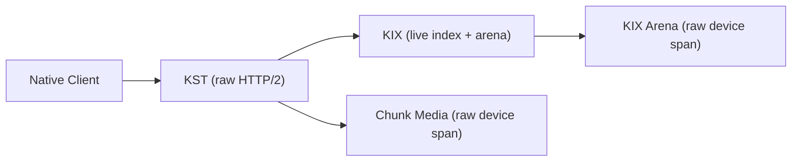
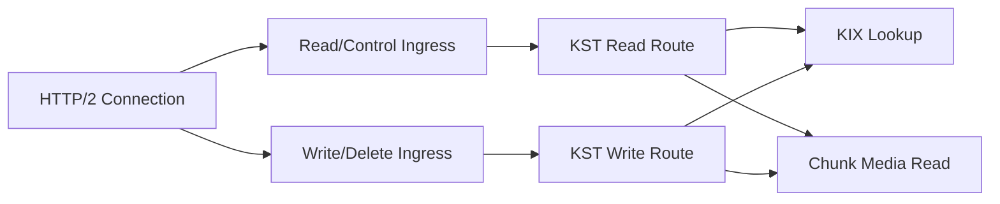
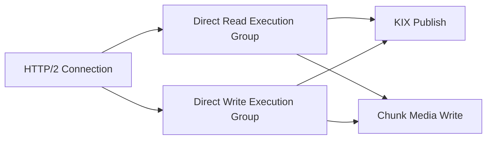
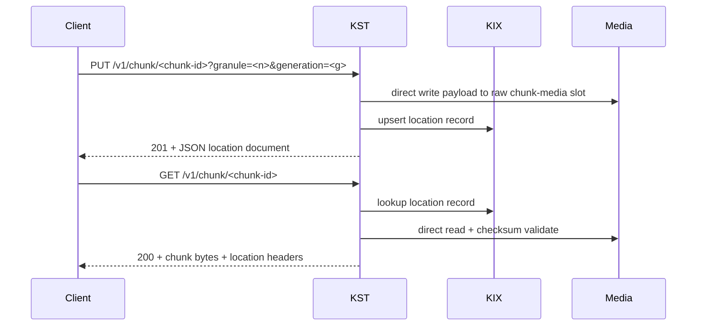

# KST

KST is the KeInFS Storage Target Service prototype.

It is a one-target, one-drive, raw-block, direct-I/O storage target that sits on top of KIX for location publication and recovery metadata.

Related POC components:

- [Current I/O Lifecycle](/Users/akrause/devel/local/KeInFS/poc/IO_LIFECYCLE.md)
- [KP2](/Users/akrause/devel/local/KeInFS/poc/kp2/README.md)
- [KSC](/Users/akrause/devel/local/KeInFS/poc/ksc/README.md)

## First Principles

- Native storage data traffic is not gRPC.
- gRPC belongs on the management and control plane only.
- The target data plane uses raw HTTP/2 semantics, implemented directly with the `h2` crate.
- One physical drive is one target.
- KIX and chunk media operate on raw block-device slices with direct I/O.
- Read/control ingress and write/delete ingress are separate worker classes with independent queueing and worker modes.
- KST exposes a live runtime tree under `/run/keinfs/kst/...`, and embedded KIX exposes its own tree under `/run/keinfs/kix/...`.
- KST must survive large client fan-in. Connection admission, stream admission, handshake behavior, and read-vs-write pressure are first-class runtime signals.

The practical reason for the raw `h2` foundation is simple: future direct push delivery must be able to use native HTTP/2 features, including `PUSH_PROMISE`, without ripping out a higher-level RPC stack later.

## Target Shape



## Ingress Shape



The buffered ingress workers are now for buffered and packed routes. The direct
single-chunk `1 MiB` path no longer rides the same queueing machinery, because
that was exactly how to reintroduce the latency tax we had just removed.

## Direct Execution Shape



Direct chunk writes no longer force the Tokio request handler to fully buffer
the body before dispatch, and they no longer bounce through Tokio's generic
blocking pool either. The handler streams body frames into a complete `1 MiB`
payload, then hands the storage work to the target-local direct write execution
group. Direct reads follow the same principle through the direct read execution
group.

## Request Flow



## Public Placement Term

Externally, the direct write contract is `granule_index`.

The current target implementation still maps that public `granule_index`
one-to-one onto an internal logical slot index, because the POC chunk-media
layout is not yet the final allocator-backed target format. The public seam is
already granule-based so the control plane does not need to unlearn old slot
language later.

## Publication Model

The current direct `1 MiB` path uses a two-lane publication model per logical
slot.

- one logical slot owns two physical publication lanes on raw chunk media
- KST serializes writes per logical slot with a slot-scoped publication guard
- KST seeds an explicit current-owner state per slot from live KIX entries at
  startup and refuses to start if two live KIX entries claim the same slot
- each new write publishes to the non-current lane
- same-slot replacement publishes the new chunk and retires the superseded
  chunk mapping from KIX instead of leaving a stale live record behind
- KIX publishes only after the new lane has been written and synced
- reads resolve through KIX and may retry once or twice if they catch a stale
  lane during active publication churn

This is still a prototype publication model, not the final storage-target
publication scheme. Its current job is narrower and more honest: keep mixed
read/write traffic from lying to the reader under overlap.

## Endpoint Surface

- `GET /v1/info`
  Returns target identity and topology as JSON.
- `GET /v1/stats`
  Returns live target stats plus embedded KIX summary as JSON.
- `PUT /v1/kp2/chunk-pack`
  Accepts one packed same-target KP2 write transaction.
- `POST /v1/kp2/chunk-pack/read`
  Accepts one packed same-target KP2 read query and returns one packed read response body.
- `HEAD /v1/chunk/<chunk-id-hex>`
  Returns chunk presence and location metadata via HTTP headers.
- `GET /v1/chunk/<chunk-id-hex>`
  Returns raw chunk bytes plus location metadata headers.
- `PUT /v1/chunk/<chunk-id-hex>?granule=<n>&generation=<g>`
  Writes payload bytes to the configured granule, then publishes the location into KIX.
- `DELETE /v1/chunk/<chunk-id-hex>`
  Writes a chunk-media tombstone and then removes the location from KIX.

## Runtime Tree

KST writes a `/proc`-style runtime tree below `/run/keinfs/kst/<target-id>-<pid>/`.

Files:

- `summary`
- `connections`
- `streams`
- `kp2`
- `identity`
- `config`
- `hardware`
- `embedded-kix`
- `errors`
- `rpcs/target-info`
- `rpcs/head`
- `rpcs/read`
- `rpcs/write`
- `rpcs/delete`
- `rpcs/stats`
- `rpcs/other`

The intent is operational readability first: live counters, payload bytes, latency summaries, hardware identity, NUMA placement, queue settings, connection pressure, read-vs-write stream pressure, and the path to the embedded KIX runtime tree.

## Backpressure and Rate Limiting

KST applies explicit in-flight ceilings for:

- all active streams
- read/control streams
- write/delete streams

When a request is rejected because one of those ceilings is exhausted, KST
returns `429 Too Many Requests` and emits the KP2 rate-limit headers defined by
the shared [KP2](/Users/akrause/devel/local/KeInFS/poc/kp2/KP2_Spec.md) spec.

The current POC enforcement is target-scoped. Connection-scoped client limits
are part of the KP2 design surface, but they are not implemented yet.

## Packed Limit Semantics

KST now makes the packed contract explicit instead of muddying protocol and
transport limits together.

- `max_packed_payload_bytes`
  protocol logical payload ceiling
- `max_packed_write_request_bytes`
  target-specific packed write wire-body ceiling
- `max_request_body_bytes`
  actual HTTP request-body cap enforced by KST

For the current `extent-only` `1 MiB` target shape, a full `16 MiB` logical
pack needs `16778072` bytes of request-body headroom once KP2 framing overhead
is included. KST now auto-raises its default request-body limit to that value
when the operator did not explicitly set a larger or smaller cap.

If the operator explicitly sets `--max-message-bytes` too low for the target's
packed write shape, KST now fails startup with an actionable error instead of
letting clients discover the mismatch by eating `413` responses.

## Commands

Serve a target:

```bash
sudo ./target/release/kst serve \
  --listen 127.0.0.1:18080 \
  --listen-backlog 2048 \
  --target-id devws-nvme0 \
  --drive-id 0 \
  --raw-device /dev/nvme0n1 \
  --record-mix extent-only \
  --extent-bytes 1048576 \
  --packed-bytes 16384 \
  --key-slots 1024 \
  --read-ingress-mode interrupt \
  --write-ingress-mode interrupt \
  --read-ingress-workers 4 \
  --write-ingress-workers 2 \
  --read-ingress-queue-depth 2048 \
  --write-ingress-queue-depth 1024 \
  --direct-read-mode busy \
  --direct-write-mode interrupt \
  --direct-read-workers 8 \
  --direct-write-workers 8 \
  --direct-read-queue-depth 2048 \
  --direct-write-queue-depth 2048 \
  --max-connections 1024 \
  --max-active-streams 2048 \
  --max-read-streams 1536 \
  --max-write-streams 512 \
  --h2-max-concurrent-streams 64 \
  --h2-initial-window-bytes 1048576 \
  --h2-max-frame-bytes 1048576 \
  --h2-max-header-list-bytes 32768 \
  --h2-max-send-buffer-bytes 8388608 \
  --shards 4
```

When `--media-raw-device`, `--raw-offset-bytes`, `--raw-slice-bytes`,
`--media-raw-offset-bytes`, and `--media-raw-slice-bytes` are omitted on a
same-device target, `KST` now discovers the drive geometry itself, uses the
front of the device for chunk media, and parks a fat `KIX` arena at the tail.
That is the default path for the EPYC target maps now, because hardwiring a
2 GiB metadata slice onto a multi-terabyte NVMe drive was a deeply unserious
thing to keep doing.

Smoke a live target:

```bash
./target/release/kst smoke \
  --endpoint http://127.0.0.1:18080 \
  --chunk-seed 7 \
  --slot-index 9 \
  --generation 1
```

Smoke the packed KP2 path through KSC:

```bash
cd /home/akrause/KeInFS-poc/ksc
./target/release/ksc smoke \
  --endpoint http://127.0.0.1:18083 \
  --chunk-seed 7 \
  --slot-index 9 \
  --generation 1 \
  --packed-count 4
```

## Validation

Validated on March 19, 2026:

- `andreas-bm-kvm-nvlustre-prim`
  - `cargo build --release` for `poc/kst`
  - live raw-target smoke succeeded on `/dev/nvme0n1`
  - smoke wrote and read back a `1 MiB` extent, then deleted it
  - KST runtime tree and embedded KIX tree both populated correctly
- `10.0.0.20`
  - upgraded toolchain to `rustc/cargo 1.94.0`
  - `cargo build --release` for `poc/kst`
  - live raw-target smoke succeeded on `/dev/nvme0n1`
  - KST runtime tree and embedded KIX tree both populated correctly

Observed live smoke counters on both hosts:

- `total_requests=7`
- `total_errors=0`
- `read_payload_bytes=1048576`
- `write_payload_bytes=1048576`

Observed on `10.0.0.20` with the fan-in controls enabled on March 19, 2026:

- `peak_active_connections=1`
- `total_connections_accepted=1`
- `total_handshake_failures=0`
- `peak_active_read_streams=1`
- `peak_active_write_streams=1`
- `total_stream_rejections=0`
- live caps surfaced as `max_connections=1024`, `max_active_streams=2048`, `max_read_streams=1536`, `max_write_streams=512`

Observed on `10.0.0.20` from the live `GET /v1/stats` snapshot after the packed KP2 smoke on March 19, 2026:

- `ksc_smoke_result=ok`
- `ksc_smoke_chunk_count=4`
- `ksc_smoke_total_payload_bytes=4194304`
- `kp2_packed_write_requests=1`
- `kp2_packed_write_chunks=4`
- `kp2_packed_write_logical_payload_bytes=4194304`
- `kp2_packed_read_requests=1`
- `kp2_packed_read_chunks=4`
- `kp2_packed_read_logical_payload_bytes=4194304`
- total KST request count after the smoke: `7`

Observed on `andreas-bm-kvm-nvlustre-prim` on March 19, 2026, after the packed
wire-body fix on target `18080`:

- `max_packed_payload_bytes=16777216`
- `max_packed_write_request_bytes=16778072`
- `max_request_body_bytes=16778072`

## Phase Timing

KST now records phase timing for each RPC class and publishes it in both:

- `GET /v1/stats`
- `/run/keinfs/kst/<target-id>-<pid>/rpcs/read`
- `/run/keinfs/kst/<target-id>-<pid>/rpcs/write`

Current phase keys:

- `phase_body_collect_*`
- `phase_body_stream_receive_*`
- `phase_execution_queue_wait_*`
- `phase_ingress_queue_wait_*`
- `phase_route_execute_*`
- `phase_request_decode_*`
- `phase_kix_lookup_*`
- `phase_media_header_validate_*`
- `phase_media_payload_read_*`
- `phase_media_payload_copy_*`
- `phase_media_crc_*`
- `phase_media_write_prepare_*`
- `phase_media_write_io_*`
- `phase_media_fsync_*`
- `phase_kix_publish_*`
- `phase_location_map_*`
- `phase_response_encode_*`
- `phase_response_send_*`

Observed on `10.0.0.20` on March 19, 2026 with the current plain `1 MiB`
single-chunk path, `64` active streams (`8` workers x `8` in-flight), the
two-lane mixed-publication fix in place, the current KIX one-sync arena append
path, and the dedicated direct execution groups in place:

- `100% read`
  - KSC throughput: `4102.72 MiB/s`
  - KSC `wait_response avg 2739 us`
  - KSC `collect_response avg 276 us`
  - KSC `payload_validate avg 56 us`
  - KST read latency avg `1157 us`, `p50 1024 us`, `p95 1024 us`, `p99 2048 us`
  - KST `execution_queue_wait avg 44 us`
  - KST `route_execute avg 1097 us`
  - KST `media_header_validate avg 159 us`
  - KST `media_payload_read avg 593 us`
  - KST `media_payload_copy avg 189 us`
  - KST `media_crc avg 33 us`

- `100% write`
  - KSC throughput: `2833.09 MiB/s`
  - KSC `wait_response avg 4765 us`
  - KST write latency avg `4092 us`, `p50 2048 us`, `p95 4096 us`, `p99 8192 us`
  - KST `body_stream_receive avg 315 us`
  - KST `execution_queue_wait avg 1045 us`
  - KST `route_execute avg 2711 us`
  - KST `media_write_prepare avg 648 us`
  - KST `media_write_io avg 503 us`
  - KST `media_fsync avg 700 us`
  - KST `kix_publish avg 668 us`

- `70% read / 30% write`
  - KSC throughput: `3876.20 ops/s`
  - read throughput: `2713.73 MiB/s`
  - write throughput: `1162.47 MiB/s`
  - KSC `total_errors=0`
  - validated cleanly with no mixed-load payload mismatches

- same-slot replacement proof
  - direct HTTP/2 write of chunk `A` to slot `9`: `201`
  - direct HTTP/2 read of chunk `A`: `200`
  - direct HTTP/2 write of chunk `B` to the same slot `9`: `201`
  - direct HTTP/2 read of chunk `B`: `200`
  - direct HTTP/2 read of superseded chunk `A`: `404`

What this means now:

- KIX lookup is still not the bottleneck on the current KST path.
- The current direct `1 MiB` read and write paths no longer lose most of their
  life in ingress queue wait, and they no longer depend on Tokio's generic
  blocking pool.
- The mixed publication fix did its actual job: the validated `70/30` run
  completed cleanly instead of collapsing into header/payload mismatches.
- Same-slot replacement now retires the superseded chunk mapping from KIX
  instead of leaving a stale live record behind.
- The write-side tax is now actual storage work rather than transport or queue
  theater. The dominant remaining costs are still `kix_publish` and
  `media_fsync`, but they are now in the low-millisecond range rather than the
  earlier embarrassing tens-of-milliseconds regime.
- The read side is still dominated by actual media work, especially payload
  read and header validation.
- Busy vs interrupt on the buffered ingress workers is now secondary for the
  direct single-chunk path, because that path uses its own direct execution
  groups and spends its time in storage work rather than queue waiting.

## Current Limits

- KST is still a prototype target service, not the final production target stack.
- The public write contract is the allocator's `granule_index` (see Public Placement Term); the prototype maps it one-to-one onto an internal logical slot because the on-media chunk layout is not yet the final allocator-backed format.
- The current request path is raw HTTP/2 request/response only. The `h2` foundation is there so push delivery can be added later without replatforming the data plane.
- Direct chunk reads and writes use dedicated target-local execution groups.
- Packed and buffered write paths still use the ingress workers.
- Packed and buffered read paths still use the ingress workers.
- The current direct write path still assembles a full payload in memory before issuing the raw media write. Better than handler-side buffering, still not a final zero-copy design.
- The current real write-path bottleneck is no longer ingress queueing; it is the storage work in `route_execute`.
- The current two-lane publication model is a prototype correctness mechanism,
  not the final storage-target publication design.
- Slot publication state is now authoritative for same-slot replacement, but a
  full compare-and-publish model for chunk relocation across different slots is
  still unfinished.
- `GET /v1/stats` is the authoritative live observability view today. The background runtime-tree publisher exists, but under the current busy-poll target lab it can lag and still needs a freshness fix.
